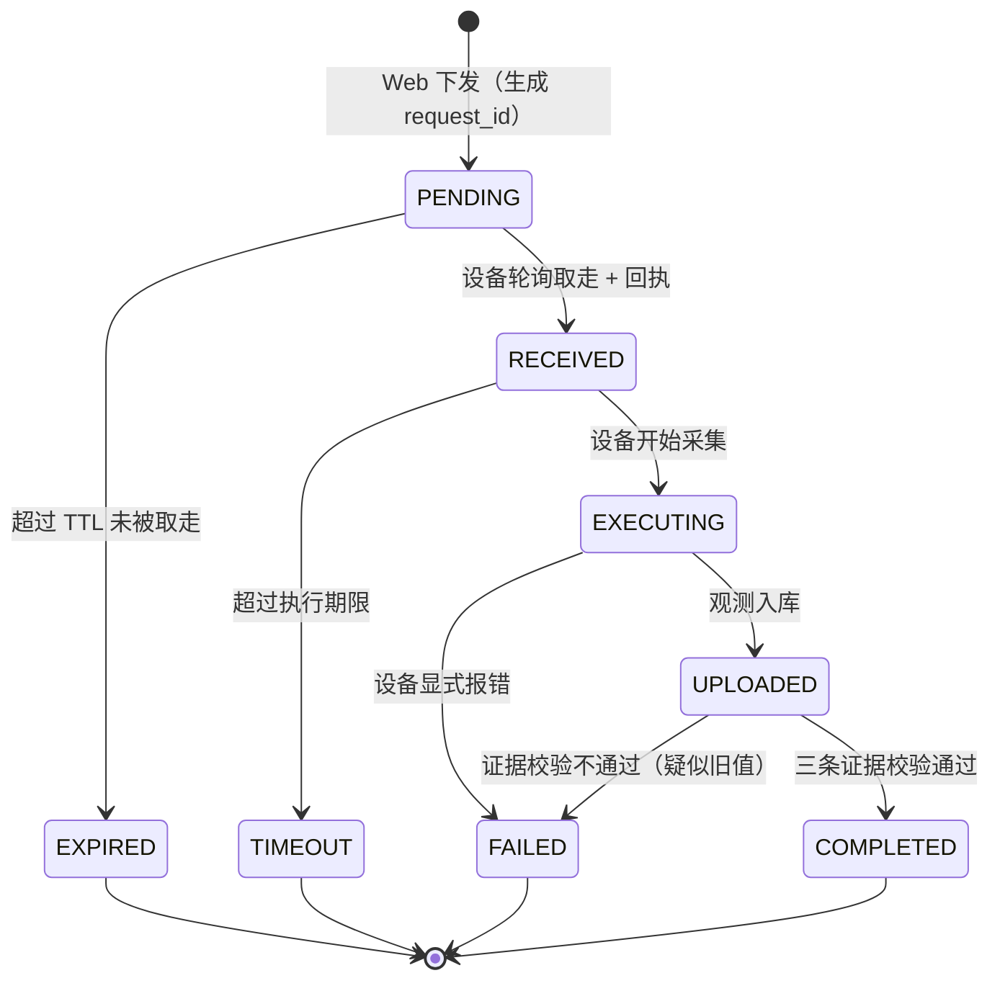

# EGO LINK 项目计划书

> **课程**：AI 交互课　**项目**：EGO LINK —— 可穿戴主动式 AI 伙伴
> **文档性质**：**规划文档，不含实现代码**（第 2 周作业要求：仅规划）
> **版本**：v1.0（2026-09-18）
> **适用周期**：第 2 周起至学期末

---

## 0. 阅读指引

本文档回答九个问题：

| 章节 | 回答的问题 |
|---|---|
| 1 | 项目要做成什么？现在到哪了？ |
| 2 | 整个学期分几个阶段、怎么迭代？ |
| 3 | **第 2 周（本周）具体做什么、怎么验收？** |
| 4 | 传感器数据链怎么搭？ |
| 5 | 多传感器怎么融合？ |
| 6 | 端侧模型和服务端模型怎么协同、网络怎么选？ |
| 7 | 模型怎么训、怎么评？ |
| 8 | 人机交互怎么测？ |
| 9 | GitHub 和文档怎么管？ |
| 10 | 初级→中级→高级怎么递进？ |

---

## 1. 项目定位与当前基线

### 1.1 项目定位

**EGO LINK**：一枚可穿戴的主动式 AI 伙伴（挂坠/胸针形态，烟熏玻璃外壳概念）。

它不做"你问它答"，而是**持续感知你的环境，在你需要之前先把信息准备好**。
技术内核是三条链：

```
感知链：IMU / 麦克风 / 摄像头 / 定位  →  时间对齐  →  数据入库
智能链：端侧轻模型（触发）  →  服务端大模型（理解）  →  主动建议
交互链：设备反馈（灯/震动/语音）  +  Web 控制台（状态可视、可追溯）
```

**课程内核**是"人与 AI 交互的技术实现"，所以第三条链（交互链）不是附属品，
而是**和感知、智能同等重要**的交付物 —— 第 2 周作业正是在补强它。

### 1.2 第 1 周基线（已完成，作为起点）

| 能力 | 现状 |
|---|---|
| 硬件 | ESP32-S3-EYE（N8R8）：QMA7981 IMU + OV2640 摄像头 |
| 采集 | IMU 1 Hz；摄像头按周期抓帧（JPEG，~20–25 KB/帧） |
| 传输 | Wi-Fi → HTTP POST 到本机服务器（`http://10.1.41.151:8000`） |
| 服务端 | Python 标准库 + SQLite，接口：`/api/ingest`、`/api/frame`、`/api/latest`、`/api/devices`、`/api/frame/latest` |
| 展示 | 单页 Web，显示最新数值 + 最新图像 |
| 方向 | **纯上行、周期驱动、无请求关联** |

**基线的关键缺口**（正是第 2 周要补的）：

1. **只有"设备想传就传"，没有"我想让它传它才传"** —— 无下行通道。
2. **无法区分"这是新数据"和"这是页面又把旧数据读了一遍"** —— 无请求关联标识。
3. **没有执行结果的追踪** —— 不知道一条指令到底执行了没有、卡在哪一步。

### 1.3 第 2 周作业的命题

课程讲义里那句话就是本周的题眼：

> **点击"采集一次最新数据"，怎样证明开发板进行了新采集，而非页面重新显示了数据库中的旧值？**

这不是一个"功能"问题，是一个**可验证性**问题。第 2 周的所有设计都围绕它展开。

---

## 2. 阶段划分与迭代节奏

### 2.1 迭代节奏（固定为一周一个迭代）

每个迭代遵守同一条流水线，**每次迭代结束必须向 GitHub 推一次**：

```
周一~周二   需求澄清 / 设计（含状态图、数据契约、接口）
周三~周四   实现（端 + 云 + 前端）
周五        当堂验证 + 自测（含异常路径）
周六        文档归档（迭代报告 + AI 对话与提示词记录）
周日        提交 GitHub（打 tag）+ 复盘 + 下一迭代计划
```

**硬规则**：迭代不跨周堆积。宁可砍范围，不可欠文档 ——
课程明确要求"保留从学期初到学期末的完整提交记录"。

### 2.2 阶段路线图

| 阶段 | 周次 | 主题 | 等级目标 |
|---|---|---|---|
| **P0** | 第 1 周 | 单传感器上行闭环 | 初级（已达成） |
| **P1** | **第 2 周** | **下行指令 + 执行结果追踪（本周）** | 初级→中级 |
| P2 | 第 3–4 周 | 传感器扩容：声音 + 定位；数据链补齐 | 中级（3–4 类） |
| P3 | 第 5–6 周 | 数据融合 + 端侧轻模型 | 中级 |
| P4 | 第 7–9 周 | 服务端多模态模型 + 端云协同；主动式服务雏形 | 中级→高级 |
| P5 | 第 10–12 周 | 鲁棒性 / 低功耗 / 响应速度；用户体验 A/B | 高级 |
| P6 | 第 13–16 周 | 外壳·结构·PCB 收敛；期末归档与演示 | 高级 |

### 2.3 能力主线（贯穿所有阶段）

四个能力维度**每阶段都要推进一点**，避免"最后才补"：

| 维度 | P1 | P2 | P3 | P4 | P5 |
|---|---|---|---|---|---|
| 数据链 | 双向（上+下行） | 多传感 + 断网缓冲 | 时间对齐 | 特征级融合 | 全链路可观测 |
| 智能 | 规则触发 | 事件检测 | 端侧轻模型 | 端云协同 | 模型热更新 |
| 交互 | 状态可视 + 可追溯 | 设备侧反馈 | 多通道反馈 | 主动建议 | 体验调优 |
| 工程 | 状态机 | 幂等/去重 | 功耗测量 | 延迟预算 | 鲁棒性测试 |

---

## 3. 第 2 周迭代详细计划（本周重点）

### 3.1 目标（可验收）

| # | 目标 | 验收方式 |
|---|---|---|
| G1 | Web 能**主动下发**一次抓拍指令到指定设备 | 点击后云端出现一条指令记录，状态为"待取" |
| G2 | 设备**取走并执行**，且 Web 能看到"设备已接收" | 状态推进到"已接收"，且带设备侧时间 |
| G3 | 抓拍结果**自动上传并刷新画框** | 页面出现新图，且图与本次请求绑定 |
| G4 | **能证明是新采集**（本题眼） | 三条证据齐全（见 3.4） |
| G5 | 异常路径可追踪：关机 / 重复点击 / 超时 | 状态分别落到"过期 / 独立追踪 / 超时"，且旧值不被冒充 |

### 3.2 核心概念：一次请求的完整生命周期

**交付物之一：首版状态图。** 建议状态集合：

| 状态 | 含义 | 谁写 |
|---|---|---|
| `PENDING` | 指令已创建，等待设备取走 | 服务端（下发时） |
| `RECEIVED` | 设备已取走并回执 | 设备（轮询后立即回执） |
| `EXECUTING` | 设备正在采集/上传 | 设备（可选，便于定位卡点） |
| `UPLOADED` | 图像/数据已入库 | 服务端（收到观测时） |
| `COMPLETED` | 闭环确认（证据校验通过） | 服务端（校验通过后） |
| `EXPIRED` | TTL 内无人取 | 服务端（超时判定） |
| `TIMEOUT` | 已取走但超时未回传 | 服务端（超时判定） |
| `FAILED` | 设备显式报错 | 设备 |

状态图（mermaid，GitHub 可直接渲染）：



**关键设计原则**：`UPLOADED` **不等于** `COMPLETED`。
收到一张图不代表它就是这次要的那张 —— 必须过证据校验才能算完成。

### 3.3 端到端时序（设计级）

| 步 | 发起方 | 动作 | 关键载荷 |
|---|---|---|---|
| 1 | Web | 下发抓拍指令（选设备、动作、TTL） | 服务端生成 `request_id` |
| 2 | 服务端 | 落库为 `PENDING`，进入该设备队列 | `request_id`, `device_id`, `action`, `expires_at` |
| 3 | 设备 | 周期轮询取指令（建议 5 s 一次） | `device_id` |
| 4 | 服务端 | 返回待执行指令（或空） | `request_id`, `action`, `expires_at` |
| 5 | 设备 | **立即回执** `RECEIVED` + 设备侧时间 | `request_id`, `device_ts`, `boot_id`, `seq` |
| 6 | 设备 | 采集 → 上传观测 | 图像 + **`request_id`** + `capture_ts` + `seq` |
| 7 | 服务端 | 入库 → 证据校验 → 置 `COMPLETED` | 校验结论 + 时间线 |
| 8 | Web | 轮询/长连状态，刷新画框与时间线 | 状态机全貌 |

**轮询周期建议 5 s**：教师参考实现里写的是"通常 5~15 秒"，
取 5 s 是为了让当堂验证时"点击 → 出图"的等待感可接受。

### 3.4 🔑 本题眼：怎么证明"是新采集"

**三条证据，缺一不可。** 这是第 2 周最重要的设计产出。

| # | 证据 | 机制 | 排除掉什么 |
|---|---|---|---|
| **E1** | **请求贯穿** | `request_id` 同时出现在①指令记录 ②设备回执 ③观测记录 | 排除"随便一张历史图被标成本次结果" |
| **E2** | **时序合理** | 观测的 `capture_ts` **必须晚于** 指令的 `dispatched_at` | 排除"库里旧图被重新提交" |
| **E3** | **新鲜度单调** | 设备随观测回传 `boot_id` + 递增 `seq`；同一次开机内 `seq` 必须**严格递增** | 排除"同一张图被重复上传冒充新拍" |

**E3 是关键补充**：E1+E2 只能证明"这条请求对应这张图"，
但如果设备把**上一次拍的同一张图**重传一次，E1/E2 都拦不住。
`boot_id + seq` 的单调性才能证明"这确实是新按了一次快门"。

> 实现层面的提示（留给执行阶段，本文不展开）：
> `seq` 用设备侧持久化的递增计数，重启后 `boot_id` 变化、`seq` 归零，
> 服务端按 `(boot_id, seq)` 组合判定单调性。

### 3.5 防"旧值冒充"的展示层设计

页面上**每张图旁边必须能直接读出它属于哪次请求**，让"旧值"无处藏身：

| 展示元素 | 作用 |
|---|---|
| 请求编号（短码） | 人眼可核对 |
| 拍摄时间 vs 指令下发时间 | 一眼看出先后 |
| 设备标识 + 开机序号 | 证明是这台设备、这一次开机 |
| 状态徽标 | 待取 / 已接收 / 已完成 / 超时 / 过期 |
| 状态时间线 | 每个状态的时间戳，卡在哪一步一目了然 |

**反例保护**：如果某次请求 `EXPIRED` 或 `TIMEOUT`，
页面上**对应位置必须显示"未完成"，绝不能显示库里的旧图**。
这一条是老师明确会考的。

### 3.6 异常与边界处理（老师明确会考）

| 场景 | 期望行为 | 禁止行为 |
|---|---|---|
| 设备**关机**时下发 | 请求停在 `PENDING`，TTL 后转 `EXPIRED` | ❌ 把库里旧值标成"本次完成" |
| **重复点击**下发 | 每次生成独立 `request_id`，各自独立追踪 | ❌ 两次点击共用一条记录导致状态混乱 |
| 设备取了但**没回传** | 转 `TIMEOUT`，保留"已接收"的证据 | ❌ 直接判定"硬件故障"（讲义原话：超时不直接判定硬件故障） |
| 上传了但**证据不全** | 转 `FAILED`，标注"疑似旧值/无法关联" | ❌ 静默算作成功 |
| **暂停周期上报** | 命令通道保持可用，命令触发仍能出新数据 | ❌ 周期上报一停，命令通道也断 |

### 3.7 当堂验证脚本（提前自跑一遍）

按讲义"当堂验证"一节，准备四步：

1. **暂停周期上报**，保持命令通道 → 页面上数据应停止增长。
2. 改变设备状态（把板子转向别处 / 换个场景）→ **点击"采集一次最新数据"**。
3. 核对：出现**新观测**，且**新观测的 request_id 与本次一致**，画面内容确实变了。
4. **关闭设备**后再发一次 → 等待 → 应显示"等待/超时"，**且旧值没有被改标为本次完成**。

### 3.8 备用路径（讲义明确要求）

按优先级准备三条路：

| 优先级 | 路径 | 说明 |
|---|---|---|
| A | 实物端到端 | 板子 + 服务器 + Web 全链路真机 |
| B | 本地可测服务 | 用本地可测试服务先把**任务逻辑**（状态机、幂等、超时）跑通，端侧后接 |
| C | 共享设备轮流 | 多组共用设备时轮流完成"真实下发→执行→回传" |

**红线**：任何**模拟回执必须明确标注**（如状态徽标写"模拟"），
**不得作为实物命令通过的证据**。讲义原文如此。

> 结合第 1 周的实际经验：链路本身可能不稳定（曾出现约 98% 的请求失败率，
> 排除了防火墙/服务端/省电/聚合/摄像头后定位到校园网 AP 侧）。
> 因此**路径 B 不是备胎，是本周的主力开发环境** —— 先在本地把逻辑跑扎实，
> 真机验证作为"验收"而非"调试"。这一条直接来自第 1 周的教训。

### 3.9 第 2 周交付物清单

| # | 交付物 | 形式 |
|---|---|---|
| D1 | 远程采集功能 | 代码（端 + 云 + 前端） |
| D2 | 请求—设备回执—新观测 三者关联的记录 | 数据库记录 + 页面展示 |
| D3 | **首版状态图** | 本文 3.2 节，迭代后更新 |
| D4 | 数据契约与接口设计 | 文档 |
| D5 | 当堂验证记录（含异常路径截图） | 文档 |
| D6 | 迭代报告 + AI 对话与提示词记录 | `docs/` |
| D7 | GitHub 提交 + tag `v0.2-remote-capture` | 仓库 |

### 3.10 第 2 周风险与应对

| 风险 | 影响 | 应对 |
|---|---|---|
| 校园网链路不稳（第 1 周已实证） | 真机验证失败率高 | 主力走路径 B；真机验证挑"好窗口"做，或改用手机热点 |
| 轮询引入延迟（5 s） | 当堂演示等待感差 | 轮询周期可调；页面显示"已下发，等待设备取走"的倒计时 |
| 设备侧时钟未同步（第 1 周 SNTP 曾失败） | E2 时序校验不可靠 | 用 `(boot_id, seq)` 单调性做兜底；时间戳标注"未同步" |
| 重复点击造成记录混乱 | 追踪失效 | `request_id` 独立生成 + 幂等设计 |
| 范围蔓延 | 本周交付不完 | 严守 3.1 的 G1–G5，其他一律推到 P2 |

---

## 4. 传感器数据链设计

### 4.1 传感器清单与选型

| 传感器 | 器件/方案 | 采样率 | 单次体积 | 阶段 |
|---|---|---|---|---|
| 惯性（IMU） | QMA7981（板载） | 1–50 Hz 可调 | ~120 B | P0 已有 |
| 图像 | OV2640（板载） | 事件/周期触发 | 20–25 KB（SVGA） | P0 已有 |
| 声音 | I2S 数字麦克风（如 INMP441） | 16 kHz 单声道 | 1 s ≈ 32 KB（PCM） | P2 |
| 定位 | Wi-Fi 指纹 / GNSS 模块 | 事件触发 | ~100 B | P2 |
| 环境（可选） | 温湿度 / 光照 | 0.1 Hz | ~50 B | P2+ |

**选型原则**：能板载就板载，能事件触发就不周期采样 —— 可穿戴设备的功耗预算是硬约束。

### 4.2 数据链分层

```
① 感知层   传感器驱动，产出"原始读数 + 单调时钟时间戳"
② 对齐层   统一时间基准，标注同步状态（已同步/未同步）
③ 缓冲层   Flash 驻留队列（断网不丢数据，恢复后补传）
④ 传输层   HTTP 上行（当前）→ 评估 MQTT/WebSocket（P2）
⑤ 存储层   SQLite（当前）→ 评估时序库（P4，数据量上来后）
⑥ 服务层   接口 / 状态机 / 模型推理
⑦ 交互层   Web 控制台 + 设备侧反馈
```

**第 1 周已验证的教训直接写进设计**：
- 时间戳**拿不到就诚实标注**，绝不伪造（第 1 周已实现 `uptime+12.6s(time_not_synced)`）。
- **断网缓冲**不是可选项 —— 讲义参考实现里也提到"断网期间捕获帧自动驻留 Flash 待恢复上传"。

### 4.3 时间基准（三重保险）

| 机制 | 作用 | 失效时的兜底 |
|---|---|---|
| SNTP 对时 | 绝对时间（跨设备可比） | 标注"未同步"，用运行时长 |
| 单调时钟 | 同一次开机内可排序 | —— |
| `boot_id` + `seq` | 跨重启可判新鲜度 | —— |

**三者的分工**：SNTP 管"什么时候"，单调时钟管"先后"，`boot_id+seq` 管"是不是新的"。

### 4.4 数据契约（每类传感器统一字段）

所有观测记录共用一张"信封"，传感器差异放在 `payload` 里：

| 字段 | 说明 | 必填 |
|---|---|---|
| `device_id` | 设备标识 | ✅ |
| `sensor` | 传感源类型 | ✅ |
| `unit` | 物理单位（g / Pa / px …） | ✅ |
| `ts_device` | 设备侧时间（未同步时标注） | ✅ |
| `ts_server` | 服务端入库时间 | ✅ |
| `boot_id` | 本次开机标识 | ✅ |
| `seq` | 开机内递增序号 | ✅ |
| `request_id` | **本次所属请求**（命令触发时） | 命令触发必填 |
| `capture_ts` | 采集时刻（用于时序校验） | ✅ |
| `payload` | 传感器特有数据 | ✅ |

**统一信封的好处**：状态机的证据校验（E1/E2/E3）可以**一套逻辑覆盖所有传感器**，
不用为每种传感器重写。

### 4.5 数据保留与配额

教师参考实现里已有"云端保留时长"和"配额到期已清除原图、元数据与哈希完整保留"的设计，
本项目沿用并明确规则：

| 层级 | 保留策略 | 理由 |
|---|---|---|
| 元数据（含哈希） | **永久保留** | 可追溯性；哈希能证明"这张图当时确实是这个内容" |
| 原图 | 按配额清理（开发期 7 天） | 控制存储 |
| 特征/模型输入 | 视训练需要导出 | —— |

**哈希留痕是加分项**：它让"这张图有没有被改过"成为可验证的事实。

---

## 5. 数据融合方案设计

### 5.1 融合层级选择

| 层级 | 做法 | 本项目采用 |
|---|---|---|
| 像素级 | 多模态原始信号直接拼接 | ❌ 异构传感器不适用 |
| **特征级** | 各模态抽特征后拼接/注意力融合 | ✅ P3–P4 主力 |
| **决策级** | 各模态独立判决后投票/规则融合 | ✅ P1–P2 主力（成本低、可解释） |

**策略**：**决策级先行、特征级跟进**。先用规则把多模态串起来（P2–P3），
再上模型做特征级融合（P4）。这样每一步都可单独验证，不会"一次上大模型全黑盒"。

### 5.2 融合的核心机制：事件触发 + 时间窗对齐

```
滑动时间窗（建议 ±200 ms）
   ├── IMU 事件：姿态突变 / 静止→运动
   ├── 声音事件：人声 / 关键词
   ├── 视觉：画面显著变化
   └── 定位：位置变化
        ↓
   融合判决（规则 → 模型）
        ↓
   动作：抓拍 / 上传 / 语音提示 / 静默
```

**为什么用时间窗**：异构传感器采样率差几个数量级（IMU 50 Hz vs 定位事件级），
硬对齐做不到，只能"窗口内视为同一事件"。

### 5.3 融合用例（按阶段落地）

| 用例 | 融合模态 | 价值 | 阶段 |
|---|---|---|---|
| **举起即拍** | IMU + 视觉 | 省电：不靠周期抓帧，靠姿态事件触发 | P3 |
| **有人说话才听** | 声音 + 视觉 | 减少无效录音/上传 | P3 |
| **"我在看什么"** | 视觉 + IMU + 定位 | 主动式服务的核心输入 | P4 |
| **场景变化提醒** | 视觉 + 定位 | 位置变了 + 画面变了 → 生成建议 | P4 |
| **多模态检索** | 视觉 + 文本 | 用自然语言搜"上周在图书馆看到的那本书" | P4 |

### 5.4 融合的评估方式

融合好不好，不能只看单模态指标。定义**融合增益**：

| 指标 | 定义 |
|---|---|
| 误触发率 | 单位时间误触发次数（次/小时）—— 可穿戴设备最痛的点 |
| 漏触发率 | 该触发没触发的比例 |
| 端到端延迟 | 事件发生 → 建议呈现 |
| 单模态对比 | 关掉某一模态后，指标掉多少（证明该模态确实有贡献） |

**"关掉一个模态看指标掉多少"** 是验证融合有效性的最直接办法，也便于写进报告。

---

## 6. 端云模型协同与网络结构选型

### 6.1 协同架构（主选：级联式）

```
端侧（ESP32-S3，算力/功耗受限）
  └─ 轻量模型：唤醒词 / 运动事件 / 画面显著变化
       ↓ 只在"有事发生"时唤醒
服务端（算力充足）
  └─ 大模型：场景理解 / 语音识别 / 多模态融合 / 主动建议生成
```

**为什么级联**：可穿戴设备的电池是硬约束。端侧常开一个 10 KB 级的小模型，
比持续把数据传到云端省电几个数量级。

### 6.2 三种协同模式（渐进采用）

| 模式 | 做法 | 采用阶段 |
|---|---|---|
| **A. 端侧触发 → 云端理解** | 端侧只做"要不要处理"的判断 | P3（主选） |
| **B. 端侧预筛 → 云端精算** | 端侧置信度低于阈值才上传原图 | P4 |
| **C. 云端下发模型更新** | 服务端训练好轻量模型，推给设备 | P5（加分项） |

### 6.3 网络结构选型

**端侧（部署在 ESP32-S3 上）**

| 任务 | 候选结构 | 选型理由 |
|---|---|---|
| 唤醒词 / 关键词 | **DS-CNN**（深度可分离卷积） | 参数量小、专为 MCU 设计、社区实现成熟 |
| 运动事件分类 | **1D-CNN** 或 轻量 LSTM | IMU 是时序信号，1D-CNN 足够且更快 |
| 画面显著变化 | 传统 CV（帧差 / 直方图）+ 阈值 | 不需要神经网络，最省 |
| 轻量视觉分类（可选） | **MobileNetV3-Small** / MCUNet 系列 | 若必须端侧看图，选最小可用结构 |

**服务端**

| 任务 | 候选结构 | 选型理由 |
|---|---|---|
| 图像理解 / 检索 | **CLIP 类双塔**（图像编码器 + 文本编码器） | 天然支持"用文字搜图"，契合主动式服务 |
| 场景描述 / 建议生成 | **VLM**（视觉语言模型） | 直接产出自然语言建议 |
| 多模态融合 | **注意力融合层 / 门控融合** | 可按模态置信度动态加权 |
| 语音识别 | 成熟 ASR 方案 | 不自研，直接复用 |

**选型原则**：**端侧用最小可用模型，服务端用成熟大模型**。
课程核心是"人机交互的技术实现"，不是模型刷分 —— 把工程链路和交互体验做扎实优先。

### 6.4 延迟与功耗预算

| 环节 | 目标 | 依据 |
|---|---|---|
| 端侧唤醒 | < 100 ms | 用户感知不到延迟 |
| 端→云上传（一帧 SVGA） | < 500 ms（局域网） | 25 KB 在当前链路上可接受 |
| 云端推理 | < 1.5 s | 建议生成 |
| **端到端"看到→建议"** | **< 2 s** | 超过 2 s 用户会觉得"它没反应" |
| 待机功耗 | 目标 < 50 mA @3.7 V | 可穿戴基本盘 |

### 6.5 通信方式演进

| 阶段 | 方式 | 理由 |
|---|---|---|
| P1（本周） | **HTTP 轮询**（5 s） | 复用第 1 周已验证的通信，本周不重写底层协议（讲义要求） |
| P2 | 评估 **MQTT** | 长连、低功耗、天然支持下行 |
| P3+ | 评估 **WebSocket** | 需要实时双向时 |

**注意**：第 2 周**不重写底层通信协议** —— 讲义明确"不在本周重写底层通信协议"。
所以本周是"在 HTTP 之上加一层命令语义"，不是换协议。

---

## 7. 模型训练与评估方法

### 7.1 数据采集与标注

| 步骤 | 做法 |
|---|---|
| 采集 | 用本项目自己的设备采集（真实场景优于公开数据集，也更契合课程要求） |
| 预标注 | 用现成模型先跑一遍，人工只做校正（省时间） |
| 划分 | 按**时间/场景**划分训练/验证/测试，不按随机划分（避免数据泄漏） |
| 版本 | 数据集打版本号，与模型版本对应记录 |

**划分方式的坑**：连续采集的数据随机划分会导致"训练集和测试集高度相似"，
指标虚高。按时间段划分才反映真实泛化能力。

### 7.2 训练方案

| 层级 | 方案 |
|---|---|
| 端侧 | **迁移学习**为主：冻结主干 + 微调分类头；训练后 **int8 量化** |
| 服务端 | 复用预训练大模型；需要定制时用 **LoRA 等轻量微调**，不从头训 |
| 融合层 | 单独训练，输入是各模态的特征/置信度 |

### 7.3 评估指标（分三层）

| 层级 | 指标 | 为什么重要 |
|---|---|---|
| 端侧 | 准确率 / 召回率、**误触发率（次/小时）**、推理延迟（ms）、峰值电流（mA） | 可穿戴设备的可用性由"误触发"和"功耗"决定，不是准确率 |
| 服务端 | Top-k 准确率、端到端延迟、建议采纳率 | 建议没人采纳 = 白做 |
| 交互 | 任务完成率、平均响应时延、用户信任评分 | 课程核心指标 |

**注意**：**误触发率**在本项目里比准确率更重要。
一个每 10 分钟误拍一次的可穿戴设备，用户第二天就会摘掉。

### 7.4 评估方法

- **离线评估**：固定测试集出指标。
- **消融实验**：关掉某个模态/模块，看指标掉多少 → 证明每个部分都有贡献。
- **在线 A/B**：同一场景下两种策略交替，比较用户反馈（P5）。
- **回归测试**：每次迭代跑同一套固定用例，防止新功能破坏旧行为。

---

## 8. 人机交互与用户体验测试安排

### 8.1 交互通道设计

| 通道 | 载体 | 用途 | 阶段 |
|---|---|---|---|
| 视觉（设备） | RGB LED / 小屏 | 状态提示（待机/正在处理/完成/错误） | P2 |
| 触觉 | 震动马达 | 静默提醒（不打扰他人） | P3 |
| 语音 | 扬声器 | 主动建议播报 | P4 |
| **Web 控制台** | 浏览器 | 全状态可视、可追溯、可回放 | P1（本周） |

**本周重点在 Web 控制台**：它是"可追溯性"的载体，也是本周作业的验收面。

### 8.2 用户体验测试安排

| 频次 | 形式 | 样本 | 产出 |
|---|---|---|---|
| 每迭代 | 自测 + 组内互测 | 1–2 人 | 问题清单 |
| 每 2 迭代 | 任务脚本测试 | ≥ 3 人 | 完成率、耗时、卡点 |
| P4 起 | 半结构化访谈 + 量表 | ≥ 5 人 | 信任度、意愿度、改进项 |

**任务脚本示例**（第 2 周就能用）：
> "请你让设备现在拍一张照片，并告诉我你怎么确认这是刚拍的、而不是之前那张。"

用户答不上来 → 说明可追溯性设计还不够直观 → 下一迭代改进展示层。

### 8.3 迭代闭环

```
用户反馈 → 问题清单 → 按"影响面 × 修复成本"排序 → 取前 2–3 项进入下一迭代
                                              ↓
                                        其余进 backlog（不丢）
```

**每迭代只解决 2–3 个用户问题**，避免范围蔓延。

### 8.4 信任度是核心指标

主动式 AI 最大的风险是"用户不信任它"。要测的不只是"好不好用"，还有：

- 用户是否**知道它什么时候在工作**（状态可见性）
- 用户是否**能关掉它**（可控性）
- 出错时用户是否**能理解为什么**（可解释性）

第 2 周的状态机 + 时间线，本质上就是在为这三条打地基。

---

## 9. GitHub 提交与文档管理规范

### 9.1 仓库结构（建议）

```
zuoye/
├── README.md                    # 仓库导航（总入口）
├── docs/
│   ├── 项目计划书.md             # 本文档
│   ├── 架构与协议.md             # 数据链、数据契约、接口
│   ├── 状态机.md                 # 随迭代更新
│   ├── ai-log/                  # ★ 与 AI 的对话与主要提示词（课程硬性要求）
│   │   ├── README.md            # 记录方法说明
│   │   └── 2026-09-18-week2.md
│   └── 迭代报告/
│       └── week2.md
├── ai_week/                     # 全部作业内容（不分周次）
│   ├── firmware/  server/  tools/     # 设备端 / 服务端 / 辅助脚本
│   ├── archive/                 # 迭代过程中的单版本文档
│   └── 第二周作业-…（版本迭代稿）.md   # 本作业主交付
└── hardware/                    # 外壳 / 结构 / PCB（P6）
```

### 9.2 提交规范

**分支**：`main` 保持可用；功能开发走 `feat/<主题>`，验证通过后合并。

**提交信息**（Conventional Commits）：

| 前缀 | 用途 |
|---|---|
| `feat:` | 新功能 |
| `fix:` | 修 bug |
| `docs:` | 文档 |
| `exp:` | 实验性改动（可回退） |
| `chore:` | 杂项 |

**每迭代一次 tag**：`v0.2-remote-capture`、`v0.3-multi-sensor` …

**讲义硬性要求**："每完成一个版本须上传 GitHub 进行一次迭代" ——
所以**提交频率要跟迭代节奏绑定**，不要攒到期末一次性提交。
从第 1 周起已有 10 个提交，节奏是健康的，保持住。

### 9.3 ★ AI 对话与提示词记录（课程明确要求，容易漏）

课程要求保留"与 AI 的对话、主要提示词"。建议**固定格式**归档：

| 字段 | 内容 |
|---|---|
| 日期 / 迭代 | 2026-09-18 / Week 2 |
| 意图 | 这一轮想让 AI 做什么 |
| 主要提示词 | **原文**（不是复述） |
| 产出 | AI 给了什么 |
| 人工修改 | 我改了什么、为什么改 |
| 踩坑 | 这轮踩到什么坑（可引用复盘文档） |

**为什么要记"人工修改"**：课程考核的是"你与 AI 协作的能力"，
而不是"AI 单独能做什么"。**你改了什么**才是你的贡献。

> 第 1 周已有的 `项目复盘与踩坑记录.md` 就是这份记录的一个好样板，
> 建议把它的格式延续到每周。

### 9.4 提交前自查清单

- [ ] 凭据（Wi-Fi 密码、令牌）**没有**进版本库
- [ ] 大文件（安装包、数据集、模型权重）已 `.gitignore`
- [ ] 本周迭代报告已写
- [ ] AI 对话与提示词记录已归档
- [ ] 状态图 / 数据契约已同步更新
- [ ] 仓库仍是公开的（或按需调整），且文档里没写错可见性

> 第 1 周踩过的坑：**Wi-Fi 密码被提交进了公开仓库**。
> 后续所有迭代都要过一遍这个清单。

---

## 10. 能力递进路径（初级 → 中级 → 高级）

### 10.1 对照表

| 等级 | 课程要求 | 本项目达成路径 | 达成时点 |
|---|---|---|---|
| **初级** | 采集 1–2 个传感器；数据融合 + 模型训练；部署并测试交互效果 | IMU + 摄像头两类；决策级融合（事件触发）；端侧小模型 + 云端模型；Web 控制台交互测试 | P1 末（第 2 周） |
| **中级** | 传感器类别 3–4 种或更多 | 增加**声音 + 定位** → 共 4 类；特征级融合；数据链补齐断网缓冲 | P2 末（第 4 周） |
| **高级** | 更高质量工程实现、更低功耗、更快响应、更好鲁棒性 | 功耗测量与优化（待机电流）；端到端延迟压到 < 2 s；鲁棒性测试（断网/弱网/异常输入）；模型热更新 | P5 末（第 12 周） |

### 10.2 各等级的"证据"（老师怎么看出来）

| 等级 | 需要能拿出的证据 |
|---|---|
| 初级 | 两类传感器数据入库截图；融合规则的说明；模型训练与评估记录；交互测试记录 |
| 中级 | 四类传感器数据链；断网补传的验证；特征级融合的消融实验 |
| 高级 | 功耗实测数据（前后对比）；延迟测量数据；鲁棒性测试用例与通过率；A/B 对比结果 |

**关键**：**证据要在每次迭代中随手积累**，不要期末补。
这也是"每迭代一次提交"的深层原因。

### 10.3 递进的核心原则

1. **每升一级只加一个维度**：先加传感器，再加融合，再加模型，最后加优化。
   同时上多个维度必然失控。
2. **每级都要能独立演示**：中级做完了，初级的功能仍然要能跑。
   不要"为了中级把初级拆了"。
3. **工程质量的提升来自约束，不来自堆功能**：
   低功耗、快响应、鲁棒性，都是"在限制下做选择"的结果。

---

## 11. 里程碑与时间表

| 里程碑 | 时点 | 关键产出 | tag |
|---|---|---|---|
| M0 基线 | 第 1 周 ✅ | 单传感器上行闭环 | `v0.1` |
| **M1 指令闭环** | **第 2 周** | **远程抓拍 + 状态机 + 可追溯** | `v0.2-remote-capture` |
| M2 多传感 | 第 4 周 | 4 类传感器 + 断网缓冲 | `v0.3-multi-sensor` |
| M3 融合+端侧 | 第 6 周 | 决策级融合 + 端侧触发模型 | `v0.4-fusion` |
| M4 端云协同 | 第 9 周 | 特征级融合 + 主动建议雏形 | `v0.5-proactive` |
| M5 体验优化 | 第 12 周 | 功耗/延迟/鲁棒性达标 | `v0.6-optimized` |
| M6 期末 | 第 16 周 | 外壳/结构/PCB + 完整文档 + 演示 | `v1.0` |

---

## 12. 风险清单

| # | 风险 | 概率 | 影响 | 应对 |
|---|---|---|---|---|
| R1 | **校园网链路不稳**（第 1 周实证 98% 失败率） | 高 | 高 | 主力用本地可测服务开发；真机验证挑好窗口；必要时手机热点 |
| R2 | 设备侧时钟不可用（SNTP 曾失败） | 中 | 中 | `boot_id + seq` 兜底；时间戳诚实标注"未同步" |
| R3 | 功耗预算超支（多传感器常开） | 中 | 高 | 事件触发优先；端侧模型常开、其余按需唤醒 |
| R4 | 范围蔓延导致迭代欠交付 | 高 | 中 | 严守每迭代目标；其余进 backlog |
| R5 | 凭据/大文件误入公开仓库 | 中 | 高 | 提交前自查清单（9.4） |
| R6 | 模型效果不达标 | 中 | 中 | 端侧用成熟结构；服务端复用预训练；不追刷分 |
| R7 | AI 协作记录缺失（课程硬性要求） | 中 | 高 | 固定格式归档，每迭代必写 |

---

## 13. 第 2 周立即要做的事（仅列行动，不含实现）

1. 定稿**状态集合与状态图**（本文 3.2），贴进 `docs/状态机.md`。
2. 定稿**数据契约**（本文 4.4），尤其 `request_id` / `boot_id` / `seq` 三个字段。
3. 定稿**接口清单**（下发 / 轮询 / 回执 / 状态查询），写成 `docs/架构与协议.md`。
4. 搭**本地可测服务**（路径 B），把状态机、幂等、超时逻辑先跑通。
5. 端侧接命令轮询与回执（复用第 1 周已验证的通信，不重写底层协议）。
6. 前端补**状态徽标 + 时间线 + 请求短码**，让"旧值冒充"无处藏身。
7. 跑一遍**当堂验证四步**（本文 3.7），留截图。
8. 写**迭代报告 + AI 对话与提示词记录**，提交 GitHub 并打 tag `v0.2-remote-capture`。

---

## 附：与第 1 周的衔接

第 1 周留下的三份资产直接复用：

| 资产 | 位置 | 本周怎么用 |
|---|---|---|
| 通信链路与服务端 | `ai_week/server/` | 在 HTTP 之上加命令语义，不重写协议 |
| 踩坑记录 | `ai_week/项目复盘与踩坑记录.md` | 作为"AI 对话与提示词记录"的格式样板 |
| 环境与构建流程 | `.idf_launch.py` / `tools/run_idf.py` | 直接用，本周不折腾工具链 |

**一条来自第 1 周的硬教训**：
排查问题要**先分层证明"不是谁的问题"**，再怀疑最可疑的一环。
第 1 周花了大量时间在固件里反复试，最后发现是网络环境 ——
所以本周的**主力开发环境选本地可测服务**，就是这个教训的直接应用。

---

_本文档为规划文档。第 2 周实现完成后，请回到第 3 节更新实际达成情况与偏差原因。_
