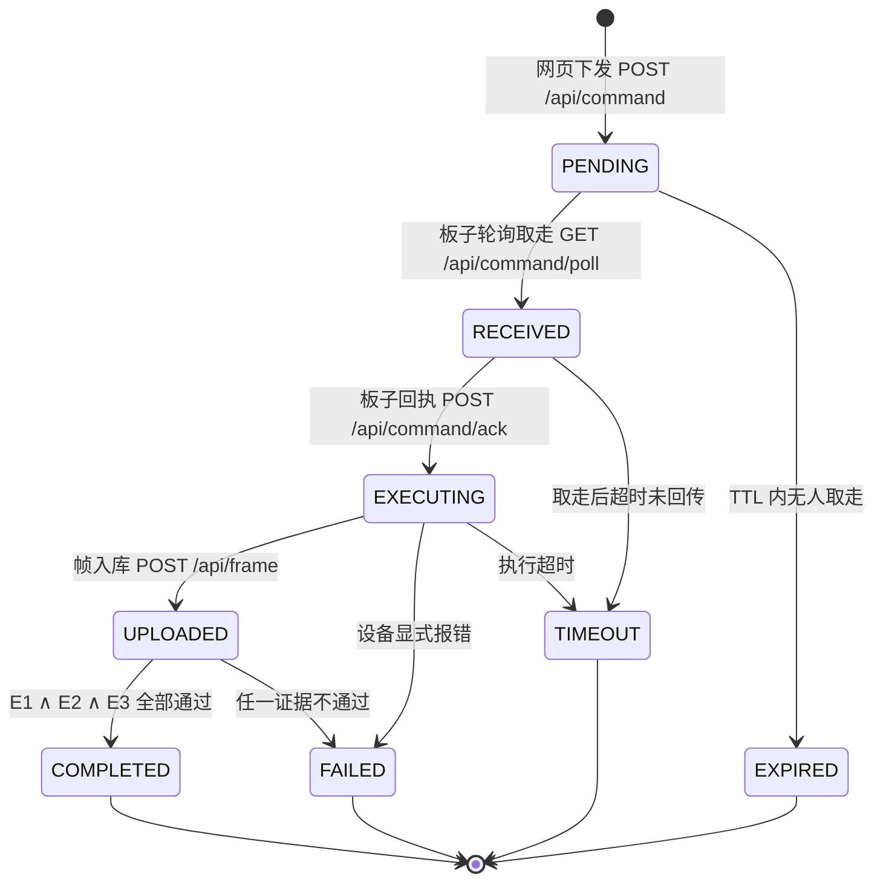
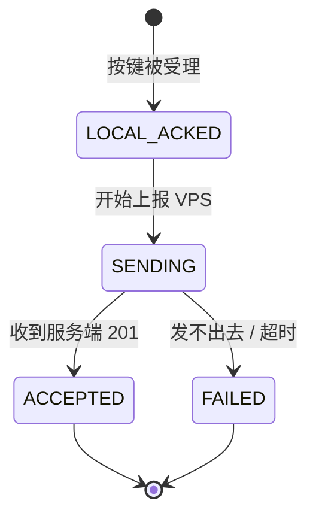
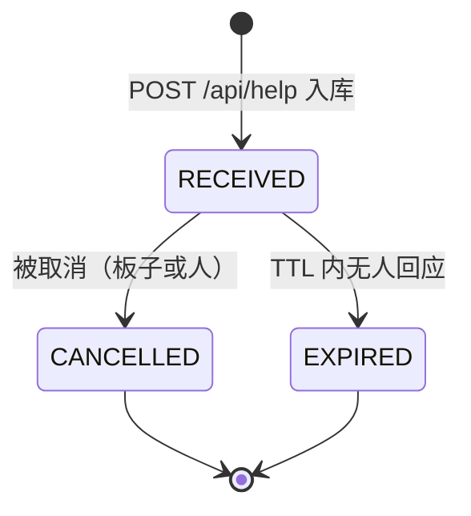
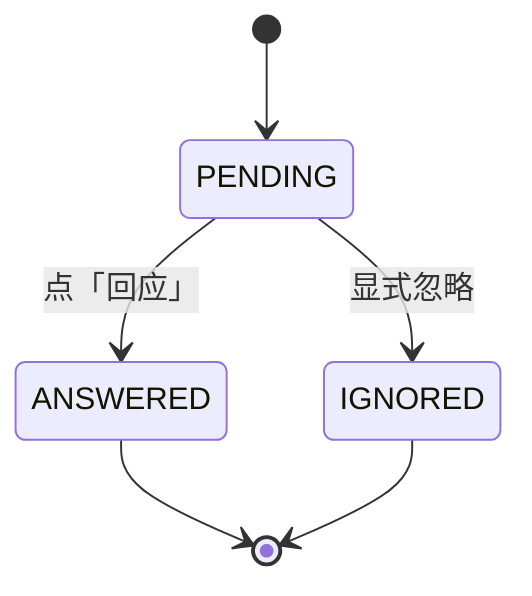

# 状态机与数据契约

> **这份文档是什么。** 第 2 周的交付物之一是「首版状态图」。计划书 §3.2 里那版是**设计稿**；
> 本文是**实现态**——每个状态、每个字段都能在代码里指到具体位置，改错了会被自测拦住。
> 两者差异见第九节（不是推翻，是"后来加了什么"）。
>
> 配套脚本：`server/trace_closed_loop.py`（把一次采集的三处记录并排打出来）、
> `server/selftest_command.py`（25 项断言，含两个反例场景）。

---

## 一、为什么状态要单独成文

第 2 周的题眼是：**怎样证明开发板进行了新采集，而不是页面重新显示了数据库里的旧值？**

这个问题的答案不是某个字段，而是**一条链**：谁下的单 → 板子有没有接 → 采到没有 → 采到的是不是这一单要的那张。
链上每一环都必须有**自己的**记录，且这些记录要能对上。

所以"状态机"在这里不是画着好看的图，它承担三件事：

1. **定义"完成"到底是什么。** 收到一张图 ≠ 完成。少了这个区分，"旧值冒充"就成立了。
2. **让"卡住"可归因。** 是没人来取，还是取了没干完？这两件事的排查方向完全相反。
3. **给三处记录一个共同的锚。** 那个锚就是 `request_id`。

---

## 二、指令状态机（第 2 周核心交付物）

### 2.1 状态图



### 2.2 状态取值

| 状态 | 页面文案 | 含义 | 谁推进的 |
|---|---|---|---|
| `PENDING` | 待设备取走 | 已创建，还没人取 | 网页下发 |
| `RECEIVED` | 设备已接收 | 板子取走了（**取走即置**，不依赖板子回话） | 板子轮询 |
| `EXECUTING` | 设备执行中 | 板子回执说开始采集了 | 板子回执 |
| `UPLOADED` | 观测已入库 | 收到帧了，**但还没过证据校验** | 服务端收帧 |
| `COMPLETED` | 已完成 | 三条证据齐全 | 服务端校验 |
| `EXPIRED` | 已过期（无设备取走） | TTL 内没人取 → **找人** | 后台扫描 |
| `TIMEOUT` | 已超时（取走未回传） | 取了但没干完 → **找活** | 后台扫描 |
| `FAILED` | 失败 | 设备显式报错，或证据不通过 | 板子 / 服务端 |

终态集合：`COMPLETED` / `EXPIRED` / `TIMEOUT` / `FAILED`（`server.py:FINAL_STATES`）。
落到终态后后台扫描不再改动它。

### 2.3 两条铁律

**① `UPLOADED ≠ COMPLETED`。**
收到帧只说明"图来了"，不说明"图是这次要的"。中间隔着证据校验。
把它俩合成一个状态，第 2 周的题眼当场失守。

**② 超时不判硬件故障。**
`EXPIRED` 和 `TIMEOUT` 必须分开，因为**排查方向相反**：

| 状态 | 说明 | 先查什么 |
|---|---|---|
| `EXPIRED` | 板子根本没来取 | 板子是否在线（掉电？没连上 Wi-Fi？）—— **不是摄像头的问题** |
| `TIMEOUT` | 板子取了，但没干完 | 板子侧执行（拍失败？传失败？看串口）—— 网络差也会走这条 |

混成一个 `TIMEOUT`，排障时就会去查错东西。这也是为什么**绝不把超时写成 `FAILED`**——
"这次没拿到结果"和"设备坏了"是两件事。

---

## 三、三条证据（E1 / E2 / E3）

服务器**自动校验**，不是人肉判断。全部通过才允许置 `COMPLETED`。

| 编号 | 判据 | 拦住的作弊方式 | 代码位置 |
|---|---|---|---|
| **E1** | 观测携带的 `request_id` 必须等于本次指令的 | 随便传一张与请求无关的图 | `server.py:667` |
| **E2** | 观测的 `capture_ts` 必须**晚于**指令的 `dispatched_at` | 把数据库里的旧图重新提交一遍 | `server.py:671` |
| **E3** | 同一 `boot_id` 内 `seq` 必须**严格递增** | 同一张图重传冒充新拍 | `server.py:680` |

### 3.1 ★ 一个必须说清的细节：E2 可能被跳过，兜底的是 E3

板子的 SNTP 常年失败（本机实测），这时板端报上来的 `capture_ts` 是
`uptime+812.500s(time_not_synced)` 这种**没有绝对时间含义**的值，
拿它跟服务端的 `dispatched_at` 比大小是没有意义的。

所以 E2 在"板端时间不可信"时会跳过，改由 **E3 兜底**——
`boot_id + seq` 不依赖任何时钟：`seq` 是同一次开机内的自增序号，
它严格递增就说明"这是一次新的采集动作"，跟钟准不准无关。

**这正是 `boot_id + seq` 存在的意义。** 它不是给 E2 打补丁，它是**时钟不可信时的替代判据**。

### 3.2 ★ E3 单行判不了

`trace_closed_loop.py` 第一版在这里踩了坑：它只看指令行，发现"有 `boot_id`、有 `seq`"就打了"E3 通过"。
结果在 `FAILED` 案例里输出成"三条证据全通过，但服务端判 `evidence_ok=0`"——
看起来像服务端有 bug。

真实原因：E3 要跟**同一个 `boot_id` 的上一条** `seq` 比，
而"上一条"不在本行的任何字段里。**单行判不了的东西，不该硬判。**
现在脚本把 E3 明确标成"单行判不了"，结论一律以服务端的 `evidence_ok` 为准。

> **教训**：一个判据不完整的"独立校验"，比不做校验更糟——
> 它会造出一个假矛盾，把排查引到错误的方向上。

---

## 四、帧的来源：这张图算不算"新采集"

同一个 `frames` 表里躺着三种来源完全不同的帧。**不区分来源，第 2 周的题眼会被"补传"重新破一次。**

| `source` | 谁产生的 | `request_id` | `capture_ts` 的位置 | 算不算"本次新采集" |
|---|---|---|---|---|
| `web_manual` | 网页点了「远程采集」，板子拍完立刻传 | **必须有** | 在下发时刻**之后** | ✅ 是，且必须过 E1/E2/E3 |
| `periodic` | 板子每 2 秒自己拍一张 | 必须**没有** | 与任何指令无关 | ❌ 不算；但它是"板子活着"的旁证 |
| `backlog` | 断网期间存进 Flash，恢复后补传 | **绝不能有** | 在**过去**，且带 `buffered_s` | ❌ 明确不算 |

三条硬规则：

1. **`backlog` + `request_id` 一起出现 → 服务端直接 400 拒收**（`server.py:1202`）。
   不是静默忽略——忽略会让板子拿到 201 以为成功，而服务端悄悄丢掉了绑定关系，
   两边对"这一帧到底属于谁"的理解从此不一致。
2. **补传帧不参与任何命令闭环**。实现方式是在入口就断掉：
   补传帧一旦带 `request_id` 直接 400，于是它根本走不到 `_link_command_frame`，
   也就没有任何机会去推进指令状态（`server.py:1202`）。
3. **网页必须给补传帧打徽标**，并把三个时间分开显示
   （板端钟只作参考 / 在队列里待了多久 / 服务端收到时刻，判定用第三个）。

细节见《断网补传设计说明.md》。

---

## 五、求助事件的三层状态（第 3 周，与第 2 周同源的错误形态）

### 5.1 为什么不是一个 `state` 字段

第 3 周的题眼是：**佩戴者按下按键，自己和查看信息的人分别应获得什么反馈？**

一次求助里同时存在**三个来源不同、谁也替不了谁**的事实：

- ① 板子自己说"按键受理了"—— **只有板子知道**（板子的钟）
- ② 服务端自己说"我收到了"—— **只有服务端知道**（服务端自己打的时间戳）
- ③ 网页前的人说"我回应了"—— **只有人知道**

把它们压成一个 `state`，就会出现"服务端收到就算完成"这种偷换——
**那正是第 2 周"旧值冒充"的同类错误：拿一个来源的事实去冒充另一个来源的事实。**
只是这次冒充的不是时间，是"谁确认了"。

所以**分三列存**（`help_events` 表）。

### 5.2 ① `device_state` —— 板端自报（板子的钟）



对应板载 LED 闪烁码（`firmware/main/help_btn.c`）：
慢闪 = `LOCAL_ACKED`、快闪 = `SENDING`、常亮 = `ACCEPTED`、急闪 ×10 = `FAILED`。

**`LOCAL_ACKED` 不依赖网络** —— `help_btn_init()` 放在连 Wi-Fi 之前。
断网时按键照样有本地反馈，这是第 3 周当堂验证要看的。

### 5.3 ② `server_state` —— 服务端自己判定（服务端自己打的 `received_at`）



**服务端绝不采信板端报的时间。** 板子报的 `pressed_at` / `sent_at` 原样存着只作参考，
判定一律用服务端自己打的 `received_at`。

### 5.4 ③ `viewer_state` —— 查看者侧



### 5.5 三条铁律

1. **超时只改 `server_state`。**
   `EXPIRED` ≠ 板子没发出来 ≠ 人拒绝了。超时是**服务端**的判断，
   它无权改写"板子确认过"和"人回应过"这两个事实。三层压一层，这里就看不出来了。
2. **已回应的求助不能再取消**（返回 **409**）。
   回应是人的动作，取消是系统动作，后者不该抹掉前者。
3. **重复取消幂等**（200 + note），**重复回应是 409**。
   取消是"确认一个已经成立的事实"，重放无害；回应是"再表态一次"，会覆盖前一次的表态。

---

## 六、状态 → 表 / 字段 / 接口 / 代码 对照

| 状态 | 存储位置 | 谁写 | 接口 | 代码 |
|---|---|---|---|---|
| `PENDING` | `commands.state` | 网页 | `POST /api/command` | `server.py:1735` |
| `RECEIVED` | 同上 | 板子轮询 | `GET /api/command/poll` | `server.py:1777` |
| `EXECUTING` | 同上 + `boot_id`/`seq`/`device_ts` | 板子回执 | `POST /api/command/ack` | `server.py:1815` |
| `UPLOADED` | 同上 + `capture_ts`/`frame_id` | 服务端收帧 | `POST /api/frame` | `server.py:1153` |
| `COMPLETED` | 同上 + `evidence_ok=1` | 服务端校验 | — | `server.py:660` |
| `EXPIRED`/`TIMEOUT` | 同上 + `fail_reason` | 后台扫描 | 被动 | `server.py:696` |
| `device_state` | `help_events.device_state` | 板子 | `POST /api/help` | `server.py:1445` |
| `server_state` | `help_events.server_state` | 服务端 | 同上 + 后台 | `server.py:1445` |
| `viewer_state` | `help_events.viewer_state` | 网页 | `POST /api/help/answer` | `server.py:1642` |

---

## 七、一次完整闭环的真实追踪记录

跑 `python server/trace_closed_loop.py` 得到（真实输出，未编辑）：

```
======================================================================
一次远程采集的三处记录 · request_id = req-20260923-103538-da16
======================================================================

① 指令记录（commands 表）—— 谁下的、下到哪一步了
  device_id      trace-demo-103538-9250
  action         capture
  created_at     2026-09-23T10:35:38.024+08:00    # 网页点下按钮的时刻
  dispatched_at  2026-09-23T10:35:38.051+08:00    # 板子取走的时刻（不是创建时刻）
  ttl_s          60
  state          COMPLETED    # 已完成

② 设备回执（板子报上来的，服务端原样存着）
  boot_id        boot-trace-9250    # 哪一次开机 —— E3 的比较范围
  seq            1    # 这次开机内第几帧 —— E3 的单调性依据
  device_ts      2026-09-23T10:35:38.063+08:00    # 板子的钟，只作参考
  ack_at         2026-09-23T10:35:38.085+08:00    # 服务端的钟，收到回执的时刻
  capture_ts     2026-09-23T10:35:38.147+08:00    # 板子说这一帧是什么时候采的

③ 观测记录（frames 表）—— 图本身的元数据
  frames.id      1
  source         web_manual    # web_manual=命令触发 / periodic=周期 / backlog=补传
  capture_ts     2026-09-23T10:35:38.147+08:00
  ts_server      2026-09-23T10:35:38.148+08:00    # 服务端收到的时刻 —— 判定用它
  bytes          68
  sha256         709dc00ddf008fc7f0790db641811db3…    # 原图内容指纹，防「换图」
  command_state  COMPLETED    # 这一帧所属指令当前的状态

服务端的判定（这是唯一权威结论）
  evidence_ok    1    # 三条证据齐全

时间线（看出卡在哪一步）
   1. PENDING      2026-09-23T10:35:38.024+08:00  网页下发指令
   2. RECEIVED     2026-09-23T10:35:38.051+08:00  设备取走并回执
   3. EXECUTING    2026-09-23T10:35:38.085+08:00  设备开始采集
   4. UPLOADED     2026-09-23T10:35:38.147+08:00  观测入库
   5. COMPLETED    2026-09-23T10:35:38.159+08:00  闭环结束
```

**同一个 `request_id` 出现在 ① ② ③ 三处** —— 这就是"请求—设备回执—新观测记录"这条交付物。
三者对不上，说明链路上有一环是"看起来对"而不是"真的对"。

脚本对失败路径会给归因结论，例如 `EXPIRED`：

```
结论
  **没有新采集**，而且问题不在板子：指令 TTL 内**没人来取**。
  → 先查板子是否在线（掉电/没连上 Wi-Fi），别去查摄像头。
```

`FAILED`：

```
结论
  **不能算新采集**：证据校验没通过，已记 FAILED。
  → 看上面的 fail_reason，它直接写清了是哪一条证据不过。
```

---

## 八、怎么自己跑

```bash
cd server

# 1) 状态机自测：25 项断言，含「设备关机」「重复点击」「旧值冒充」「重复上传」四个场景
python selftest_command.py                    # 打已经在跑的服务端

# 2) 三处记录追踪：跑一次闭环，然后并排打出来
python trace_closed_loop.py

# 3) 真机跑完之后，追踪那条真实指令（只读，不改任何状态）
python trace_closed_loop.py --request-id req-20260923-xxxxxx

# 4) 追最近一条
python trace_closed_loop.py --latest --device s3eye-group07
```

两个脚本都**显式绕开本机 HTTP 代理**（`ProxyHandler({})`）——
本机 Clash 会把连 `127.0.0.1` 的请求也劫走，返回 502 或 `IncompleteRead`，
不绕开的话自测会全红，而服务端日志一切正常。

---

## 九、迭代记录：首版 → 现在

计划书 §3.2 的首版状态图只有 4 个状态 + 3 个异常态（`PENDING/RECEIVED/EXECUTING/COMPLETED`
+ `EXPIRED/TIMEOUT/FAILED`），**没有 `UPLOADED`**。

| 变更 | 为什么 |
|---|---|
| **新增 `UPLOADED`** | 首版把"收到帧"直接当完成。但收到帧 ≠ 帧是这次要的。拆出 `UPLOADED` 才放得下证据校验 |
| **明确 `EXPIRED` / `TIMEOUT` 的归因分工** | 首版只区分了状态名，没写清"这两个的排查方向相反" |
| **新增帧的 `source` 维度** | 断网补传落地后，`frames` 表里出现了采集时刻在**过去**的帧。不加来源标记，"补传帧冒充新采集"会重演第 2 周的错 |
| **新增求助三层状态** | 第 3 周。形态不同，病根相同（拿一个来源的事实冒充另一个来源的） |

**没变的**：`request_id` 是唯一的锚；`UPLOADED ≠ COMPLETED`；超时不判硬件故障。
这三条从首版到现在一次都没松过。
