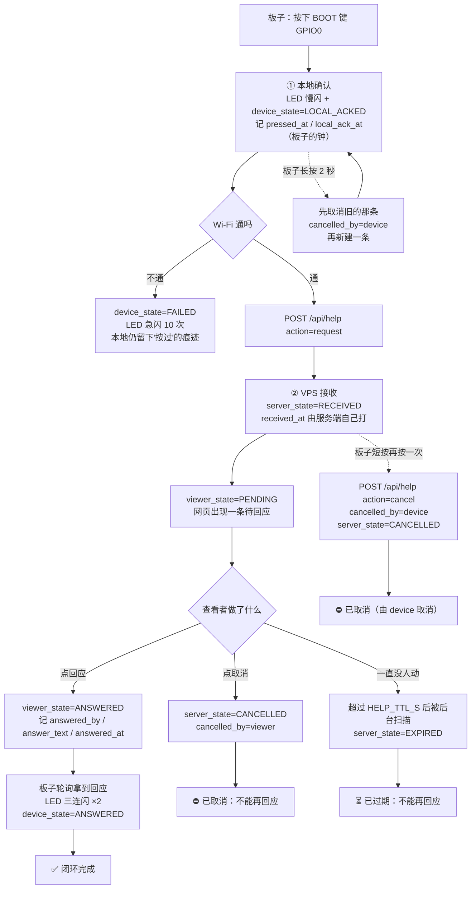

# 第三周 · 按键触发与物理反馈闭环

> 本周不新建工程，仍在第 1、2 周那套固件与同一个服务端上增量叠加。
> 一句话概括增量：**方向反过来了 —— 不再是网页让板子做事，而是板子按键主动发起，由人来回应。**
> 而这件事真正的难点不在"按键能不能触发"，在于**三种状态必须能区分**。

---

## 一、课程要求 → 落地情况对照

| 课程要求 | 落地位置 | 状态 |
|---|---|---|
| 增加"按键发起教学求助测试消息" | `firmware/main/help_btn.c` · 短按 GPIO0 | 已实现 |
| 讲解本地确认、VPS 接收、查看者回应的区别 | 本文第二节 + `server.py` 三列状态设计 | 已实现 |
| 绘制简要流程并**明确取消** | 本文第二节流程简图（含取消路径） | 已实现 |
| 复用板端上传与 VPS 任务能力 | 复用 `main.c` 的 Wi-Fi / HTTP / boot_id / seq 基建 | 已实现 |
| 增加按键/触摸、屏幕/灯光/蜂鸣 | 按键 GPIO0 + 板载 LED GPIO3 闪烁码 | 部分（屏幕见第七节） |
| 实现触发 → 本地反馈 → 远端显示 → 回应/取消 | 全链路打通，`selftest_help.py` 15 组断言 | 已实现 |
| 本地、VPS 和查看者状态可区分 | `help_events` 表三列 + 网页三张状态卡 | 已实现 |
| 同伴操作走查 | 本文第八节（7 项清单 + `server/walkthrough_help.py` 引导式走查，证据自动落盘） | 工具就绪，待同伴实操 |
| 首次三课接口检查 | 本文第九节 | 已实现 |

---

## 二、流程简图（含取消路径）

### 2.1 一次求助的完整生命周期



### 2.2 取消的两条路径，以及一条走不通的路

| 谁取消 | 接口 | 记录 | 允许吗 |
|---|---|---|---|
| 板子（按键） | `POST /api/help` `action=cancel` | `cancelled_by=device` | ✅ 允许 |
| 查看者（网页） | `POST /api/help/cancel` | `cancelled_by=viewer` | ✅ 允许 |
| **任何人** | 对**已被回应**的求助取消 | —— | ❌ **409 拒绝** |

第三条是刻意堵死的：**回应是既成事实，不能让发起方单方面抹掉**。
如果允许"先回应、再被取消"，网页上就再也说不清"这件事到底有没有人管过"——
这和第 2 周不许拿旧图冒充新采集是同一个道理：**已经发生的事实不能被后来的操作改写**。

重复取消则是幂等的（返回 200 + `note`），因为"已经是取消状态"和"刚刚被你取消"对用户是同一个结果，
没必要报错。但重复**回应**是 409 —— 回应带内容，两条不同内容不能都算数。

---

## 三、三层状态：谁说的算（本周题眼）

一次求助里同时存在**三个来源不同、谁也替不了谁**的事实，所以分成三列存，绝不压成一个 `state`：

| 层 | 字段 | 谁才知道 | 时间戳由谁打 | 压成一个 state 会怎样 |
|---|---|---|---|---|
| ① 本地确认 | `device_state` | 只有**板子**知道按键被受理了 | 板子的钟（`pressed_at` / `local_ack_at`） | 网络一断，"按过没按过"就说不清了 |
| ② VPS 接收 | `server_state` | 只有**服务端**知道自己收到了 | 服务端的钟（`received_at`，**服务端自己打**） | 会退化成"服务端收到 = 完成"这种偷换 |
| ③ 查看者回应 | `viewer_state` | 只有**人**知道 | 人的动作时刻（`answered_at`） | "没人回应"会被误读成"板子没发出来" |

三条铁律：

1. **服务端绝不采信板端报上来的时间。**
   板子报的 `pressed_at` 原样存进库（那是"板子的一面之词"，也是排查线索），
   但**判定一律用服务端自己打的 `received_at`**。
   自测第 3 组专门验证这一点：板子故意报一个"昨天"的假时刻，`received_at` 仍是当前时间。
2. **超时只改 `server_state`。**
   后台扫描把超时无人回应的标成 `EXPIRED`，`device_state` 与 `viewer_state` **一动不动**。
   「没人回应」是服务端的判断，既不等于「板子没发出来」，也不等于「人拒绝了」。
   这正是第 2 周「EXPIRED 找人 / TIMEOUT 找活」那条归因原则在求助通道上的同一套逻辑。
3. **网页把三个来源分别摆出来。**
   求助卡片上并排三张状态格，每格底下写明"这是谁的钟"。
   页面替任何一方说话都是造假。

---

## 四、物理反馈：引脚依据与闪烁码

引脚取值全部来自乐鑫官方 ESP-BSP（`bsp/esp32_s3_eye/include/bsp/esp32_s3_eye.h`），不是猜的：

| 用途 | 宏 | GPIO | 说明 |
|---|---|---|---|
| 按键 | `BSP_BUTTON_5_IO` | **GPIO 0** | 板载 BOOT 键，**板上唯一可自由读取的按键** |
| 灯光 | `BSP_LED_1_IO` | **GPIO 3** | 模组指示灯，**必须开漏（OD）驱动** |
| 蜂鸣器 | `BSP_CAPS_AUDIO_SPEAKER = 0` | —— | **板载没有扬声器/蜂鸣器**，故 `BUZZER_ENABLE=0` |

> ⚠️ GPIO3 这颗灯走的是开漏驱动，直接推挽拉高有可能烧掉 LED（v2.2 板为此加了限流电阻 R83）。
> 代码里按开漏语义写：`gpio_set_level(HELP_LED_GPIO, on ? 0 : 1)` —— **低电平点亮**。

### 闪烁码（一眼可区分，不用看串口）

| 板端状态 | LED 表现 | 含义 |
|---|---|---|
| `IDLE` | 常灭 | 没事 |
| `LOCAL_ACKED` | 慢闪（150ms 亮 / 850ms 灭） | **板子已受理**，正在往外发 |
| `SENDING` | 快闪（100ms / 100ms） | 正在发 |
| `ACCEPTED` | **常亮** | VPS 已接收 |
| `ANSWERED` | 三连闪 ×2 轮 | 查看者已回应 |
| `CANCELLED` | 长闪 ×4 | 已取消 |
| `FAILED` | 急闪 ×10 | 失败 |

**顺序很重要：先本地确认，再碰网络。**
`help_btn_init()` 放在 `app_main()` 里连 Wi-Fi **之前** —— 物理反馈不该依赖网络，
网断了灯也得亮，否则用户连"板子到底收没收到我这一按"都判断不了。

---

## 五、接口清单（第 3 周新增）

| 方法 | 路径 | 谁调用 | 作用 |
|---|---|---|---|
| POST | `/api/help` | 板子 | 发起（`action=request`）或取消（`action=cancel`） |
| GET | `/api/help/poll?device_id=X&event_id=Y` | 板子 | 轮询：查看者回应了吗？被取消了吗？ |
| GET | `/api/help?device_id=X&limit=N` | 网页 | 列出求助事件 + `pending_count` |
| POST | `/api/help/answer` | 网页 | 查看者回应（`answered_by` / `answer_text`） |
| POST | `/api/help/cancel` | 网页 | 查看者取消 |

状态码约定：`201` 新建 / `200` 成功（含幂等重复取消）/ `400` 参数不合法 / `404` 事件不存在 / **`409` 状态冲突**。
409 的三种情形：已被回应不能再取消、已取消不能再回应、已过期不能再回应。

---

## 六、自测与验证证据

`server/selftest_help.py` —— 15 组断言，**连接真实服务端**（自起隔离实例 `PORT=8013`，跑完自删数据目录）：

```
结果：全部通过
```

重点不在"功能能不能用"，而在**三个来源的事实有没有被混在一起**：

| 组 | 验的是什么 |
|---|---|
| 1–2 | 正常闭环；三层状态各自带自己的时间戳，`clock_sources` 分 `device`/`server`/`viewer` 三组 |
| **3** | ★ 服务端不采信板端报的时间：假时刻原样存着，`received_at` 不受影响 |
| 4–5 | 查看者回应；板端轮询能拿到回应人与回应内容 |
| **6** | ★ 已回应的求助不能再取消 → 409 |
| 7 | 板端取消，`cancelled_by` 必须是 `device` |
| **8** | ★ 已取消的求助不能再回应 → 409 |
| 9 | 重复取消幂等（200 而不是报错） |
| 10–11 | 查看者取消 `cancelled_by=viewer`；空回应被拒（400） |
| **12** | ★ 超时只改 `server_state`，另两层原样不动 |
| 13–15 | 网页列表与 `pending_count`；参数校验；**老接口无回归** |

第 1、2 周的两套自测同步回归，确认三周叠加没有互相破坏：

```
selftest_command.py   →  25/25 通过
selftest_gallery.py   →  全部通过
```

网页侧另有两项静态校验（临时脚本，跑完即删）：
`JS_SYNTAX_OK` / `ALL_DOM_IDS_OK(37)` / `ALL_API_ROUTES_OK(12)`；
渲染层 11 项断言全过，含"回应内容被 HTML 转义（不注入）"与"已回应/已取消/已过期的按钮该禁用的都禁用了"。

---

## 七、诚实记录：本周没做屏幕，以及为什么

课程实践里提到"屏幕/灯光/蜂鸣"。**屏幕（LCD）本周刻意没接**，理由如下：

1. 板载 LCD 是 **240×240 RGB565，走 SPI3_HOST**，`PCLK=21 / DATA0=47 / DC=43 / CS=44 / RST=NC / BACKLIGHT=48`，
   官方 BSP 里标了 `BSP_LCD_BIGENDIAN=1` —— **字节序需要真机确认**。
2. 本机当前**没有接板子**，我无法验证颜色/字节序是否正确。
   提交一份"看起来能跑、实际不亮或花屏"的代码，比不提交更糟 ——
   它会把后面所有人的排查方向带偏。
3. 灯光已经把三层状态表达清楚了（见第四节闪烁码），信息量足够支撑本周的验证目标。
4. 接入方法已写清（引脚表 + `esp_lcd_panel_st7789` 是 ESP-IDF 自带驱动，无需外部组件），
   等板子到手可以随时补上，属于**增量**而不是返工。

蜂鸣器同理：`BSP_CAPS_AUDIO_SPEAKER = 0`，板上没有扬声器。
`app_config.h` 里留了 `BUZZER_ENABLE` / `BUZZER_GPIO` 开关（走 LEDC），默认关。

---

## 八、同伴操作走查记录

> 走查目的：**让没写过这份代码的人，在不看说明的情况下，能不能只靠界面判断"现在是谁在等谁"。**

### 8.1 走查清单（每项都要同伴独立操作并给出判断）

| # | 操作 | 期望同伴能说出 | 记录 |
|---|---|---|---|
| 1 | 板子短按 BOOT 键 | "板子的灯变了" + 说出变了几次、什么节奏 | 待填 |
| 2 | 看网页求助区 | 指出三层状态格分别是"谁说的" | 待填 |
| 3 | 点「回应」并填内容 | 说出版子灯变成了什么（三连闪 ×2） | 待填 |
| 4 | 对**已回应**的那条点「取消」 | 按钮应该是灰的；若强行调接口应看到 409 | 待填 |
| 5 | 板子长按 2 秒 | 说出"旧的那条被取消、新的那条是新的" | 待填 |
| 6 | 拔掉板子电源后再看网页 | 指出超时后**只有服务端那格变了**，另外两格没变 | 待填 |
| 7 | 问同伴：这条"已过期"是不是等于"板子没发出来"？ | 应回答**不等于** | 待填 |

### 8.2 走查怎么执行（用脚本引导，证据自动落盘）

走查记录的价值在于**它是第三方真实操作的产物**。如果由写代码的人（或 AI）代填，
那它就不是走查记录，只是一张表。所以这里做了个取舍：

```bash
cd server
python walkthrough_help.py            # 默认走查 http://127.0.0.1:8000
python walkthrough_help.py http://127.0.0.1:8000 --out ../走查记录-按键求助.md
```

脚本**刻意只干两件事**：

| 谁来做 | 做什么 | 为什么 |
|---|---|---|
| 脚本（机器） | 每一步去查真实接口，把**系统当时的实际状态**抓下来、盖时间戳 | 这部分人没法编，也不需要人抄 |
| 同伴（人） | 写下"我实际看到了什么、我怎么判断的" | 这部分**只能人写**；不写就如实留「（未填写）」 |

脚本会打印每一步的操作指引与期望结论，等同伴按回车后自动抓状态，
最后生成一份 markdown，**两栏分开标注**，一眼能看出哪一栏是机器抓的、哪一栏是人写的。
它**绝不替同伴生成一句听起来合理的描述** —— 代填等于造假。

走查前的准备：板子上电并连上 Wi-Fi，先短按 BOOT 键发起一条求助；
否则第 1/3/5 步没有素材，脚本会在开始前就提醒（而不是走完一遍才发现全是空的）。

第 6 步（超时）真等 5 分钟不现实，脚本会指向自动化断言
（`selftest_help.py` 第 12 组「★ 超时只改 `server_state`，另两层不动」）作为机制证据，
走查时只需看那条断言的结论。

### 8.3 走查记录（脚本生成后由同伴确认）

> 下方表格由 `walkthrough_help.py` 输出到 `走查记录-按键求助.md`，
> 这里保留结构说明。**「同伴的判断」一栏必须是人写的**，未填就留「（未填写）」。

| 项目 | 内容 |
|---|---|
| 走查日期 | 由脚本自动填写 |
| 走查人（同伴） | 同伴输入 |
| 走查环境 | 同伴输入 |
| 逐步记录（7 步） | 每步含：期望同伴能说出 / **系统实际状态（脚本抓取）** / **同伴的判断（人工填写）** |
| 卡住的地方 | 同伴输入 |
| 同伴的改进建议 | 同伴输入 |
| 据此做的修改 | 走查后按反馈实际改了什么，逐条写；没有就写「无」 |

---

## 九、首次三课接口检查

三周的功能叠在同一个 `server.py` 上，所以必须做一次**跨周接口一致性检查**，
确认新通道没有把老通道改坏。检查项如下（已在第 6 节的自测里逐条跑过）：

| # | 检查项 | 结论 |
|---|---|---|
| 1 | 第 1 周上报链路 `/api/ingest`、`/api/latest`、`/api/history`、`/api/devices` 未受影响 | ✅ |
| 2 | 第 1 周图像链路 `/api/frame`、`/api/frame/latest` 未受影响 | ✅ |
| 3 | 第 2 周指令状态机 `/api/command*` 25 项断言全过 | ✅ |
| 4 | 第 2 周"未完成不回落旧图"（`/api/command/frame` 返回 404）仍然保持 | ✅ |
| 5 | 第 2 周画廊与配额清理自测全过 | ✅ |
| 6 | 第 3 周求助通道 15 组断言全过 | ✅ |
| 7 | 三条通道的**时间戳口径**一致：板端统一 `make_device_timestamp` / `help_ts`，服务端统一 `now_iso()` | ✅ |
| 8 | `boot_id` / `seq` 在指令通道与求助通道里语义一致（同一次开机内递增） | ✅ |
| 9 | 新增表用独立主键（`help_events.event_id`），**没有**照抄 `commands` 的自增 `id` | ✅（曾踩坑，见第十节） |
| 10 | 任何 handler 抛异常都会留下日志并回 500，不再静默断连接 | ✅（本周新增兜底） |

---

## 十、本周踩的两个坑（都记在 `项目复盘与踩坑记录.md`）

1. **照抄索引踩空**：`help_events` 用 `event_id`(TEXT) 做主键，没有自增 `id` 列，
   但我建索引和查询时照抄了 `commands` 表的 `ORDER BY id DESC` →
   服务端**启动即崩**（`sqlite3.OperationalError: no such column: id`）。
   教训：**新表先确认主键形态，再写排序**，别按肌肉记忆复制。

2. **接口抛异常只看到"断连接"**：
   列表接口同样用了 `ORDER BY id`，运行时抛异常 → HTTP 层直接断开，
   客户端只看到 `RemoteDisconnected: Remote end closed connection without response`，
   服务端连一行日志都没有，只能靠猜。
   这次顺手补了**分发层兜底**：`do_GET` / `do_POST` 外层统一 try/except，
   打印完整 traceback 并回 500 JSON。
   这和上周 `_send_json` 漏写响应体那次是同一类问题 ——
   **错误发生在响应写出之后或之外时，必须有兜底，否则排查成本极高。**

---

## 十一、已知限制

- **板子→电脑这条 Wi-Fi 链路质量很差**（第 1 周起就存在，非代码可解）：
  `ping` 不丢包但延迟在 3ms~770ms 剧烈抖动，板子 SNTP 对时失败，
  频繁 `esp-tls: select() timeout`。求助消息同样受此影响 ——
  服务端日志看到 `201`、板子却报失败是**可能同时发生**的。
  排查这类矛盾时先对比两边时间戳与条数，别一上来就怀疑代码。
- 求助事件当前**没有做通知**（不会弹窗、不会响），只有网页列表 + 待回应计数。
  要不要加声音/桌面通知，等走查反馈再定。
