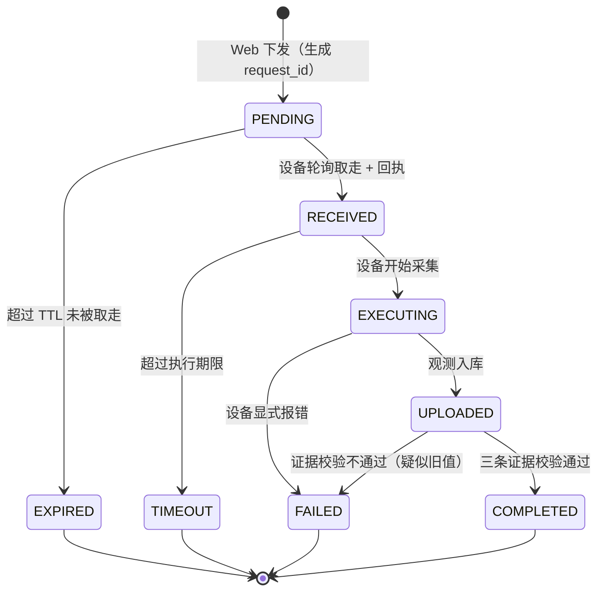

# EGO LINK · 第二周作业

## 项目计划与四课实施教学组织方案（版本迭代稿）

> **课程**：AI 交互课　**项目**：EGO LINK —— 可穿戴主动式 AI 伙伴
> **作业性质**：第 2 周作业 —— **同一份作业的两次版本迭代**，合为一册
> **版本**：v1.1（2026-09-18）　**文档性质**：规划 + 教学组织（不含实现代码）

---

## 关于本文档（版本迭代说明）

这是**同一份作业的两次版本迭代**，合为一册，不是两份独立作业。

| 版本 | 文档 | 定位 | 回答的问题 | 位置 |
|---|---|---|---|---|
| **v1.0** | 项目计划书 | **规划层** | 做什么、为什么这么做（学期级路线图） | 第一部分 |
| **v1.1** | 四课实施与教学组织方案 | **落地层** | 怎么教、怎么练、怎么验收（四课级） | 第二部分 |

**迭代原则：v1.1 只增不改。**
v1.0 的全部设计 —— 状态机、三条证据、数据契约、端云协同选型、能力递进路径 ——
在 v1.1 中**仍然有效**；v1.1 只是把它拆到“四节课”的粒度上，让规划可执行、可验收。

### v1.1 相对 v1.0 的增量清单

| # | 增量 | 位置 |
|---|---|---|
| 1 | 把计划书的 P1 阶段拆成**四节课**，逐课给出目标 / 知识点 / 设备 / 步骤 / 成果 / 验收 / 排错 | 第二部分 §2–§5 |
| 2 | 立**三条不变式** I1 / I2 / I3（第 2 课立，第 3、4 课只引用不重讲） | 第二部分 §1.1 |
| 3 | 数据契约新增 `trigger` 字段（`periodic` / `remote` / `button` / `nl`） | 第二部分 §1.4 |
| 4 | 新增「**接口只加不破**」红线 + 三课接口检查表 | 第二部分 §1.3、§4.9 |
| 5 | 新增第 2 课 **P9 实现红线**：图像区必须改为按 `request_id` 取图 | 第二部分 §3.7 |
| 6 | 新增第 3 课**三种“知道了”**：本地确认 / VPS 接收 / 查看者回应 | 第二部分 §4.3 |
| 7 | 新增第 4 课**证据约束回复表**（无证据不得回“已采集成功”） | 第二部分 §5.4 |
| 8 | 新增课堂实践三段式、分组与设备分配、证据收集清单、评分建议 | 第二部分 §7 |
| 9 | 新增跨课故障速查表 | 第二部分 §8 |

### 阅读建议

| 你的目的 | 读哪部分 |
|---|---|
| 看“这门作业要做什么、为什么这么做” | **第一部分**（v1.0） |
| 看“四节课怎么上、交什么、怎么判” | **第二部分**（v1.1） |
| 看两版之间的逐项差异 | 文末 **附录 · v1.0 → v1.1 迭代对照表** |

**两部分共用同一套技术内核**，不冲突：
状态机（第一部分 §3.2 = 第二部分 §3.3）、三条证据（§3.4 = §3.4）、数据契约（§4.4 = §1.4）。

---

# 第一部分 · v1.0 项目计划书（规划层）

---

> **课程**：AI 交互课　**项目**：EGO LINK —— 可穿戴主动式 AI 伙伴
> **文档性质**：**规划文档，不含实现代码**（第 2 周作业要求：仅规划）
> **版本**：v1.0（2026-09-18）
> **适用周期**：第 2 周起至学期末

---

## 0. 阅读指引

本文档回答九个问题：

| 章节 | 回答的问题 |
|---|---|
| 1 | 项目要做成什么？现在到哪了？ |
| 2 | 整个学期分几个阶段、怎么迭代？ |
| 3 | **第 2 周（本周）具体做什么、怎么验收？** |
| 4 | 传感器数据链怎么搭？ |
| 5 | 多传感器怎么融合？ |
| 6 | 端侧模型和服务端模型怎么协同、网络怎么选？ |
| 7 | 模型怎么训、怎么评？ |
| 8 | 人机交互怎么测？ |
| 9 | GitHub 和文档怎么管？ |
| 10 | 初级→中级→高级怎么递进？ |

---

## 1. 项目定位与当前基线

### 1.1 项目定位

**EGO LINK**：一枚可穿戴的主动式 AI 伙伴（挂坠/胸针形态，烟熏玻璃外壳概念）。

它不做"你问它答"，而是**持续感知你的环境，在你需要之前先把信息准备好**。
技术内核是三条链：

```
感知链：IMU / 麦克风 / 摄像头 / 定位  →  时间对齐  →  数据入库
智能链：端侧轻模型（触发）  →  服务端大模型（理解）  →  主动建议
交互链：设备反馈（灯/震动/语音）  +  Web 控制台（状态可视、可追溯）
```

**课程内核**是"人与 AI 交互的技术实现"，所以第三条链（交互链）不是附属品，
而是**和感知、智能同等重要**的交付物 —— 第 2 周作业正是在补强它。

### 1.2 第 1 周基线（已完成，作为起点）

| 能力 | 现状 |
|---|---|
| 硬件 | ESP32-S3-EYE（N8R8）：QMA7981 IMU + OV2640 摄像头 |
| 采集 | IMU 1 Hz；摄像头按周期抓帧（JPEG，~20–25 KB/帧） |
| 传输 | Wi-Fi → HTTP POST 到本机服务器（`http://10.1.41.151:8000`） |
| 服务端 | Python 标准库 + SQLite，接口：`/api/ingest`、`/api/frame`、`/api/latest`、`/api/devices`、`/api/frame/latest` |
| 展示 | 单页 Web，显示最新数值 + 最新图像 |
| 方向 | **纯上行、周期驱动、无请求关联** |

**基线的关键缺口**（正是第 2 周要补的）：

1. **只有"设备想传就传"，没有"我想让它传它才传"** —— 无下行通道。
2. **无法区分"这是新数据"和"这是页面又把旧数据读了一遍"** —— 无请求关联标识。
3. **没有执行结果的追踪** —— 不知道一条指令到底执行了没有、卡在哪一步。

### 1.3 第 2 周作业的命题

课程讲义里那句话就是本周的题眼：

> **点击"采集一次最新数据"，怎样证明开发板进行了新采集，而非页面重新显示了数据库中的旧值？**

这不是一个"功能"问题，是一个**可验证性**问题。第 2 周的所有设计都围绕它展开。

---

## 2. 阶段划分与迭代节奏

### 2.1 迭代节奏（固定为一周一个迭代）

每个迭代遵守同一条流水线，**每次迭代结束必须向 GitHub 推一次**：

```
周一~周二   需求澄清 / 设计（含状态图、数据契约、接口）
周三~周四   实现（端 + 云 + 前端）
周五        当堂验证 + 自测（含异常路径）
周六        文档归档（迭代报告 + AI 对话与提示词记录）
周日        提交 GitHub（打 tag）+ 复盘 + 下一迭代计划
```

**硬规则**：迭代不跨周堆积。宁可砍范围，不可欠文档 ——
课程明确要求"保留从学期初到学期末的完整提交记录"。

### 2.2 阶段路线图

| 阶段 | 周次 | 主题 | 等级目标 |
|---|---|---|---|
| **P0** | 第 1 周 | 单传感器上行闭环 | 初级（已达成） |
| **P1** | **第 2 周** | **下行指令 + 执行结果追踪（本周）** | 初级→中级 |
| P2 | 第 3–4 周 | 传感器扩容：声音 + 定位；数据链补齐 | 中级（3–4 类） |
| P3 | 第 5–6 周 | 数据融合 + 端侧轻模型 | 中级 |
| P4 | 第 7–9 周 | 服务端多模态模型 + 端云协同；主动式服务雏形 | 中级→高级 |
| P5 | 第 10–12 周 | 鲁棒性 / 低功耗 / 响应速度；用户体验 A/B | 高级 |
| P6 | 第 13–16 周 | 外壳·结构·PCB 收敛；期末归档与演示 | 高级 |

### 2.3 能力主线（贯穿所有阶段）

四个能力维度**每阶段都要推进一点**，避免"最后才补"：

| 维度 | P1 | P2 | P3 | P4 | P5 |
|---|---|---|---|---|---|
| 数据链 | 双向（上+下行） | 多传感 + 断网缓冲 | 时间对齐 | 特征级融合 | 全链路可观测 |
| 智能 | 规则触发 | 事件检测 | 端侧轻模型 | 端云协同 | 模型热更新 |
| 交互 | 状态可视 + 可追溯 | 设备侧反馈 | 多通道反馈 | 主动建议 | 体验调优 |
| 工程 | 状态机 | 幂等/去重 | 功耗测量 | 延迟预算 | 鲁棒性测试 |

---

## 3. 第 2 周迭代详细计划（本周重点）

### 3.1 目标（可验收）

| # | 目标 | 验收方式 |
|---|---|---|
| G1 | Web 能**主动下发**一次抓拍指令到指定设备 | 点击后云端出现一条指令记录，状态为"待取" |
| G2 | 设备**取走并执行**，且 Web 能看到"设备已接收" | 状态推进到"已接收"，且带设备侧时间 |
| G3 | 抓拍结果**自动上传并刷新画框** | 页面出现新图，且图与本次请求绑定 |
| G4 | **能证明是新采集**（本题眼） | 三条证据齐全（见 3.4） |
| G5 | 异常路径可追踪：关机 / 重复点击 / 超时 | 状态分别落到"过期 / 独立追踪 / 超时"，且旧值不被冒充 |

### 3.2 核心概念：一次请求的完整生命周期

**交付物之一：首版状态图。** 建议状态集合：

| 状态 | 含义 | 谁写 |
|---|---|---|
| `PENDING` | 指令已创建，等待设备取走 | 服务端（下发时） |
| `RECEIVED` | 设备已取走并回执 | 设备（轮询后立即回执） |
| `EXECUTING` | 设备正在采集/上传 | 设备（可选，便于定位卡点） |
| `UPLOADED` | 图像/数据已入库 | 服务端（收到观测时） |
| `COMPLETED` | 闭环确认（证据校验通过） | 服务端（校验通过后） |
| `EXPIRED` | TTL 内无人取 | 服务端（超时判定） |
| `TIMEOUT` | 已取走但超时未回传 | 服务端（超时判定） |
| `FAILED` | 设备显式报错 | 设备 |

状态图（mermaid，GitHub 可直接渲染）：



**关键设计原则**：`UPLOADED` **不等于** `COMPLETED`。
收到一张图不代表它就是这次要的那张 —— 必须过证据校验才能算完成。

### 3.3 端到端时序（设计级）

| 步 | 发起方 | 动作 | 关键载荷 |
|---|---|---|---|
| 1 | Web | 下发抓拍指令（选设备、动作、TTL） | 服务端生成 `request_id` |
| 2 | 服务端 | 落库为 `PENDING`，进入该设备队列 | `request_id`, `device_id`, `action`, `expires_at` |
| 3 | 设备 | 周期轮询取指令（建议 5 s 一次） | `device_id` |
| 4 | 服务端 | 返回待执行指令（或空） | `request_id`, `action`, `expires_at` |
| 5 | 设备 | **立即回执** `RECEIVED` + 设备侧时间 | `request_id`, `device_ts`, `boot_id`, `seq` |
| 6 | 设备 | 采集 → 上传观测 | 图像 + **`request_id`** + `capture_ts` + `seq` |
| 7 | 服务端 | 入库 → 证据校验 → 置 `COMPLETED` | 校验结论 + 时间线 |
| 8 | Web | 轮询/长连状态，刷新画框与时间线 | 状态机全貌 |

**轮询周期建议 5 s**：教师参考实现里写的是"通常 5~15 秒"，
取 5 s 是为了让当堂验证时"点击 → 出图"的等待感可接受。

### 3.4 🔑 本题眼：怎么证明"是新采集"

**三条证据，缺一不可。** 这是第 2 周最重要的设计产出。

| # | 证据 | 机制 | 排除掉什么 |
|---|---|---|---|
| **E1** | **请求贯穿** | `request_id` 同时出现在①指令记录 ②设备回执 ③观测记录 | 排除"随便一张历史图被标成本次结果" |
| **E2** | **时序合理** | 观测的 `capture_ts` **必须晚于** 指令的 `dispatched_at` | 排除"库里旧图被重新提交" |
| **E3** | **新鲜度单调** | 设备随观测回传 `boot_id` + 递增 `seq`；同一次开机内 `seq` 必须**严格递增** | 排除"同一张图被重复上传冒充新拍" |

**E3 是关键补充**：E1+E2 只能证明"这条请求对应这张图"，
但如果设备把**上一次拍的同一张图**重传一次，E1/E2 都拦不住。
`boot_id + seq` 的单调性才能证明"这确实是新按了一次快门"。

> 实现层面的提示（留给执行阶段，本文不展开）：
> `seq` 用设备侧持久化的递增计数，重启后 `boot_id` 变化、`seq` 归零，
> 服务端按 `(boot_id, seq)` 组合判定单调性。

### 3.5 防"旧值冒充"的展示层设计

页面上**每张图旁边必须能直接读出它属于哪次请求**，让"旧值"无处藏身：

| 展示元素 | 作用 |
|---|---|
| 请求编号（短码） | 人眼可核对 |
| 拍摄时间 vs 指令下发时间 | 一眼看出先后 |
| 设备标识 + 开机序号 | 证明是这台设备、这一次开机 |
| 状态徽标 | 待取 / 已接收 / 已完成 / 超时 / 过期 |
| 状态时间线 | 每个状态的时间戳，卡在哪一步一目了然 |

**反例保护**：如果某次请求 `EXPIRED` 或 `TIMEOUT`，
页面上**对应位置必须显示"未完成"，绝不能显示库里的旧图**。
这一条是老师明确会考的。

### 3.6 异常与边界处理（老师明确会考）

| 场景 | 期望行为 | 禁止行为 |
|---|---|---|
| 设备**关机**时下发 | 请求停在 `PENDING`，TTL 后转 `EXPIRED` | ❌ 把库里旧值标成"本次完成" |
| **重复点击**下发 | 每次生成独立 `request_id`，各自独立追踪 | ❌ 两次点击共用一条记录导致状态混乱 |
| 设备取了但**没回传** | 转 `TIMEOUT`，保留"已接收"的证据 | ❌ 直接判定"硬件故障"（讲义原话：超时不直接判定硬件故障） |
| 上传了但**证据不全** | 转 `FAILED`，标注"疑似旧值/无法关联" | ❌ 静默算作成功 |
| **暂停周期上报** | 命令通道保持可用，命令触发仍能出新数据 | ❌ 周期上报一停，命令通道也断 |

### 3.7 当堂验证脚本（提前自跑一遍）

按讲义"当堂验证"一节，准备四步：

1. **暂停周期上报**，保持命令通道 → 页面上数据应停止增长。
2. 改变设备状态（把板子转向别处 / 换个场景）→ **点击"采集一次最新数据"**。
3. 核对：出现**新观测**，且**新观测的 request_id 与本次一致**，画面内容确实变了。
4. **关闭设备**后再发一次 → 等待 → 应显示"等待/超时"，**且旧值没有被改标为本次完成**。

### 3.8 备用路径（讲义明确要求）

按优先级准备三条路：

| 优先级 | 路径 | 说明 |
|---|---|---|
| A | 实物端到端 | 板子 + 服务器 + Web 全链路真机 |
| B | 本地可测服务 | 用本地可测试服务先把**任务逻辑**（状态机、幂等、超时）跑通，端侧后接 |
| C | 共享设备轮流 | 多组共用设备时轮流完成"真实下发→执行→回传" |

**红线**：任何**模拟回执必须明确标注**（如状态徽标写"模拟"），
**不得作为实物命令通过的证据**。讲义原文如此。

> 结合第 1 周的实际经验：链路本身可能不稳定（曾出现约 98% 的请求失败率，
> 排除了防火墙/服务端/省电/聚合/摄像头后定位到校园网 AP 侧）。
> 因此**路径 B 不是备胎，是本周的主力开发环境** —— 先在本地把逻辑跑扎实，
> 真机验证作为"验收"而非"调试"。这一条直接来自第 1 周的教训。

### 3.9 第 2 周交付物清单

| # | 交付物 | 形式 |
|---|---|---|
| D1 | 远程采集功能 | 代码（端 + 云 + 前端） |
| D2 | 请求—设备回执—新观测 三者关联的记录 | 数据库记录 + 页面展示 |
| D3 | **首版状态图** | 本文 3.2 节，迭代后更新 |
| D4 | 数据契约与接口设计 | 文档 |
| D5 | 当堂验证记录（含异常路径截图） | 文档 |
| D6 | 迭代报告 + AI 对话与提示词记录 | `docs/` |
| D7 | GitHub 提交 + tag `v0.2-remote-capture` | 仓库 |

### 3.10 第 2 周风险与应对

| 风险 | 影响 | 应对 |
|---|---|---|
| 校园网链路不稳（第 1 周已实证） | 真机验证失败率高 | 主力走路径 B；真机验证挑"好窗口"做，或改用手机热点 |
| 轮询引入延迟（5 s） | 当堂演示等待感差 | 轮询周期可调；页面显示"已下发，等待设备取走"的倒计时 |
| 设备侧时钟未同步（第 1 周 SNTP 曾失败） | E2 时序校验不可靠 | 用 `(boot_id, seq)` 单调性做兜底；时间戳标注"未同步" |
| 重复点击造成记录混乱 | 追踪失效 | `request_id` 独立生成 + 幂等设计 |
| 范围蔓延 | 本周交付不完 | 严守 3.1 的 G1–G5，其他一律推到 P2 |

---

## 4. 传感器数据链设计

### 4.1 传感器清单与选型

| 传感器 | 器件/方案 | 采样率 | 单次体积 | 阶段 |
|---|---|---|---|---|
| 惯性（IMU） | QMA7981（板载） | 1–50 Hz 可调 | ~120 B | P0 已有 |
| 图像 | OV2640（板载） | 事件/周期触发 | 20–25 KB（SVGA） | P0 已有 |
| 声音 | I2S 数字麦克风（如 INMP441） | 16 kHz 单声道 | 1 s ≈ 32 KB（PCM） | P2 |
| 定位 | Wi-Fi 指纹 / GNSS 模块 | 事件触发 | ~100 B | P2 |
| 环境（可选） | 温湿度 / 光照 | 0.1 Hz | ~50 B | P2+ |

**选型原则**：能板载就板载，能事件触发就不周期采样 —— 可穿戴设备的功耗预算是硬约束。

### 4.2 数据链分层

```
① 感知层   传感器驱动，产出"原始读数 + 单调时钟时间戳"
② 对齐层   统一时间基准，标注同步状态（已同步/未同步）
③ 缓冲层   Flash 驻留队列（断网不丢数据，恢复后补传）✅ 已落地，见《断网补传设计说明.md》
④ 传输层   HTTP 上行（当前）→ 评估 MQTT/WebSocket（P2）
⑤ 存储层   SQLite（当前）→ 评估时序库（P4，数据量上来后）
⑥ 服务层   接口 / 状态机 / 模型推理
⑦ 交互层   Web 控制台 + 设备侧反馈
```

**第 1 周已验证的教训直接写进设计**：
- 时间戳**拿不到就诚实标注**，绝不伪造（第 1 周已实现 `uptime+12.6s(time_not_synced)`）。
- **断网缓冲**不是可选项 —— 讲义参考实现里也提到"断网期间捕获帧自动驻留 Flash 待恢复上传"。
  > **✅ 已落地（补做）**：断网时按 10 秒间隔抓帧写入 SPIFFS 队列（分区 `backlog`，3 MB），
  > 联网后按 FIFO 补传。设计要点：补传帧带 `X-Source: backlog` + 采集时刻，
  > **不带 `request_id`**（服务端硬拒 400，否则就是"旧值冒充新采集"换个形状）；
  > 三个时间口径（板端采集时刻 / 在队列里待了多久 / 服务端收到时刻）分开存、分开显示。
  > 完整设计与板上验收步骤见《断网补传设计说明.md》。

### 4.3 时间基准（三重保险）

| 机制 | 作用 | 失效时的兜底 |
|---|---|---|
| SNTP 对时 | 绝对时间（跨设备可比） | 标注"未同步"，用运行时长 |
| 单调时钟 | 同一次开机内可排序 | —— |
| `boot_id` + `seq` | 跨重启可判新鲜度 | —— |

**三者的分工**：SNTP 管"什么时候"，单调时钟管"先后"，`boot_id+seq` 管"是不是新的"。

### 4.4 数据契约（每类传感器统一字段）

所有观测记录共用一张"信封"，传感器差异放在 `payload` 里：

| 字段 | 说明 | 必填 |
|---|---|---|
| `device_id` | 设备标识 | ✅ |
| `sensor` | 传感源类型 | ✅ |
| `unit` | 物理单位（g / Pa / px …） | ✅ |
| `ts_device` | 设备侧时间（未同步时标注） | ✅ |
| `ts_server` | 服务端入库时间 | ✅ |
| `boot_id` | 本次开机标识 | ✅ |
| `seq` | 开机内递增序号 | ✅ |
| `request_id` | **本次所属请求**（命令触发时） | 命令触发必填 |
| `capture_ts` | 采集时刻（用于时序校验） | ✅ |
| `payload` | 传感器特有数据 | ✅ |

**统一信封的好处**：状态机的证据校验（E1/E2/E3）可以**一套逻辑覆盖所有传感器**，
不用为每种传感器重写。

### 4.5 数据保留与配额

教师参考实现里已有"云端保留时长"和"配额到期已清除原图、元数据与哈希完整保留"的设计，
本项目沿用并明确规则：

| 层级 | 保留策略 | 理由 |
|---|---|---|
| 元数据（含哈希） | **永久保留** | 可追溯性；哈希能证明"这张图当时确实是这个内容" |
| 原图 | 按配额清理（开发期 7 天） | 控制存储 |
| 特征/模型输入 | 视训练需要导出 | —— |

**哈希留痕是加分项**：它让"这张图有没有被改过"成为可验证的事实。

---

## 5. 数据融合方案设计

### 5.1 融合层级选择

| 层级 | 做法 | 本项目采用 |
|---|---|---|
| 像素级 | 多模态原始信号直接拼接 | ❌ 异构传感器不适用 |
| **特征级** | 各模态抽特征后拼接/注意力融合 | ✅ P3–P4 主力 |
| **决策级** | 各模态独立判决后投票/规则融合 | ✅ P1–P2 主力（成本低、可解释） |

**策略**：**决策级先行、特征级跟进**。先用规则把多模态串起来（P2–P3），
再上模型做特征级融合（P4）。这样每一步都可单独验证，不会"一次上大模型全黑盒"。

### 5.2 融合的核心机制：事件触发 + 时间窗对齐

```
滑动时间窗（建议 ±200 ms）
   ├── IMU 事件：姿态突变 / 静止→运动
   ├── 声音事件：人声 / 关键词
   ├── 视觉：画面显著变化
   └── 定位：位置变化
        ↓
   融合判决（规则 → 模型）
        ↓
   动作：抓拍 / 上传 / 语音提示 / 静默
```

**为什么用时间窗**：异构传感器采样率差几个数量级（IMU 50 Hz vs 定位事件级），
硬对齐做不到，只能"窗口内视为同一事件"。

### 5.3 融合用例（按阶段落地）

| 用例 | 融合模态 | 价值 | 阶段 |
|---|---|---|---|
| **举起即拍** | IMU + 视觉 | 省电：不靠周期抓帧，靠姿态事件触发 | P3 |
| **有人说话才听** | 声音 + 视觉 | 减少无效录音/上传 | P3 |
| **"我在看什么"** | 视觉 + IMU + 定位 | 主动式服务的核心输入 | P4 |
| **场景变化提醒** | 视觉 + 定位 | 位置变了 + 画面变了 → 生成建议 | P4 |
| **多模态检索** | 视觉 + 文本 | 用自然语言搜"上周在图书馆看到的那本书" | P4 |

### 5.4 融合的评估方式

融合好不好，不能只看单模态指标。定义**融合增益**：

| 指标 | 定义 |
|---|---|
| 误触发率 | 单位时间误触发次数（次/小时）—— 可穿戴设备最痛的点 |
| 漏触发率 | 该触发没触发的比例 |
| 端到端延迟 | 事件发生 → 建议呈现 |
| 单模态对比 | 关掉某一模态后，指标掉多少（证明该模态确实有贡献） |

**"关掉一个模态看指标掉多少"** 是验证融合有效性的最直接办法，也便于写进报告。

---

## 6. 端云模型协同与网络结构选型

### 6.1 协同架构（主选：级联式）

```
端侧（ESP32-S3，算力/功耗受限）
  └─ 轻量模型：唤醒词 / 运动事件 / 画面显著变化
       ↓ 只在"有事发生"时唤醒
服务端（算力充足）
  └─ 大模型：场景理解 / 语音识别 / 多模态融合 / 主动建议生成
```

**为什么级联**：可穿戴设备的电池是硬约束。端侧常开一个 10 KB 级的小模型，
比持续把数据传到云端省电几个数量级。

### 6.2 三种协同模式（渐进采用）

| 模式 | 做法 | 采用阶段 |
|---|---|---|
| **A. 端侧触发 → 云端理解** | 端侧只做"要不要处理"的判断 | P3（主选） |
| **B. 端侧预筛 → 云端精算** | 端侧置信度低于阈值才上传原图 | P4 |
| **C. 云端下发模型更新** | 服务端训练好轻量模型，推给设备 | P5（加分项） |

### 6.3 网络结构选型

**端侧（部署在 ESP32-S3 上）**

| 任务 | 候选结构 | 选型理由 |
|---|---|---|
| 唤醒词 / 关键词 | **DS-CNN**（深度可分离卷积） | 参数量小、专为 MCU 设计、社区实现成熟 |
| 运动事件分类 | **1D-CNN** 或 轻量 LSTM | IMU 是时序信号，1D-CNN 足够且更快 |
| 画面显著变化 | 传统 CV（帧差 / 直方图）+ 阈值 | 不需要神经网络，最省 |
| 轻量视觉分类（可选） | **MobileNetV3-Small** / MCUNet 系列 | 若必须端侧看图，选最小可用结构 |

**服务端**

| 任务 | 候选结构 | 选型理由 |
|---|---|---|
| 图像理解 / 检索 | **CLIP 类双塔**（图像编码器 + 文本编码器） | 天然支持"用文字搜图"，契合主动式服务 |
| 场景描述 / 建议生成 | **VLM**（视觉语言模型） | 直接产出自然语言建议 |
| 多模态融合 | **注意力融合层 / 门控融合** | 可按模态置信度动态加权 |
| 语音识别 | 成熟 ASR 方案 | 不自研，直接复用 |

**选型原则**：**端侧用最小可用模型，服务端用成熟大模型**。
课程核心是"人机交互的技术实现"，不是模型刷分 —— 把工程链路和交互体验做扎实优先。

### 6.4 延迟与功耗预算

| 环节 | 目标 | 依据 |
|---|---|---|
| 端侧唤醒 | < 100 ms | 用户感知不到延迟 |
| 端→云上传（一帧 SVGA） | < 500 ms（局域网） | 25 KB 在当前链路上可接受 |
| 云端推理 | < 1.5 s | 建议生成 |
| **端到端"看到→建议"** | **< 2 s** | 超过 2 s 用户会觉得"它没反应" |
| 待机功耗 | 目标 < 50 mA @3.7 V | 可穿戴基本盘 |

### 6.5 通信方式演进

| 阶段 | 方式 | 理由 |
|---|---|---|
| P1（本周） | **HTTP 轮询**（5 s） | 复用第 1 周已验证的通信，本周不重写底层协议（讲义要求） |
| P2 | 评估 **MQTT** | 长连、低功耗、天然支持下行 |
| P3+ | 评估 **WebSocket** | 需要实时双向时 |

**注意**：第 2 周**不重写底层通信协议** —— 讲义明确"不在本周重写底层通信协议"。
所以本周是"在 HTTP 之上加一层命令语义"，不是换协议。

---

## 7. 模型训练与评估方法

### 7.1 数据采集与标注

| 步骤 | 做法 |
|---|---|
| 采集 | 用本项目自己的设备采集（真实场景优于公开数据集，也更契合课程要求） |
| 预标注 | 用现成模型先跑一遍，人工只做校正（省时间） |
| 划分 | 按**时间/场景**划分训练/验证/测试，不按随机划分（避免数据泄漏） |
| 版本 | 数据集打版本号，与模型版本对应记录 |

**划分方式的坑**：连续采集的数据随机划分会导致"训练集和测试集高度相似"，
指标虚高。按时间段划分才反映真实泛化能力。

### 7.2 训练方案

| 层级 | 方案 |
|---|---|
| 端侧 | **迁移学习**为主：冻结主干 + 微调分类头；训练后 **int8 量化** |
| 服务端 | 复用预训练大模型；需要定制时用 **LoRA 等轻量微调**，不从头训 |
| 融合层 | 单独训练，输入是各模态的特征/置信度 |

### 7.3 评估指标（分三层）

| 层级 | 指标 | 为什么重要 |
|---|---|---|
| 端侧 | 准确率 / 召回率、**误触发率（次/小时）**、推理延迟（ms）、峰值电流（mA） | 可穿戴设备的可用性由"误触发"和"功耗"决定，不是准确率 |
| 服务端 | Top-k 准确率、端到端延迟、建议采纳率 | 建议没人采纳 = 白做 |
| 交互 | 任务完成率、平均响应时延、用户信任评分 | 课程核心指标 |

**注意**：**误触发率**在本项目里比准确率更重要。
一个每 10 分钟误拍一次的可穿戴设备，用户第二天就会摘掉。

### 7.4 评估方法

- **离线评估**：固定测试集出指标。
- **消融实验**：关掉某个模态/模块，看指标掉多少 → 证明每个部分都有贡献。
- **在线 A/B**：同一场景下两种策略交替，比较用户反馈（P5）。
- **回归测试**：每次迭代跑同一套固定用例，防止新功能破坏旧行为。

---

## 8. 人机交互与用户体验测试安排

### 8.1 交互通道设计

| 通道 | 载体 | 用途 | 阶段 |
|---|---|---|---|
| 视觉（设备） | RGB LED / 小屏 | 状态提示（待机/正在处理/完成/错误） | P2 |
| 触觉 | 震动马达 | 静默提醒（不打扰他人） | P3 |
| 语音 | 扬声器 | 主动建议播报 | P4 |
| **Web 控制台** | 浏览器 | 全状态可视、可追溯、可回放 | P1（本周） |

**本周重点在 Web 控制台**：它是"可追溯性"的载体，也是本周作业的验收面。

### 8.2 用户体验测试安排

| 频次 | 形式 | 样本 | 产出 |
|---|---|---|---|
| 每迭代 | 自测 + 组内互测 | 1–2 人 | 问题清单 |
| 每 2 迭代 | 任务脚本测试 | ≥ 3 人 | 完成率、耗时、卡点 |
| P4 起 | 半结构化访谈 + 量表 | ≥ 5 人 | 信任度、意愿度、改进项 |

**任务脚本示例**（第 2 周就能用）：
> "请你让设备现在拍一张照片，并告诉我你怎么确认这是刚拍的、而不是之前那张。"

用户答不上来 → 说明可追溯性设计还不够直观 → 下一迭代改进展示层。

### 8.3 迭代闭环

```
用户反馈 → 问题清单 → 按"影响面 × 修复成本"排序 → 取前 2–3 项进入下一迭代
                                              ↓
                                        其余进 backlog（不丢）
```

**每迭代只解决 2–3 个用户问题**，避免范围蔓延。

### 8.4 信任度是核心指标

主动式 AI 最大的风险是"用户不信任它"。要测的不只是"好不好用"，还有：

- 用户是否**知道它什么时候在工作**（状态可见性）
- 用户是否**能关掉它**（可控性）
- 出错时用户是否**能理解为什么**（可解释性）

第 2 周的状态机 + 时间线，本质上就是在为这三条打地基。

---

## 9. GitHub 提交与文档管理规范

### 9.1 仓库结构（建议）

```
zuoye/
├── README.md                    # 仓库导航（总入口）
├── docs/
│   ├── 第二周作业-项目计划与四课实施方案.md   # 本文档（v1.0→v1.1 版本迭代稿）
│   ├── 架构与协议.md             # 数据链、数据契约、接口
│   ├── 状态机.md                 # 随迭代更新
│   ├── ai-log/                  # ★ 与 AI 的对话与主要提示词（课程硬性要求）
│   │   ├── README.md            # 记录方法说明
│   │   └── 2026-09-18-week2.md
│   └── 迭代报告/
│       └── week2.md
├── ai_week/                     # 全部作业内容（不分周次）
│   ├── firmware/  server/  tools/     # 设备端 / 服务端 / 辅助脚本
│   ├── archive/                 # 迭代过程中的单版本文档
│   └── 第二周作业-…（版本迭代稿）.md   # 本作业主交付
└── hardware/                    # 外壳 / 结构 / PCB（P6）
```

### 9.2 提交规范

**分支**：`main` 保持可用；功能开发走 `feat/<主题>`，验证通过后合并。

**提交信息**（Conventional Commits）：

| 前缀 | 用途 |
|---|---|
| `feat:` | 新功能 |
| `fix:` | 修 bug |
| `docs:` | 文档 |
| `exp:` | 实验性改动（可回退） |
| `chore:` | 杂项 |

**每迭代一次 tag**：`v0.2-remote-capture`、`v0.3-multi-sensor` …

**讲义硬性要求**："每完成一个版本须上传 GitHub 进行一次迭代" ——
所以**提交频率要跟迭代节奏绑定**，不要攒到期末一次性提交。
从第 1 周起已有 10 个提交，节奏是健康的，保持住。

### 9.3 ★ AI 对话与提示词记录（课程明确要求，容易漏）

课程要求保留"与 AI 的对话、主要提示词"。建议**固定格式**归档：

| 字段 | 内容 |
|---|---|
| 日期 / 迭代 | 2026-09-18 / Week 2 |
| 意图 | 这一轮想让 AI 做什么 |
| 主要提示词 | **原文**（不是复述） |
| 产出 | AI 给了什么 |
| 人工修改 | 我改了什么、为什么改 |
| 踩坑 | 这轮踩到什么坑（可引用复盘文档） |

**为什么要记"人工修改"**：课程考核的是"你与 AI 协作的能力"，
而不是"AI 单独能做什么"。**你改了什么**才是你的贡献。

> 第 1 周已有的 `项目复盘与踩坑记录.md` 就是这份记录的一个好样板，
> 建议把它的格式延续到每周。

### 9.4 提交前自查清单

- [ ] 凭据（Wi-Fi 密码、令牌）**没有**进版本库
- [ ] 大文件（安装包、数据集、模型权重）已 `.gitignore`
- [ ] 本周迭代报告已写
- [ ] AI 对话与提示词记录已归档
- [ ] 状态图 / 数据契约已同步更新
- [ ] 仓库仍是公开的（或按需调整），且文档里没写错可见性

> 第 1 周踩过的坑：**Wi-Fi 密码被提交进了公开仓库**。
> 后续所有迭代都要过一遍这个清单。

---

## 10. 能力递进路径（初级 → 中级 → 高级）

### 10.1 对照表

| 等级 | 课程要求 | 本项目达成路径 | 达成时点 |
|---|---|---|---|
| **初级** | 采集 1–2 个传感器；数据融合 + 模型训练；部署并测试交互效果 | IMU + 摄像头两类；决策级融合（事件触发）；端侧小模型 + 云端模型；Web 控制台交互测试 | P1 末（第 2 周） |
| **中级** | 传感器类别 3–4 种或更多 | 增加**声音 + 定位** → 共 4 类；特征级融合；数据链补齐断网缓冲 | P2 末（第 4 周） |
| **高级** | 更高质量工程实现、更低功耗、更快响应、更好鲁棒性 | 功耗测量与优化（待机电流）；端到端延迟压到 < 2 s；鲁棒性测试（断网/弱网/异常输入）；模型热更新 | P5 末（第 12 周） |

### 10.2 各等级的"证据"（老师怎么看出来）

| 等级 | 需要能拿出的证据 |
|---|---|
| 初级 | 两类传感器数据入库截图；融合规则的说明；模型训练与评估记录；交互测试记录 |
| 中级 | 四类传感器数据链；断网补传的验证；特征级融合的消融实验 |
| 高级 | 功耗实测数据（前后对比）；延迟测量数据；鲁棒性测试用例与通过率；A/B 对比结果 |

**关键**：**证据要在每次迭代中随手积累**，不要期末补。
这也是"每迭代一次提交"的深层原因。

### 10.3 递进的核心原则

1. **每升一级只加一个维度**：先加传感器，再加融合，再加模型，最后加优化。
   同时上多个维度必然失控。
2. **每级都要能独立演示**：中级做完了，初级的功能仍然要能跑。
   不要"为了中级把初级拆了"。
3. **工程质量的提升来自约束，不来自堆功能**：
   低功耗、快响应、鲁棒性，都是"在限制下做选择"的结果。

---

## 11. 里程碑与时间表

| 里程碑 | 时点 | 关键产出 | tag |
|---|---|---|---|
| M0 基线 | 第 1 周 ✅ | 单传感器上行闭环 | `v0.1` |
| **M1 指令闭环** | **第 2 周** | **远程抓拍 + 状态机 + 可追溯** | `v0.2-remote-capture` |
| M2 多传感 | 第 4 周 | 4 类传感器 + 断网缓冲 | `v0.3-multi-sensor` |
| M3 融合+端侧 | 第 6 周 | 决策级融合 + 端侧触发模型 | `v0.4-fusion` |
| M4 端云协同 | 第 9 周 | 特征级融合 + 主动建议雏形 | `v0.5-proactive` |
| M5 体验优化 | 第 12 周 | 功耗/延迟/鲁棒性达标 | `v0.6-optimized` |
| M6 期末 | 第 16 周 | 外壳/结构/PCB + 完整文档 + 演示 | `v1.0` |

---

## 12. 风险清单

| # | 风险 | 概率 | 影响 | 应对 |
|---|---|---|---|---|
| R1 | **校园网链路不稳**（第 1 周实证 98% 失败率） | 高 | 高 | 主力用本地可测服务开发；真机验证挑好窗口；必要时手机热点 |
| R2 | 设备侧时钟不可用（SNTP 曾失败） | 中 | 中 | `boot_id + seq` 兜底；时间戳诚实标注"未同步" |
| R3 | 功耗预算超支（多传感器常开） | 中 | 高 | 事件触发优先；端侧模型常开、其余按需唤醒 |
| R4 | 范围蔓延导致迭代欠交付 | 高 | 中 | 严守每迭代目标；其余进 backlog |
| R5 | 凭据/大文件误入公开仓库 | 中 | 高 | 提交前自查清单（9.4） |
| R6 | 模型效果不达标 | 中 | 中 | 端侧用成熟结构；服务端复用预训练；不追刷分 |
| R7 | AI 协作记录缺失（课程硬性要求） | 中 | 高 | 固定格式归档，每迭代必写 |

---

## 13. 第 2 周立即要做的事（仅列行动，不含实现）

1. 定稿**状态集合与状态图**（本文 3.2），贴进 `docs/状态机.md`。
2. 定稿**数据契约**（本文 4.4），尤其 `request_id` / `boot_id` / `seq` 三个字段。
3. 定稿**接口清单**（下发 / 轮询 / 回执 / 状态查询），写成 `docs/架构与协议.md`。
4. 搭**本地可测服务**（路径 B），把状态机、幂等、超时逻辑先跑通。
5. 端侧接命令轮询与回执（复用第 1 周已验证的通信，不重写底层协议）。
6. 前端补**状态徽标 + 时间线 + 请求短码**，让"旧值冒充"无处藏身。
7. 跑一遍**当堂验证四步**（本文 3.7），留截图。
8. 写**迭代报告 + AI 对话与提示词记录**，提交 GitHub 并打 tag `v0.2-remote-capture`。

---

## 附：与第 1 周的衔接

第 1 周留下的三份资产直接复用：

| 资产 | 位置 | 本周怎么用 |
|---|---|---|
| 通信链路与服务端 | `ai_week/server/` | 在 HTTP 之上加命令语义，不重写协议 |
| 踩坑记录 | `ai_week/项目复盘与踩坑记录.md` | 作为"AI 对话与提示词记录"的格式样板 |
| 环境与构建流程 | `.idf_launch.py` / `tools/run_idf.py` | 直接用，本周不折腾工具链 |

**一条来自第 1 周的硬教训**：
排查问题要**先分层证明"不是谁的问题"**，再怀疑最可疑的一环。
第 1 周花了大量时间在固件里反复试，最后发现是网络环境 ——
所以本周的**主力开发环境选本地可测服务**，就是这个教训的直接应用。

---

_本部分（v1.0 规划文档）到此结束。_
_第 2 周实现完成后，请回到本部分第 3 节更新实际达成情况与偏差原因；_
_四课粒度的落地安排见 **第二部分（v1.1）**。_

---

# 第二部分 · v1.1 四课实施与教学组织方案（落地层）

---

> **课程**：AI 交互课 · **项目**：EGO LINK —— 可穿戴主动式 AI 伙伴
> **文档性质**：教学组织与实施方案（v1.1 迭代稿，是第一部分 v1.0 计划书的**落地层**）
> **版本**：v1.1（2026-09-18）
> **覆盖范围**：第 1–4 课（对应第一部分 P1 阶段，即"初级达成"路径）

---

## 0. 本方案怎么用

### 0.1 与第一部分（v1.0 项目计划书）的关系

| 部分 | 回答的问题 | 视角 |
|---|---|---|
| **第一部分**（v1.0 项目计划书） | **做什么、为什么这么做** | 项目/工程视角（学期级路线图） |
| **第二部分**（本部分，v1.1） | **怎么教、怎么练、怎么验收** | 教学/课堂视角（四课级落地） |

两部分共用同一套技术内核 —— **同一套状态机、同三条证据、同一份数据契约**。
本部分不引入第一部分里没有的新概念，只把它拆到"每节课做什么、交什么、怎么判"。

> 本部分相对第一部分的**增量清单**见文首「关于本文档」；**逐项对照**见文末附录。

### 0.2 四课总览

| 课次 | 理/实 | 主题一句话 | 主线推进 | 等级锚点 |
|---|---|---|---|---|
| **第 1 课** | 2 / 2 | 让数据**从板子走到浏览器** | 打通上行链路 | 初级起点 |
| **第 2 课** | 1 / 3 | 让数据**听我的话才产生** | 补下行指令 + 可验证性 | 初级达成 |
| **第 3 课** | 1 / 3 | 让设备**自己开口找我** | 补本地触发 + 物理反馈 | 初级→中级过渡 |
| **第 4 课** | 2 / 2 | 让我**说人话就能用** | 补自然语言层 | 中级入口 |

### 0.3 一条主线（贯穿四课）

```
第1课：设备 → 云 → 浏览器            「数据能被看见」
第2课：浏览器 → 云 → 设备 → 云 → 浏览器 「指令能被证明」
第3课：人（按键）→ 设备 → 云 → 人       「设备能主动发起」
第4课：人（自然语言）→ 云 → 设备 → 云 → 人 「人能用自己的话驱动」
```

**四课不是四个独立功能，是同一件事的四次收口**：
每次只加一个环节，且**前面课的能力必须仍然可用**（这是验收红线）。

---

## 1. 总体设计：一条主线，四次收口

### 1.1 三条不变式（第 2 课起全程有效，不得中途推翻）

| 不变式 | 内容 | 为什么从第 2 课就要立 |
|---|---|---|
| **I1 · 统一信封** | 所有观测记录共用同一份字段契约（见 1.4） | 后面每加一个传感源、一种触发方式，都不用改校验逻辑 |
| **I2 · 三条证据** | `request_id` 贯穿 / `capture_ts` 晚于下达时刻 / `boot_id + seq` 严格递增 | "证明是新采集"是整门课的技术题眼，第 3、4 课都要复用它 |
| **I3 · 一次迭代一次提交** | 每课结束向 GitHub 推一次并打 tag | 课程硬性要求"保留学期初到学期末完整提交记录" |

> **教学提示**：I1 和 I2 在第 2 课第一次讲清楚后，第 3、4 课**只引用、不重讲**。
> 学生每次复用一次，理解就深一层 —— 这是四课"贯通感"的来源。

### 1.2 四课能力递进矩阵

| 维度 | 第 1 课 | 第 2 课 | 第 3 课 | 第 4 课 |
|---|---|---|---|---|
| **数据方向** | 单向（上） | **双向**（上+下行） | 双向 + 本地发起 | 双向 + 语义层 |
| **触发源** | 周期定时 | 周期 + 远程指令 | 周期 + 远程 + **物理按键** | 周期 + 远程 + 按键 + **自然语言** |
| **反馈通道** | Web 页面 | Web 状态徽标 + 时间线 | Web + **设备侧灯光/蜂鸣** | Web + 设备 + **对话式回复** |
| **可追溯性** | 时间戳 | **状态机 + 三条证据** | 证据 + 求助闭环状态 | 证据 + **来源与状态如实陈述** |
| **工程能力** | 编译/烧录/联调 | 状态机/幂等/超时 | 中断/去抖/事件模型 | 工具调用/参数校验/歧义处理 |
| **交付节奏** | `v0.1-baseline` | `v0.2-remote-capture` | `v0.3-local-trigger` | `v0.4-nl-tools` |

### 1.3 接口继承关系（每课只加不破）

```
第1课 接口集（最小可用）
  GET  /                     页面
  GET  /api/health           健康检查
  POST /api/ingest           上行观测（统一信封）
  POST /api/frame            上行图像
  GET  /api/latest           最新数值
  GET  /api/history          历史记录
  GET  /api/devices          设备列表
  GET  /api/frame/latest     最新图像
        ↓ 第2课新增（不改上面任何一个）
  POST /api/command          创建指令（生成 request_id）
  GET  /api/command/poll     设备轮询取指令
  POST /api/command/ack      设备回执
  GET  /api/command/status   状态查询（页面轮询）
        ↓ 第3课新增
  POST /api/help             教学求助消息
  GET  /api/help/status      求助状态（本地确认/云端收到/查看者回应）
  POST /api/help/cancel      取消
        ↓ 第4课新增
  POST /api/nl               自然语言入口（意图解析 → 调用受限工具）
  GET  /api/tools            工具清单（受限工具注册表）
```

**红线**：新一课的接口**不允许**修改旧接口的请求/响应字段语义。
若要扩展，只能**新增字段且保持向后兼容**。这条规则让学生在期末能演示"四课全部功能同时可用"。

### 1.4 数据契约（统一信封，第 1 课定，四课共用）

| 字段 | 说明 | 第1课 | 第2课 | 第3课 | 第4课 |
|---|---|---|---|---|---|
| `device_id` | 设备标识 | ✅ | ✅ | ✅ | ✅ |
| `sensor` | 传感源类型（`imu` / `camera` / …） | ✅ | ✅ | ✅ | ✅ |
| `unit` | 物理单位（g / px / …） | ✅ | ✅ | ✅ | ✅ |
| `ts_device` | 设备侧时间（未同步须标注） | ✅ | ✅ | ✅ | ✅ |
| `ts_server` | 服务端入库时间 | ✅ | ✅ | ✅ | ✅ |
| `boot_id` | 本次开机标识 | — | ✅ | ✅ | ✅ |
| `seq` | 开机内递增序号 | — | ✅ | ✅ | ✅ |
| `request_id` | 本次所属请求 | — | ✅（命令触发必填） | ✅ | ✅ |
| `capture_ts` | 采集时刻（时序校验用） | — | ✅ | ✅ | ✅ |
| `trigger` | 触发来源（`periodic`/`remote`/`button`/`nl`） | — | ✅ | ✅ | ✅ |
| `payload` | 传感源特有数据 | ✅ | ✅ | ✅ | ✅ |

> `trigger` 字段是本文相对计划书的**一处补充**：第 3、4 课引入新触发源后，
> 若不在契约里显式标注来源，就无法在页面上区分"这条是定时采的、还是我按的、还是我说出来的"。
> 建议在第 2 课就把 `trigger` 一起定下来，为后面两课留好位置。

---

## 2. 第 1 课（理 2 / 实 2）：构建开发板传感数据采集与 Web 展示系统

### 2.1 教学目标

**知识目标**
- 能说明"设备使用者"与"数据查看者"是**两个不同角色**，以及由此产生的权限/可见性差异。
- 能画出板端 / VPS / 浏览器三方的职责边界与数据流向。
- 能解释为什么采集数据必须带**单位**和**时间**，缺一不可。

**能力目标**
- 能依据器件型号、实际接线与驱动参考，**独立建立工程并完成编译烧录**。
- 能采集**一个真实传感源**并核对单位与时间是否正确。
- 能开发**最小接收与存储服务 + 查询接口 + Web 页面**，并部署到分配的 VPS 空间。
- 能修改板端上传逻辑，完成端到端联调。
- 能**说明自己的排错过程**（不是"我试了好多次"，而是"我如何逐层排除"）。

**素养目标**
- 建立"**先分层证明不是谁的问题**"的排错习惯（这是第 1 周踩坑记录里最贵的一条经验）。

### 2.2 关键知识点

| # | 知识点 | 要点 |
|---|---|---|
| K1.1 | **三方分工模型** | 板端=采集与上行；VPS=接收/存储/查询；浏览器=展示与操作。三者是**进程隔离**的，任何一环挂了都要能定位到是哪一环 |
| K1.2 | **角色辨析** | 设备使用者（现场的人）≠ 数据查看者（远程的人）。第 3 课的"教学求助"正是建立在这个区分上 |
| K1.3 | **工程建立与工具链** | ESP-IDF 工程结构、`sdkconfig` vs `sdkconfig.defaults` 的优先级、分区表 |
| K1.4 | **传感器驱动与总线** | I2C 地址扫描、SCCB 与 I2C 的**总线复用**（同一组 GPIO 上挂两个器件时必须共用一个 I2C 端口） |
| K1.5 | **单位与量纲** | 原始读数 → 物理量的换算系数（如加速度计 LSB/g）；单位写错比数据错更隐蔽 |
| K1.6 | **时间三要素** | 设备侧时间 / 服务端时间 / 同步状态。**拿不到就诚实标注"未同步"，绝不伪造** |
| K1.7 | **最小服务设计** | HTTP 服务 + SQLite；请求体大小上限；并发（多设备同时上报） |
| K1.8 | **部署** | VPS 空间分配、端口、进程常驻、日志查看 |
| K1.9 | **无数据与失败态** | 页面必须区分"没有数据"和"请求失败"，不能都显示成空白 |
| K1.10 | **分层排错法** | 从链路两端往中间夹逼：先用 `curl` 证明服务端没问题，再看串口证明板端发出去了，最后看中间 |

### 2.3 所需设备与工具

| 类别 | 清单 | 说明 |
|---|---|---|
| **硬件** | ESP32-S3-EYE 开发板 ×1/组 | 板载 IMU + 摄像头 |
| | USB 数据线（**能传数据**，非纯充电线） | 常见坑：充电线无数据线芯 |
| | 可选：充电宝 | 脱机供电时用，此时无串口 |
| **软件（板端）** | ESP-IDF v5.x + 工具链 | 环境须预先验证可用 |
| | 串口驱动（CP210x / CH34x） | 装不上会看不到 COM 口 |
| **软件（服务端）** | Python 3.11+ | 标准库足够，不必引框架 |
| | SQLite（随 Python 自带） | 零配置 |
| | SSH 客户端 / 文件传输工具 | 部署到 VPS |
| **软件（前端）** | 任意浏览器 | 建议**不引 CDN**，避免课堂网络抖动导致页面白屏 |
| **网络** | 2.4 GHz Wi-Fi（板子不支持 5 GHz） | 必须与 VPS 网络可达 |
| **账号** | VPS 空间与访问凭据 | 由教师分配 |
| | GitHub 账号 | 提交记录是考核项 |
| **辅助** | 接线图 / 器件手册 / 驱动示例 | 讲义提供 |

### 2.4 课堂实践步骤

**理论段（2 学时）**

| 步骤 | 内容 | 产出 |
|---|---|---|
| T1 | 讲三方分工，让学生**自己画出**板端/VPS/浏览器各自的输入输出 | 手绘分工图 |
| T2 | 角色辨析：设备使用者 vs 数据查看者；引出"为什么远程的人需要知道数据是谁、什么时候采的" | 讨论记录 |
| T3 | 讲工程建立与工具链，**当场演示一次完整编译+烧录** | 学生照做 |
| T4 | 讲传感器接入：型号识别、接线、驱动查找方法 | 接线确认 |
| T5 | 讲单位与时间：为什么必须带单位、时间从哪来、拿不到怎么办 | —— |

**实践段（2 学时）**

| 步骤 | 操作 | 检查点 |
|---|---|---|
| P1 | 建立工程，配置器件型号与引脚，**编译通过** | 编译无 error |
| P2 | **烧录并看串口**，确认传感器被正确识别（读到器件 ID / 原始读数） | 串口有稳定读数 |
| P3 | **核对单位**：把板子朝已知方向摆放，检查读数是否符合物理预期 | 三轴符号与量级正确 |
| P4 | **核对时间**：确认时间戳来源；未同步时页面/日志是否如实标注 | 标注可见 |
| P5 | 起最小接收服务，用 `curl` 手工 POST 一条假数据，确认**落库成功** | 数据库有记录 |
| P6 | 写查询接口 + 最小 Web 页面，显示最新数值 | 浏览器能看到 |
| P7 | **部署到分配的 VPS 空间**，改板端 `SERVER_URL` 指向 VPS | 公网可访问 |
| P8 | 端到端联调：板子上传 → VPS 入库 → 页面刷新 | 数据实时出现 |
| P9 | **故障注入练习**（教师指定）：拔网线 / 关服务 / 关板子，观察页面表现并修正 | 三种失败态可区分 |
| P10 | 记录排错过程，写进迭代报告 | 报告初稿 |

> **P9 是本课最容易被跳过、但最该做的一步。**
> 学生若能区分"无数据 / 请求失败 / 服务挂了"，第 2 课的状态机才有落脚点。

### 2.5 成果与证据

| # | 成果 | 形式 | 证据强度 |
|---|---|---|---|
| G1 | 真实采集—VPS 存储—Web 展示 全链路可运行 | 现场演示 | 强 |
| G2 | 板端代码（含个人修改） | 代码 diff | 强 |
| G3 | 服务端代码（接收/存储/查询） | 代码 | 强 |
| G4 | 前端页面代码 | 代码 | 中 |
| G5 | **部署记录**（VPS 地址、部署步骤、访问方式） | 文档 + 截图 | 强 |
| G6 | 一条真实数据记录（含单位、设备侧时间、服务端时间） | 截图/导出 | 强 |
| G7 | 排错过程说明 | 迭代报告 | 中 |
| G8 | GitHub 提交 + tag `v0.1-baseline` | 仓库 | 强 |

**必交的"个人修改"证据**：课程明确要求"板端/服务端/页面代码与部署记录**及个人修改**"。
即：不能只交一份能跑的代码，要能指出**哪一行是你改的、为什么改**。

### 2.6 验收标准

| 等级 | 标准 |
|---|---|
| **合格** | ① 编译烧录成功 ② 一个真实传感源有稳定读数 ③ 数据能到 VPS 并落库 ④ 页面能看到最新值 ⑤ VPS 可被外部访问 ⑥ 代码已提交 GitHub |
| **良好** | 以上全部 + ⑦ 单位与时间**正确**（不是"有就行"）⑧ 无数据/失败状态在页面上**可区分** ⑨ 部署记录完整可复现 ⑩ 排错过程写清"如何逐层排除" |
| **优秀** | 以上全部 + ⑪ 时间未同步时**如实标注**而非伪造 ⑫ 能解释三方分工中每一环的失败表现 ⑬ 代码里没有硬编码凭据（Wi-Fi 密码、VPS 口令不进仓库） |

### 2.7 常见排错要点

| 现象 | 可能原因 | 排查顺序 |
|---|---|---|
| 编译报错一堆，看不出重点 | 工具链环境未就绪 / 配置项名写错被静默忽略 | 先看**第一条** error；改配置后确认它**真的生效**（很多配置项写错名字不报错、直接忽略） |
| 串口无任何输出 | ① 用了充电线 ② 驱动未装 ③ 波特率不对 ④ 板子未进下载模式 | 先确认系统能看到 COM 口 → 再确认波特率 → 再确认线 |
| 传感器读数全是 0 / 全是 0xFFFF | I2C 地址不对 / 引脚配错 / **总线被抢** | 扫描 I2C 地址；检查是否有第二个器件在**新建**一条 I2C 总线占用了同一组 GPIO |
| 摄像头初始化失败但 IMU 正常 | 摄像头 SCCB 未复用 IMU 的 I2C 端口，导致抢引脚 | 让两者**共用同一个 I2C 端口**，不要各建一条 |
| 板子连上 Wi-Fi 但数据传不上去 | ① 连了 5 GHz 或隔离网段 ② `SERVER_URL` 指向了错误的网段 ③ VPS 安全组/防火墙未放行 ④ 链路本身不稳 | **先 `curl` 证明服务端从外网可达**，再查板子 |
| 页面一直空白 | 前端引了 CDN，课堂网络拉不到；或接口路径写错 | 打开浏览器控制台看 Network；**建议前端零外部依赖** |
| 数据落库了但页面不刷新 | 轮询间隔太长 / 页面缓存 | 缩短轮询间隔；给图片请求加时间戳参数绕开缓存 |
| 时间戳明显不对 | 未对时且**伪造**了时间 | 改回"诚实标注未同步 + 用运行时长" |

> **一条贯穿四课的原则**：排错要**先证明"不是谁的问题"**。
> 第 1 周曾花大量时间在固件里反复改，最后发现是网络环境 ——
> 所以本课把"分层排错法"当知识点讲，而不是当经验讲。

---

## 3. 第 2 课（理 1 / 实 3）：实现 Web 远程采集指令与执行结果反馈

> **本课是全四课的技术核心。** 第 3、4 课都建立在本课的状态机与三条证据之上。

### 3.1 教学目标

**知识目标**
- 能**明确区分**"刷新已存数据"与"采集一次最新数据" —— 前者是查询，后者是**产生新数据**。
- 能设计一条指令的**目标设备、传感源、`request_id` 与完成条件**四要素。
- 能解释 `UPLOADED ≠ COMPLETED`：收到一张图不代表它就是这次要的那张。
- 能说明"超时不直接判定硬件故障"这一判断原则。

**能力目标**
- 能在已有服务与通信基础上，实现**任务创建、下发、板端采集处理**。
- 能将新观测**与请求关联**回传，页面显示：已提交 / 设备接收（有回执时）/ 完成 / 失败 / 超时。
- 能**暂停周期上报**验证按钮触发路径仍然可用。
- 能测试**关机**与**重复点击**两种异常并留下追踪记录。

**素养目标**
- 建立"**可验证性优先**"的工程价值观：一个功能能跑不够，还要能**证明**它真的跑了。

### 3.2 关键知识点

| # | 知识点 | 要点 |
|---|---|---|
| K2.1 | **查询 vs 采集** | 刷新页面不产生新数据；本课要造的是"能让设备现在动一下"的通道 |
| K2.2 | **指令四要素** | 目标设备 / 传感源 / `request_id` / 完成条件（缺完成条件就无法判超时） |
| K2.3 | **`request_id` 的作用** | 一次请求的唯一身份证，贯穿"指令记录—设备回执—观测记录"三处 |
| K2.4 | **状态机** | `PENDING → RECEIVED → EXECUTING → UPLOADED → COMPLETED`，分支 `EXPIRED` / `TIMEOUT` / `FAILED` |
| K2.5 | **轮询机制** | 设备周期取指令（建议 5 s）；为什么本周不换协议（讲义明确"不在本周重写底层通信协议"） |
| K2.6 | **回执** | 设备取走指令后**立即**回执，这是"设备接收"这一状态唯一的证据来源 |
| K2.7 | **🔑 三条证据** | E1 `request_id` 贯穿 / E2 `capture_ts` 晚于下达时刻 / E3 `boot_id + seq` 严格递增 |
| K2.8 | **幂等与去重** | 同一 `request_id` 重复上报只算一次；重复点击生成**不同** `request_id` |
| K2.9 | **TTL 与超时** | `PENDING` 超时→`EXPIRED`（没人取）；`RECEIVED` 超时→`TIMEOUT`（取了没回传） |
| K2.10 | **展示层的防伪设计** | 每张图旁边必须能读出它属于哪次请求；失败请求的位置**绝不能显示旧图** |

### 3.3 状态机（本课核心交付物）


| 状态 | 含义 | 谁写 |
|---|---|---|
| `PENDING` | 指令已创建，等待设备取走 | 服务端 |
| `RECEIVED` | 设备已取走并回执 | 设备 |
| `EXECUTING` | 设备正在采集/上传（可选，便于定位卡点） | 设备 |
| `UPLOADED` | 观测已入库（**但还没验证**） | 服务端 |
| `COMPLETED` | 证据校验通过 | 服务端 |
| `EXPIRED` | TTL 内无人取 | 服务端 |
| `TIMEOUT` | 已取走但超时未回传 | 服务端 |
| `FAILED` | 设备显式报错 / 证据不足 | 设备 / 服务端 |

### 3.4 🔑 三条证据（本课题眼，第 3、4 课继续复用）

| # | 证据 | 机制 | 排除掉什么 |
|---|---|---|---|
| **E1** | 请求贯穿 | `request_id` 同时出现在 ①指令记录 ②设备回执 ③观测记录 | 排除"随便一张历史图被标成本次结果" |
| **E2** | 时序合理 | 观测 `capture_ts` **必须晚于** 指令 `dispatched_at` | 排除"库里旧图被重新提交" |
| **E3** | 新鲜度单调 | 设备回传 `boot_id` + 递增 `seq`，同一次开机内 `seq` **严格递增** | 排除"同一张图被重复上传冒充新拍" |

**为什么 E3 不能省**：E1+E2 只能证明"这条请求对应这张图"，
但如果设备把**上一次拍的同一张图**重传一次，E1/E2 都拦不住。
`boot_id + seq` 的单调性才能证明"这确实是新按了一次快门"。

### 3.5 端到端时序

| 步 | 发起方 | 动作 | 关键载荷 |
|---|---|---|---|
| 1 | Web | 下发采集指令（选设备、动作、TTL） | 服务端生成 `request_id` |
| 2 | 服务端 | 落库为 `PENDING`，入该设备队列 | `request_id`, `device_id`, `action`, `expires_at` |
| 3 | 设备 | 周期轮询取指令（5 s） | `device_id` |
| 4 | 服务端 | 返回待执行指令（或空） | `request_id`, `action`, `expires_at` |
| 5 | 设备 | **立即回执** `RECEIVED` + 设备侧时间 | `request_id`, `device_ts`, `boot_id`, `seq` |
| 6 | 设备 | 采集 → 上传观测 | 图像/数据 + **`request_id`** + `capture_ts` + `seq` |
| 7 | 服务端 | 入库 → 证据校验 → 置 `COMPLETED` | 校验结论 + 时间线 |
| 8 | Web | 轮询状态，刷新画框与时间线 | 状态机全貌 |

### 3.6 所需设备与工具

| 类别 | 清单 | 说明 |
|---|---|---|
| 硬件 | 同第 1 课（板子 + 数据线 + 可选充电宝） | 充电宝供电时**无法用串口调试**，只能靠服务器端验证 |
| 服务端 | 第 1 课的服务与 VPS | 本课只**新增**接口，不重写底层协议 |
| 前端 | 第 1 课的页面 | 需新增：下发按钮、请求短码、状态徽标、状态时间线 |
| 调试 | 浏览器开发者工具（Network 面板） | 看指令与状态轮询的原始报文 |
| 辅助 | **本地可测服务** | 见 3.9，本课主力开发环境 |
| 计时 | 秒表/手机 | 测"点击 → 出图"的实际等待时长 |

### 3.7 课堂实践步骤

**理论段（1 学时）**

| 步骤 | 内容 |
|---|---|
| T1 | 辨析"刷新已存数据"vs"采集一次最新数据"，用一个现场小实验引入（刷新页面，数据没变；那怎么证明设备真的动了？） |
| T2 | 讲指令四要素与 `request_id` |
| T3 | 讲状态机（画图 + 逐状态问"谁写这个状态"） |
| T4 | 讲三条证据，**重点讲 E3 为什么不能省** |
| T5 | 讲异常原则：超时不等于硬件故障 |

**实践段（3 学时）**

| 步骤 | 操作 | 检查点 |
|---|---|---|
| P1 | 定稿状态集合与状态图，写进 `docs/状态机.md` | 图可渲染 |
| P2 | 定稿数据契约（补 `boot_id`/`seq`/`request_id`/`capture_ts`/`trigger`） | 字段冻结 |
| P3 | 服务端新增指令表与四个接口（创建/轮询/回执/状态） | 接口可 `curl` 通 |
| P4 | **搭本地可测服务**，先把状态机、幂等、超时逻辑跑通 | 不依赖真机即可验证 |
| P5 | 板端加命令轮询（5 s）与**立即回执** | 串口可见取指令日志 |
| P6 | 板端采集后把 `request_id` / `capture_ts` / `boot_id` / `seq` 随观测回传 | 服务端能读到四个字段 |
| P7 | 服务端做**证据校验**，通过才置 `COMPLETED`，否则 `FAILED` | 校验逻辑可演示 |
| P8 | 前端加：下发按钮 + 请求短码 + 状态徽标 + 状态时间线 | 四元素齐 |
| P9 | **🔑 把图像显示改为"按 `request_id` 取图"**，不再固定取 `latest.jpg` | 见下方红线 |
| P10 | **暂停周期上报**，验证命令通道仍可用 | 数据停增但指令仍能出新数据 |
| P11 | 测试**关机后下发**：等待 → 应显示 `EXPIRED`，且旧值未被改标为本次完成 | 状态正确、旧图未冒充 |
| P12 | 测试**重复点击**：每次独立 `request_id`，各自独立追踪 | 两条记录互不干扰 |
| P13 | 当堂验证四步（见 3.8），留截图 | 四张截图 |
| P14 | 写迭代报告 + AI 对话与提示词记录，提交 GitHub + tag `v0.2-remote-capture` | 提交完成 |

> ### ⚠️ P9 是必须强调的实现红线
> 第 1 课的页面图像区取的是**固定路径的最新图**（如 `latest.jpg`）。
> 若第 2 课不改这一处，那么当某次请求 `EXPIRED` 或 `TIMEOUT` 时，
> 页面**仍然会显示库里那张旧图** —— 学生以为成功了，实际上正是本课要排除的"旧值冒充"。
> **必须改为按 `request_id` 取图**：请求没完成，对应位置就显示"未完成"，**不显示任何图**。

### 3.8 当堂验证脚本（学生须提前自跑一遍）

1. **暂停周期上报**，保持命令通道 → 页面数据应停止增长。
2. 改变设备状态（把板子转向别处 / 换场景）→ **点击"采集一次最新数据"**。
3. 核对：出现**新观测**，且**新观测的 `request_id` 与本次一致**，画面内容确实变了。
4. **关闭设备**后再发一次 → 等待 → 应显示"等待/超时"，**且旧值没有被改标为本次完成**。

> 第 4 步是老师明确会考的点。**"失败时不许拿旧值冒充"** 比"成功时能出图"更能体现工程素养。

### 3.9 备用路径（讲义明确要求，必须准备）

| 优先级 | 路径 | 说明 |
|---|---|---|
| **A** | 实物端到端 | 板子 + VPS + Web 全链路真机 |
| **B** | 本地可测服务 | 先用本地可测服务把**任务逻辑**（状态机、幂等、超时）跑通，端侧后接 |
| **C** | 共享设备轮流 | 多组共用设备时轮流完成"真实下发→执行→回传" |

> **红线**：任何**模拟回执必须明确标注**（如状态徽标写"模拟"），
> **不得作为实物命令通过的证据**。讲义原文如此。

**为什么路径 B 是本课主力**：第 1 周实测链路曾出现极高失败率
（排除了防火墙/服务端/省电/聚合/摄像头后定位到 AP 侧）。
所以正确做法是 —— **先在本地把逻辑跑扎实，真机验证作为"验收"而非"调试"**。

### 3.10 成果与证据

| # | 成果 | 形式 |
|---|---|---|
| G1 | Web 远程采集按钮（可用） | 代码 + 演示 |
| G2 | **请求—回执—新观测**三者对应的记录 | 数据库记录 + 页面截图 |
| G3 | **首版状态图** | `docs/状态机.md` |
| G4 | 数据契约与接口设计 | `docs/架构与协议.md` |
| G5 | 暂停周期上报后的按钮触发验证 | 截图 |
| G6 | **关机 / 超时测试记录**（含旧值未被冒充的证据） | 截图 |
| G7 | **重复点击测试记录**（两条独立 `request_id`） | 截图 |
| G8 | 迭代报告 + AI 对话与提示词记录 | `docs/ai-log/` |
| G9 | GitHub 提交 + tag `v0.2-remote-capture` | 仓库 |

### 3.11 验收标准

| 等级 | 标准 |
|---|---|
| **合格** | ① 能下发指令并生成 `request_id` ② 设备能取走并回执 ③ 新观测能关联回本次请求 ④ 页面能显示"已提交/已接收/完成" ⑤ 关机后显示超时或过期 |
| **良好** | 以上全部 + ⑥ **三条证据齐全**且能被演示 ⑦ 暂停周期上报后命令通道仍可用 ⑧ 重复点击产生独立记录 ⑨ 状态时间线可见（能看出卡在哪一步） |
| **优秀** | 以上全部 + ⑩ **失败请求的位置不显示旧图**（P9 红线）⑪ 模拟回执已明确标注 ⑫ 幂等与 TTL 逻辑在本地可测服务里可重复验证 ⑬ 能主动说明"为什么 `UPLOADED ≠ COMPLETED`" |

### 3.12 常见排错要点

| 现象 | 可能原因 | 排查顺序 |
|---|---|---|
| 点击后没反应，状态一直 `PENDING` | ① 设备未在轮询 ② 轮询接口返回格式不匹配 ③ 设备不在线 | 先 `curl` 轮询接口看有无指令 → 再看串口有无轮询日志 |
| 设备回执了但状态没推进 | `request_id` 未正确透传 / 服务端未按 `request_id` 更新 | 打印两端 `request_id` 比对 |
| 出了图但被判 `FAILED` | 证据不全：缺 `capture_ts` / `boot_id` / `seq`；或 `capture_ts` 早于下达时刻（时钟问题） | 逐条打印三个字段；时钟未同步时用 `(boot_id, seq)` 兜底 |
| **超时后页面仍显示旧图** | 前端仍取固定路径最新图（P9 红线） | 改为按 `request_id` 取图，未完成则显示"未完成" |
| 重复点击后状态互相覆盖 | 复用了同一条记录 / 未按 `request_id` 隔离 | 每次生成新 `request_id`，独立追踪 |
| 暂停周期上报后指令也不通了 | 把命令通道和周期上报做成了同一个开关 | 两者必须解耦 |
| 板子取指令但采集失败 | 摄像头/传感器初始化在首次触发时未就绪 | 先初始化再回执 `RECEIVED`，或显式报 `FAILED` |
| 演示时等待太久 | 轮询 5 s + 上传耗时叠加 | 页面显示"已下发，等待设备取走"的倒计时，管理用户预期 |

---

## 4. 第 3 课（理 1 / 实 3）：按键触发与物理反馈闭环

### 4.1 教学目标

**知识目标**
- 能区分三种"知道了"：**本地确认**（设备自己知道）/ **VPS 接收**（云端知道了）/ **查看者回应**（人知道了）。
- 能画出"按键 → 本地反馈 → 远端显示 → 回应/取消"的简要流程，并明确**取消逻辑**。
- 能说明物理反馈（灯光/蜂鸣/屏幕）在交互上的意义：**让用户知道设备收到了我的操作**。

**能力目标**
- 能在前两课工程中加入"按键发起教学求助测试消息"。
- 能复用板端上传与 VPS 任务能力，增加按键/触摸 + 屏幕/灯光/蜂鸣。
- 能实现"触发—本地反馈—远端显示—回应/取消"完整闭环。
- 能组织**同伴操作走查**，并完成**首次三课接口检查**。

**素养目标**
- 建立"**用户的每一次操作都应有即时反馈**"的交互意识。
- 学会用**他人视角**走查自己的作品（同伴走查的价值在此）。

### 4.2 关键知识点

| # | 知识点 | 要点 |
|---|---|---|
| K3.1 | **三种"知道了"** | 本地确认 ≠ VPS 接收 ≠ 查看者回应。三者可分别成功/失败，必须分别可见 |
| K3.2 | **按键输入** | GPIO 输入、**上拉/下拉**、**去抖**（硬件 RC 或软件延时）、边沿触发 vs 电平触发 |
| K3.3 | **中断与事件模型** | 用中断而非主循环轮询按键；注意**中断里不做耗时操作**（只投递事件） |
| K3.4 | **物理反馈通道** | LED（含 RGB 状态色）、蜂鸣器、屏幕、震动马达。**反馈必须与状态语义一一对应** |
| K3.5 | **求助消息** | 复用第 2 课的任务机制，但方向反过来 —— **设备主动创建**一条记录 |
| K3.6 | **取消逻辑** | 谁能取消（本地按键长按？网页按钮？）、取消后各端状态如何一致 |
| K3.7 | **状态一致性** | 本地已亮灯但 VPS 没收到（网络断）时，设备该显示什么？（**必须诚实**） |
| K3.8 | **走查方法** | 同伴按脚本操作，观察者记录卡点；不解释、不引导 |

### 4.3 闭环流程（本课核心交付物）

```
   ┌─────────────── 本地确认（设备自己知道）───────────────┐
   │                                                        │
  [按键/触摸] → 去抖 → 事件入队 → 本地反馈（灯/蜂鸣/屏幕）    │
   │                                   │                    │
   │                                   ▼                    │
   │                          VPS 接收（云端知道了）          │
   │                                   │                    │
   │                                   ▼                    │
   │                          远端显示（查看者知道了）        │
   │                                   │                    │
   │                          ┌────────┴────────┐           │
   │                          ▼                 ▼           │
   │                    查看者回应          取消             │
   │                          │                 │           │
   └──────────────────────────┴─────────────────┘           │
                              ▼                              │
                     状态回写设备（灯变 / 屏幕提示）───────────┘
```

**三种"知道了"必须在页面上**分别可见 **，例如三个并列徽标：

| 徽标 | 含义 | 证据来源 |
|---|---|---|
| 本地已确认 | 设备侧已受理该操作 | 设备本地日志 / 本地反馈已发生 |
| VPS 已接收 | 消息已入库 | 服务端记录（含 `request_id`） |
| 查看者已回应 | 人已处理 | 回应动作的记录 |

> **教学要点**：学生最容易把这三者混成一个"成功"。
> 一旦网络断在中间，"本地已亮灯但 VPS 没收到"就会出现 —— 这正是本课要暴露的现象。

### 4.4 所需设备与工具

| 类别 | 清单 | 说明 |
|---|---|---|
| 硬件 | 前两课的板子 + 数据线 | —— |
| | **按键或触摸模块**（板载按键亦可） | 需确认引脚与上下拉 |
| | **LED / RGB LED / 屏幕 / 蜂鸣器** | 至少选一种做物理反馈；推荐灯 + 蜂鸣两种，便于区分状态 |
| | 杜邦线 / 面包板（若用外接器件） | —— |
| 软件 | 前两课的固件与服务 | 本课**只加不改** |
| 辅助 | 走查记录表（打印） | 见 4.8 |
| 人力 | 同伴（≥1 人） | 走查必须由**他人**操作 |

### 4.5 课堂实践步骤

**理论段（1 学时）**

| 步骤 | 内容 |
|---|---|
| T1 | 讲三种"知道了"，用"发消息对方已读"做类比 |
| T2 | 讲按键输入：上拉/下拉、去抖、中断 vs 轮询 |
| T3 | 讲物理反馈的语义设计：什么状态配什么颜色/声音 |
| T4 | 讲取消逻辑，让学生**自己决定**谁能取消、取消后各端怎么变 |
| T5 | 讲走查方法（不解释、不引导、只记录） |

**实践段（3 学时）**

| 步骤 | 操作 | 检查点 |
|---|---|---|
| P1 | 画出简要流程图（触发—本地反馈—远端显示—回应/取消） | 流程图完成 |
| P2 | 加按键输入：上拉 + 去抖 + 中断投递事件 | 串口可见一次按下只触发一次 |
| P3 | 加本地反馈：按下立即亮灯/蜂鸣 | **按下到反馈 < 100 ms**（主观"无延迟"） |
| P4 | 复用第 2 课机制，让设备**主动创建**一条求助记录（带 `request_id`、`trigger=button`） | VPS 有记录 |
| P5 | 页面显示三个徽标：本地已确认 / VPS 已接收 / 查看者已回应 | 三徽标独立 |
| P6 | 实现回应与取消；取消后状态回写设备（灯变/屏幕提示） | 各端状态一致 |
| P7 | **故障注入**：断网后按按键，观察"本地亮了但 VPS 没收到"如何呈现 | 现象可解释、不伪装成功 |
| P8 | **同伴操作走查**：同伴按脚本操作，观察者记录卡点 | 走查记录 |
| P9 | **首次三课接口检查**（见 4.9） | 检查表填完 |
| P10 | 写迭代报告 + AI 记录，提交 GitHub + tag `v0.3-local-trigger` | 提交完成 |

### 4.6 成果与证据

| # | 成果 | 形式 |
|---|---|---|
| G1 | 既有工程新增按键输入与实体反馈 | 代码 + 演示 |
| G2 | 求助消息完整闭环（触发→反馈→显示→回应/取消） | 演示 |
| G3 | 本地 / VPS / 查看者三种状态**可区分** | 页面截图 |
| G4 | 简要流程图 | 文档 |
| G5 | **同伴操作走查记录** | 文档（含卡点与改进项） |
| G6 | **三课接口检查表**（第 1、2 课功能仍可用） | 文档 |
| G7 | 迭代报告 + AI 记录 | `docs/` |
| G8 | GitHub 提交 + tag `v0.3-local-trigger` | 仓库 |

### 4.7 验收标准

| 等级 | 标准 |
|---|---|
| **合格** | ① 按键能触发一次上传 ② 有本地物理反馈（灯或声音）③ VPS 能收到并显示 ④ 有取消或回应动作 |
| **良好** | 以上全部 + ⑤ 三种"知道了"在页面上**分别可见** ⑥ 按键去抖有效（一次按下 = 一次记录）⑦ 本地反馈延迟主观无感 ⑧ 走查记录完成 |
| **优秀** | 以上全部 + ⑨ **断网时诚实呈现**"本地已确认但 VPS 未接收"，不伪装成功 ⑩ 取消逻辑各端状态一致 ⑪ 三课接口检查通过（旧功能未被破坏）⑫ 走查发现的卡点已给出改进方案 |

### 4.8 走查记录表（模板）

| 项 | 内容 |
|---|---|
| 走查日期 / 走查人 | |
| 操作脚本 | 例："请按下设备上的按键，然后告诉我你怎么知道它成功了" |
| 观察到的卡点 | 时间点 + 现象 + 走查人当时的原话 |
| 走查人是否误判 | 是否把"本地亮了"当成"云端收到了" |
| 改进项 | 按"影响面 × 修复成本"排序，取前 2–3 项进入下一迭代 |

> **走查铁律**：走查过程中**不许解释**。
> 你一解释，卡点就消失了 —— 而卡点才是这堂课真正要收集的东西。

### 4.9 三课接口检查表（本课必须完成）

| 检查项 | 来自 | 期望 |
|---|---|---|
| 页面能显示最新数值 | 第 1 课 | 仍可用 |
| 数据带单位与时间 | 第 1 课 | 字段仍在 |
| 无数据/失败态可区分 | 第 1 课 | 仍可区分 |
| Web 能下发采集指令 | 第 2 课 | 仍可用 |
| 状态机五态齐全 | 第 2 课 | 仍可走通 |
| 三条证据齐全 | 第 2 课 | 仍可演示 |
| 失败请求不显示旧图 | 第 2 课 | **仍成立** |
| 新增按键触发不影响周期上报 | 第 3 课 | 三者可共存 |

> 这张表是"每课只加不破"这条主线的**可执行检查手段**。
> 期末演示时，学生要能一次性跑通全部四课功能 —— 靠的就是每课都做这张表。

### 4.10 常见排错要点

| 现象 | 可能原因 | 排查顺序 |
|---|---|---|
| 按一次键产生多条记录 | 未去抖 / 中断重复触发 | 软件去抖 + 状态机（按下沿触发一次，松开前忽略） |
| 按键完全无反应 | 上拉/下拉配反，引脚悬空 | 读原始电平；确认按下时电平变化方向 |
| 灯亮了但 VPS 没记录 | 网络断了（**这正是要暴露的现象**） | 不要"修掉"，要让页面如实显示"本地已确认，VPS 未接收" |
| 中断里做网络请求导致崩溃 | 中断上下文做了耗时/阻塞操作 | 中断只投递事件，处理放到主循环/任务里 |
| 屏幕/蜂鸣与灯状态不一致 | 反馈语义未统一设计 | 先定状态→反馈映射表，再写代码 |
| 取消后设备灯还亮着 | 取消未回写设备 | 补"状态回写设备"这一环 |
| 加了按键后第 2 课功能失效 | 改动破坏了旧接口 | 跑三课接口检查表，定位到具体哪一项 |
| 走查时看不出问题 | 走查人在被引导 | 重申走查铁律：不解释、不引导 |

---

## 5. 第 4 课（理 2 / 实 2）：用自然语言查询与请求采集

### 5.1 教学目标

**知识目标**
- 能**区分开发助手与产品运行时模型**：前者帮你写代码，后者是产品里干活的。
- 能说明"意图—参数—结构化输出"三段式，以及为什么**不能**直接把自然语言丢给设备。
- 能解释"受限工具"（工具调用 / function calling）的意义：**把能力封成有边界的接口**。
- 能说明为什么"**无设备完成证据时不得回复'已采集成功'**"。

**能力目标**
- 能接入授权语言服务，把自然语言分别映射为"读取已有记录"或"请求一次新采集"。
- 能把自建查询/采集接口**封装为受限工具**，校验参数与设备范围并处理歧义。
- 能基于**真实结果**回复来源、时间与状态。

**素养目标**
- 建立"**不编造**"的原则：模型不得在没有证据时声称完成。
- 建立"**歧义要追问，不要猜**"的交互习惯。

### 5.2 关键知识点

| # | 知识点 | 要点 |
|---|---|---|
| K4.1 | **开发助手 vs 运行时模型** | 一个是"帮你写"，一个是"在跑"。混用会导致"模型能写工具代码"被误当成"模型能调用工具" |
| K4.2 | **意图识别** | 用户这句话是想**查历史**还是**要新数据**？这是本课最核心的一刀切分 |
| K4.3 | **参数抽取** | 设备、传感源、时间范围、数量上限。缺参数时**追问**，不要默认 |
| K4.4 | **结构化输出** | 模型输出必须是可校验的结构（而非自由文本），否则无法安全执行 |
| K4.5 | **受限工具封装** | 把自建接口封成工具，**只暴露必要参数**；工具描述要写清边界 |
| K4.6 | **参数校验与设备范围校验** | 设备不存在 / 无权访问 / 参数越界 → 拒绝并说明原因 |
| K4.7 | **歧义处理** | "拍张照"没说是哪台设备 → 追问；多台设备时**不得随便挑一台** |
| K4.8 | **🔑 证据约束回复** | 回复"已采集成功"**必须**有第 2 课的证据链支撑（E1/E2/E3 齐）；否则只能回"已下发，等待设备执行" |
| K4.9 | **来源、时间、状态三要素** | 每条回复都要带：数据来自哪台设备 / 什么时候采的 / 当前处于什么状态 |
| K4.10 | **无响应记录** | 设备没回，要留记录（`EXPIRED`/`TIMEOUT`），不能静默失败 |

### 5.3 自然语言 → 两条路径（本课核心）

```
用户说："帮我看看板子现在拍到了什么"
        │
        ▼
  ① 意图识别（开发助手不管，运行时模型管）
        │
   ┌────┴─────┐
   ▼          ▼
查历史      要新数据
   │          │
   ▼          ▼
② 参数抽取（设备？传感源？时间范围？数量？）
   │          │
   ▼          ▼
工具A: 查询已有记录        工具B: 请求一次新采集
   │                            │
   │                            ▼
   │                     下发指令（第2课机制）
   │                            │
   │                            ▼
   │                     等待设备执行（可能超时/过期）
   ▼                            ▼
③ 结构化结果 → 组装回复（来源 + 时间 + 状态）
```

### 5.4 🔑 回复的证据约束（本课最关键的一条）

| 服务端掌握的证据 | 允许回复 | **禁止**回复 |
|---|---|---|
| 只有指令记录（`PENDING`） | "已下发采集请求，等待设备取走" | ❌ "已采集成功" |
| 有回执（`RECEIVED`） | "设备已接收，正在采集" | ❌ "照片已上传" |
| 有观测但**证据不全** | "收到一条数据，但无法确认是本次采集的结果" | ❌ "这是刚拍的照片" |
| **三条证据齐全**（`COMPLETED`） | "已采集完成，来自 <设备>，采集时间 <t>" | —— |
| `EXPIRED` / `TIMEOUT` | "设备未响应（已过期/超时），建议检查设备状态" | ❌ "已采集成功" / ❌ 拿旧图充数 |

> **这条规则是整门课的收口。**
> 第 2 课立的"三条证据"，在第 4 课变成了**语言模型敢不敢说"成功"的唯一依据**。
> 学生在这里会真正理解：为什么当初非要那个 `request_id` 和 `boot_id + seq`。

### 5.5 所需设备与工具

| 类别 | 清单 | 说明 |
|---|---|---|
| 硬件 | 前三课的板子（建议接充电宝脱机运行） | 本课重点在软件层 |
| 服务端 | 前三课的服务 | 新增 `/api/nl` 与工具注册表 |
| 语言服务 | **授权可用的语言模型服务 + 凭据** | 由教师提供；**凭据严禁进仓库** |
| 软件 | HTTP 客户端库（服务端侧） | 用于调用语言服务 |
| 文档 | 工具描述文档 | 每个工具的用途、参数、边界 |
| 调试 | 接口调试工具 | 查看模型的原始结构化输出 |

### 5.6 课堂实践步骤

**理论段（2 学时）**

| 步骤 | 内容 |
|---|---|
| T1 | 区分开发助手与产品运行时模型（用同一句话问两个"角色"，看输出差别） |
| T2 | 讲意图—参数—结构化输出三段式 |
| T3 | 讲受限工具：为什么**不能**让模型直接生成设备指令 |
| T4 | 讲参数校验与设备范围校验 |
| T5 | 讲歧义处理：追问优于猜测 |
| T6 | **重点讲证据约束回复**（5.4 表），逐行讨论"这种情况下你该怎么回" |

**实践段（2 学时）**

| 步骤 | 操作 | 检查点 |
|---|---|---|
| P1 | 接入授权语言服务，跑通一次最简调用 | 有返回 |
| P2 | 定义意图分类：查历史 / 要新数据 | 两类可区分 |
| P3 | 封装**工具 A（查询）**：参数 = 设备、传感源、时间范围、数量上限 | 参数校验生效 |
| P4 | 封装**工具 B（采集）**：参数 = 设备、传感源、TTL | 复用第 2 课接口 |
| P5 | 写工具描述文档（用途/参数/边界） | 文档完成 |
| P6 | 实现参数校验：设备不存在 / 越权 / 参数越界 → 拒绝并说明 | 三种拒绝可演示 |
| P7 | 实现歧义处理：多设备未指定 → **追问** | 追问可演示 |
| P8 | **实现证据约束回复**（5.4 表逐行验证） | 五种情形回复正确 |
| P9 | **故意制造无响应**：关掉设备后提问 → 应回"未响应"并留记录 | 不撒谎 |
| P10 | 回复必须带来源 + 时间 + 状态三要素 | 三要素齐 |
| P11 | 同伴走查：让同伴用自然语言自由提问，记录模型误解的情况 | 走查记录 |
| P12 | 写迭代报告 + AI 记录，提交 GitHub + tag `v0.4-nl-tools` | 提交完成 |

### 5.7 成果与证据

| # | 成果 | 形式 |
|---|---|---|
| G1 | 自然语言能分别调用**已有查询接口**与**采集接口** | 演示 + 截图 |
| G2 | 结构化输出与参数校验记录 | 日志/截图 |
| G3 | **歧义处理记录**（追问而非猜测） | 截图 |
| G4 | **无响应记录**（设备未回时如实回复） | 截图 |
| G5 | 工具描述文档 | `docs/` |
| G6 | 同伴走查记录 | 文档 |
| G7 | 迭代报告 + AI 对话与提示词记录 | `docs/ai-log/` |
| G8 | GitHub 提交 + tag `v0.4-nl-tools` | 仓库 |

### 5.8 验收标准

| 等级 | 标准 |
|---|---|
| **合格** | ① 自然语言能触发一次查询 ② 自然语言能触发一次采集 ③ 回复能给出结果 |
| **良好** | 以上全部 + ④ 意图区分正确（查历史 vs 要新数据）⑤ 参数校验生效（非法设备被拒）⑥ 歧义时**追问**而不是猜 ⑦ 回复带来源、时间、状态 |
| **优秀** | 以上全部 + ⑧ **无证据时绝不回复"已采集成功"**（5.4 表全部情形正确）⑨ 无响应情形有记录且回复如实 ⑩ 工具边界清晰（模型无法越权调用）⑪ 走查发现的误解已给出改进方案 |

### 5.9 常见排错要点

| 现象 | 可能原因 | 排查顺序 |
|---|---|---|
| 模型直接开始编数据 | 未做证据约束；把工具返回当"参考"而非"唯一事实源" | 回复必须**只能**引用工具返回值；无证据就走"未完成"分支 |
| 说"要新数据"却被当成查询 | 意图分类边界模糊 | 在提示/规则里明确"现在/马上/拍一张"归为采集 |
| 设备名说错了模型也照做 | 未做设备范围校验 | 校验设备白名单，不存在则明确拒绝 |
| 多台设备时随便挑了一台 | 未做歧义检测 | 设备数 > 1 且未指定 → 必须追问 |
| 模型输出无法解析 | 未要求结构化输出 | 强制结构化格式 + 解析失败时降级为追问 |
| 凭据进了仓库 | 未做提交前自查 | 见 6.4 自查清单；**立刻作废并更换凭据** |
| 语言服务调用失败导致整个页面挂掉 | 未做超时与降级 | 加超时；失败时回退到"手动按钮"路径（第 2 课功能） |
| 回复里时间对不上 | 用了模型自己"编"的时间 | 时间**必须**取自数据库字段，不得由模型生成 |

---

## 6. 四课衔接与递进关系

### 6.1 衔接关系（每课依赖上一课的什么）

| 课次 | 依赖上一课的 | 新增的 | 不变式被如何复用 |
|---|---|---|---|
| 第 1 课 | —— | 上行链路 + 展示 | 立 I1（统一信封）、I3（一次迭代一次提交） |
| 第 2 课 | 第 1 课的通信与服务（**不重写协议**） | 下行指令 + 状态机 + 三条证据 | 立 I2；I1 扩展 `boot_id`/`seq`/`request_id`/`capture_ts` |
| 第 3 课 | 第 2 课的任务机制（**反向复用**：设备主动创建） | 物理触发 + 物理反馈 + 求助闭环 | I2 直接复用；新增 `trigger=button` |
| 第 4 课 | 第 1、2 课的所有接口（**封成受限工具**） | 自然语言层 + 证据约束回复 | I2 成为"模型敢不敢说成功"的判据 |

### 6.2 递进的三个层次

**① 数据方向递进**
```
单向上行 → 双向（加下行） → 双向 + 本地发起 → 双向 + 语义发起
```

**② 触发源递进**（每一课只加一种，不替换）
```
定时 → 定时+远程 → 定时+远程+按键 → 定时+远程+按键+自然语言
```

**③ 可追溯性递进**（本课最核心的一条线）
```
有时间戳 → 有状态机+三条证据 → 证据+三态区分 → 证据+语言层不撒谎
```

> **教学观察**：③ 是最能体现"能力在长"的一条线。
> 学生从"数据能看到"走到"模型不敢撒谎"，这条线的每一段都建立在前一段上。

### 6.3 与第一部分（v1.0 项目计划书）的对齐

| 计划书章节 | 对应本方案 | 说明 |
|---|---|---|
| 2.1 迭代节奏（一周一迭代） | 四课 = 四个迭代 | 每课结束推一次 GitHub |
| 3.2 状态机 | **第 2 课**（核心） | 第 3、4 课继续使用 |
| 3.4 三条证据 | **第 2 课**（核心） | 第 4 课作为回复约束 |
| 3.5 防旧值冒充的展示层 | 第 2 课 P9 红线 | 老师明确会考 |
| 3.6 异常与边界处理 | 第 2 课 P11/P12 | 关机 / 重复点击 |
| 3.8 备用路径 A/B/C | 第 2 课 3.9 | 模拟回执必须标注 |
| 4.4 数据契约（统一信封） | 第 1 课定、第 2 课扩展 | 四课共用 |
| 4.3 时间基准（三重保险） | 第 1 课讲、第 2 课用 | SNTP / 单调时钟 / `boot_id+seq` |
| 8.1 交互通道设计 | **第 3 课**（设备侧反馈） | 视觉/触觉/听觉 |
| 9.2/9.3 GitHub 与 AI 记录规范 | 四课每课执行 | 课程硬性要求 |
| 10.1 能力递进路径 | 四课 = 初级达成路径 | 初级在第 4 课收口 |

**四课与"初级"等级的对应**：课程初级要求"采集 1–2 个传感器 + 数据融合与模型训练 + 部署并测试交互效果"。
四课覆盖了**采集、部署、交互测试**三块，**数据融合与模型训练**由后续课程（计划书 P2–P4）承接。

### 6.4 提交前自查清单（每课结束都要过一遍）

- [ ] 凭据（Wi-Fi 密码、VPS 口令、语言服务密钥）**没有**进版本库
- [ ] 大文件（安装包、数据集、模型权重）已 `.gitignore`
- [ ] 本周迭代报告已写
- [ ] **AI 对话与主要提示词记录已归档**（课程硬性要求，最容易漏）
- [ ] 状态图 / 数据契约已同步更新
- [ ] **三课接口检查表已跑过**（第 3 课起）
- [ ] 前端仍是**零外部依赖**（避免课堂网络导致白屏）
- [ ] 仓库可见性设置与文档描述一致

> 第 1 周实际踩过的坑：**Wi-Fi 密码被提交进了公开仓库**。
> 所以这份清单不是形式，是必须逐条打勾的动作。

### 6.5 四课交付物汇总

| 课次 | 代码交付 | 文档交付 | Git tag |
|---|---|---|---|
| 第 1 课 | 板端采集 + 服务端最小服务 + 页面 | 部署记录 + 排错说明 | `v0.1-baseline` |
| 第 2 课 | 指令下发 + 状态机 + 前端状态展示 | 状态机 + 数据契约 + 验证记录 | `v0.2-remote-capture` |
| 第 3 课 | 按键 + 物理反馈 + 求助闭环 | 流程图 + 走查记录 + 三课检查表 | `v0.3-local-trigger` |
| 第 4 课 | 自然语言入口 + 受限工具 + 证据约束回复 | 工具描述 + 走查记录 | `v0.4-nl-tools` |

---

## 7. 通用教学组织建议

### 7.1 课堂节奏模板

| 理/实 | 建议节奏 |
|---|---|
| **2/2** | 理论 45 min ×2 → 实践 45 min ×2（中间留 10 min 集中答疑） |
| **1/3** | 理论 45 min → 实践 45 min ×3（实践第 1 段做"跑通"，第 2 段做"异常"，第 3 段做"留证据"） |

**实践段的三段式**（第 2、3 课尤其适用）：

```
第1段：跑通主路径（Happy Path）—— 先让它能work
第2段：注入异常（关机/断网/重复操作）—— 再让它别骗人
第3段：留证据（截图/日志/走查）—— 最后证明它确实work
```

> 第 3 段最容易被赶时间跳过，但**它才是考核要的东西**。
> 建议把"留证据"写进课堂任务卡，明确"没截图不算完成"。

### 7.2 分组与设备分配

| 项 | 建议 |
|---|---|
| 分组规模 | 2–3 人/组（1 人操作、1 人记录、1 人复核） |
| 设备分配 | 设备少于组数时，采用"**共享设备轮流**"路径（第 2 课路径 C） |
| 角色轮换 | 每课轮换"操作者/记录者"，保证每人都有动手记录 |
| 走查 | 第 3、4 课必须**跨组**走查（同组人太熟，看不出问题） |

### 7.3 证据收集清单（学生自查）

| 类别 | 需要留的证据 |
|---|---|
| 运行证据 | 页面截图、串口日志、数据库记录 |
| 异常证据 | 关机/断网/重复操作时的页面状态截图 |
| 关联证据 | `request_id` 在三处的对应关系截图 |
| 时间证据 | 指令下发时刻 vs 采集时刻的对比 |
| 协作证据 | 走查记录、AI 对话与提示词原文 |
| 版本证据 | GitHub 提交记录、tag、部署记录 |

### 7.4 评分建议

| 维度 | 权重建议 | 看什么 |
|---|---|---|
| 功能达成 | 40% | 主路径能跑通、四课功能可共存 |
| **可验证性** | 25% | 三条证据齐全、失败不伪装成功 |
| 异常处理 | 15% | 关机/断网/重复操作的正确处理 |
| 文档与协作 | 20% | 迭代报告、AI 记录、走查记录、部署记录 |

> **把"可验证性"单列 25%** 是有意的：
> 本课程的核心命题不是"能不能做出功能"，而是"**能不能证明功能真的发生了**"。

---

## 8. 附录：跨课故障速查表

| 症状 | 最可能出现在 | 首选排查动作 |
|---|---|---|
| 板子连上 Wi-Fi 但传不上去 | 第 1 课 | `curl` 证明服务端从外部可达；确认板子连的是 2.4 GHz 且与服务器同网段 |
| 传感器读数为 0 / 异常值 | 第 1 课 | 扫 I2C 地址；检查是否有第二个器件抢占了同一组 GPIO |
| 页面空白 | 第 1 课 | 看浏览器 Network；确认前端未引 CDN |
| 点击后一直 `PENDING` | 第 2 课 | 查设备是否在轮询；`curl` 轮询接口 |
| 出图但被判 `FAILED` | 第 2 课 | 逐条打印 `request_id`/`capture_ts`/`boot_id`/`seq` |
| 超时后页面仍显示旧图 | 第 2 课 | 前端是否仍取固定路径最新图（**红线**） |
| 重复点击状态混乱 | 第 2 课 | 是否每次生成独立 `request_id` |
| 按一次键出多条记录 | 第 3 课 | 加去抖 + 边沿触发 |
| 灯亮了但云端没记录 | 第 3 课 | **这不是 bug**，要如实呈现为"本地已确认，VPS 未接收" |
| 模型说"已采集成功"但设备没动 | 第 4 课 | 检查证据约束分支是否实现（无证据不得报成功） |
| 模型把设备名说错也照做 | 第 4 课 | 补设备白名单校验 |
| 密钥出现在仓库里 | 任一课 | 立即作废并更换；把文件加入 `.gitignore` |

---

## 附：一句话总结

> **四课讲的是同一件事的四次收口 ——
> 第 1 课让数据能被看见，第 2 课让指令能被证明，第 3 课让设备能主动开口，第 4 课让人能用自己的话驱动它。
> 而贯穿四课的那条暗线，是"**不许撒谎**"：没有证据，就不许说成功。**

---

_本部分为 v1.1 教学组织方案。四课实施完成后，请回到本部分第 6 节更新实际达成情况与偏差原因。_

---

# 附录 · v1.0 → v1.1 迭代对照表

| 主题 | v1.0 项目计划书 | v1.1 四课实施与教学组织方案 |
|---|---|---|
| 状态机 | §3.2 定义状态集合与状态图 | §3.3 复述 + 教学用法（第 2 课核心交付物） |
| 三条证据 E1/E2/E3 | §3.4 定义 | §3.4 复述 + **§5.4 升级为“模型回复的判据”** |
| 数据契约 | §4.4 十字段 | §1.4 十一字段（**+新增 `trigger`**） |
| 防旧值冒充 | §3.5 展示层设计原则 | §3.7 **P9 实现红线**（可执行） |
| 异常与边界处理 | §3.6 六种场景表 | §3.7 P11/P12 变成**课堂实操步骤** |
| 备用路径 A/B/C | §3.8 | §3.9 沿用 + 明确“B 是主力开发环境” |
| 传感器数据链 | §4 全章 | 第二部分 §2–§5 按课分散落地 |
| 数据融合 | §5 全章 | 由后续课程承接（超出四课范围） |
| 端云协同与网络选型 | §6 全章 | 由后续课程承接（第 4 课只到“工具调用”层） |
| 模型训练与评估 | §7 全章 | 由后续课程承接 |
| 人机交互与 UX | §8 全章 | §4（设备侧反馈）+ §7.3 / §7.4（证据与评分） |
| GitHub 与文档规范 | §9 全章 | §6.4 提交前自查清单（每课执行） |
| 能力递进路径 | §10 初级→中级→高级 | §1.2 四课递进矩阵 |
| 里程碑 | §11 六个里程碑 | §6.5 四课交付物汇总 + tag |
| 风险清单 | §12 七项风险 | §3.10 风险 + §8 跨课故障速查表 |

---

## 迭代总结

**v1.0 解决“方向”，v1.1 解决“落地”。**
v1.0 把“怎么证明设备真的重新采集了”这个题眼拆成三条证据与一台状态机；
v1.1 把这套东西放进四节课，让它可以被教、被练、被验收。

**一句话记住四课：**
第 1 课让数据能被看见，第 2 课让指令能被证明，
第 3 课让设备能主动开口，第 4 课让人能用自己的话驱动它。
贯穿四课的那条暗线是——**没有证据，就不许说成功**。

---

_本文档为 v1.1 版本迭代稿。四课实施完成后，请回到第二部分 §6 更新实际达成情况与偏差原因。_
