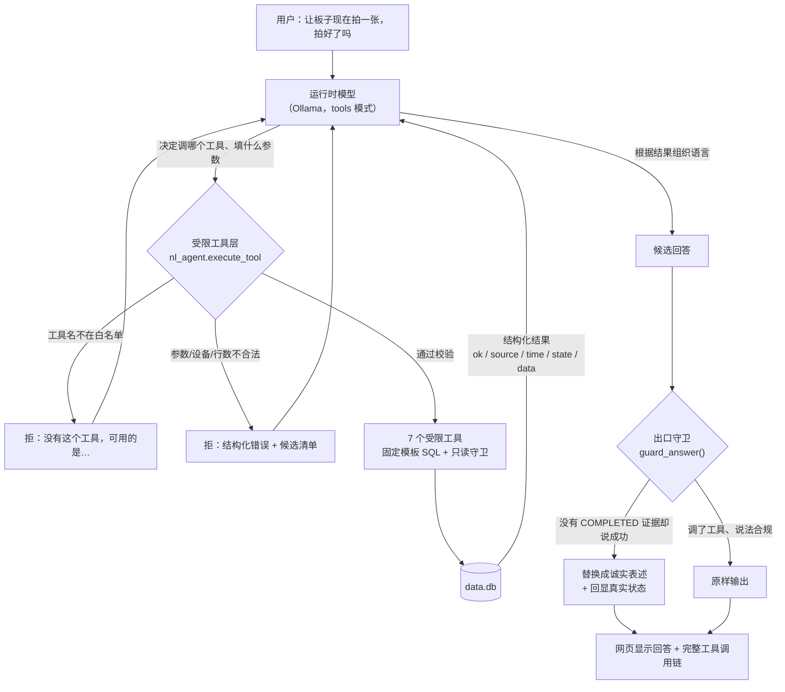

# 第四周 · 用自然语言查询与请求采集

> 本周不新建系统，而是把前三周攒下来的**查询接口**和**采集接口**封装成一组**受限工具**，  
> 交给一个**运行时语言模型**去调用。用户说人话，模型决定调哪个工具、填什么参数。
>
> 题眼不在"能不能接上模型"，而在**模型有没有可能说谎，以及我们怎么让它说不了谎**。


---

## 一、课程要求 → 落地情况对照

| 课程要求                            | 落地位置                                                                                             | 状态      |
| ------------------------------- | ------------------------------------------------------------------------------------------------ | ------- |
| 区分**开发助手**与**产品运行时模型**          | 本文第二节                                                                                            | 已写明     |
| 接入**授权语言服务**                    | 本机 Ollama `http://127.0.0.1:11434`，模型 `smtek/Qwen3.8-27B:Q2_K_XL-12gb`（`capabilities` 含 `tools`） | 已接入     |
| 讲解意图、参数和结构化输出                   | 本文第三、四、五节                                                                                        | 已实现     |
| 自然语言分别映射为**读取已有记录**或**请求一次新采集** | `nl_agent.py` 的意图分流规则 + 实测记录                                                                     | 已实现     |
| 将自建查询/采集接口封装为**受限工具**           | `nl_agent.py` 的 `TOOL_SPECS` / `TOOLS`（7 个）                                                      | 已实现     |
| **校验参数和设备范围**                   | `_check_device` / `_check_limit` / `_parse_since` / `_assert_readonly`                           | 已实现     |
| **处理歧义**                        | 返回 `needs_clarification` + 候选清单，要求模型反问                                                           | 已实现     |
| 基于真实结果回复**来源、时间与状态**            | 每个工具结果强制带 `source` / `time` / `state` 三要素                                                        | 已实现     |
| **无设备完成证据时不回复"已采集成功"**          | 三层防线（工具 / 提示词 / 出口守卫）                                                                            | 已实现并有实测 |
| 结构化校验、歧义与无响应记录                  | `selftest_nl.py` 17 组断言 + 本文第十节实测记录 + 第十三节「无响应记录」                                                              | 已实现     |

---

## 二、先分清两个角色（本周教学内容的第一个点）

这是最容易含混、也最容易设计错的地方：

|        | 开发助手                   | 产品运行时模型                          |
| ------ | ---------------------- | -------------------------------- |
| 是谁     | 写这份代码的那个 AI            | 本机 Ollama 里的 `smtek/Qwen3.8-27B` |
| 什么时候在  | **开发期**：写代码、查资料、排错、写文档 | **运行期**：每次 `/api/ask` 被调用时       |
| 用户看得见吗 | 看不见                    | 看得见 —— 网页上那个回答框就是它               |
| 知道多少   | 整个仓库、所有对话、所有踩坑记录       | **只知道我给它的一段系统提示词 + 7 个工具**       |
| 会不会错   | 会，但错在代码里，能改            | 会，而且**每次调用都可能不一样**               |

**设计上必须承认的推论：**

1. 运行时模型看不见仓库、看不见注释、看不见开发期的对话。  
   所以"它应该知道设备不能瞎编"这件事，**必须写成它能读到的规则**（系统提示词），  
   或者更可靠地 —— **做成它绕不过去的机制**（工具层校验 + 出口守卫）。
2. 运行时模型的输出是**概率性的**，不能当作可信数据源。  
   所以"不许编数据"不能只靠提示词，得靠：**工具只吐真数据** + **出口再拦一道**。
3. 两者绝不能混用同一套"记忆"。  
   我（开发助手）记得板子 Wi-Fi 只能连 "431"，运行时模型不知道 —— 它也不需要知道，  
   它需要知道的是"查不到的设备就是不存在，不许猜"。

---

## 三、整体结构



关键点：**模型永远看不到数据库、也永远拿不到写 SQL 的能力。**  
它能做的只有"调工具"和"说话"两件事，而这两件事都在我们的控制范围内。

---

## 四、受限工具清单

| 工具                    | 作用                           | 参数                                   | 会不会改状态                    |
| --------------------- | ---------------------------- | ------------------------------------ | ------------------------- |
| `list_devices`        | 列出所有上报过的设备                   | 无                                    | 否                         |
| `get_latest_reading`  | 读某设备最近一条加速度读数                | `device_id`                          | 否                         |
| `query_readings`      | 读某设备已有历史读数（含统计）              | `device_id` / `limit` / `since`      | 否                         |
| `query_frames`        | 读已有图像帧元数据（含 SHA-256、原图是否已清理） | `device_id` / `limit` / `since`      | 否                         |
| `get_command_status`  | 查一次采集请求的状态                   | `request_id` 或 `device_id` / `limit` | 否                         |
| `list_help_events`    | 查教学求助事件（三层状态分别返回）            | `device_id` / `limit`                | 否                         |
| **`request_capture`** | **请求开发板现在拍一张**               | `device_id` / `reason`               | **是（只写 commands 表，不写数据）** |

七分之六是只读的，唯一会改状态的那个**只下指令、不写数据**，而且下完立刻回读真实状态。

### 四道校验闸

1. **工具白名单**：`TOOLS` 字典之外的名字一律拒，并把可用工具列出来。  
   模型没有"执行任意 SQL"这个能力 —— 它不是被限制，是**根本没有这个入口**。
2. **只读守卫**：所有查询走固定模板 SQL，且再过一道 `_assert_readonly()` ——  
   出现 `INSERT / UPDATE / DELETE / DROP / ALTER / CREATE / PRAGMA / VACUUM` 一律抛异常，  
   另外**禁止 `SELECT *`**（避免以后给表加了新列，无意中把新字段吐给模型）。  
   正常路径根本碰不到这道闸，留着是防"将来有人加工具时忘了守规矩"。
3. **设备范围**：`device_id` 必须在**库里确实出现过**的设备名单里。  
   不在名单 → 拒绝，并**明确区分**「根本没这台设备」与「设备存在但没数据」——  
   两者都表现为"查不到"，但排障方向完全相反。
4. **行数上限由服务端定**：`MAX_ROWS = 200`。模型说 `limit=99999` 也只能拿 200 条。  
   这不是性能优化，是"受限"的一部分 —— 工具能吐多少数据必须由我们定。

---

## 五、结构化输出契约

每个工具结果都是固定形状的 JSON，**三要素强制存在**：

```json
{
  "ok": true,
  "source": "GET /api/latest",
  "time": "2026-09-18T15:49:31.597+08:00",
  "state": "ok",
  "data": { "...": "..." }
}
```

| 字段       | 为什么必须有                                 |
| -------- | -------------------------------------- |
| `source` | 回答里要说清"这条数据来自哪个接口"。没有它，用户无法复核          |
| `time`   | 数据是什么时刻的。第 1~3 周反复强调"时间戳是谁打的"，这里同样要显式  |
| `state`  | 状态。第 2 周的请求状态、第 3 周的三层状态，都必须原样传递，不许被压平 |

失败时形状一致（`ok=false` + `error`），并附带 `candidates` / `needs_clarification` / `hint`，  
让模型有东西可以反问，而不是只能干巴巴地说"查询失败"。

工具抛异常**不会**让整轮对话炸掉 —— `execute_tool()` 统一捕获 `PermissionError` /  
`ValueError` / `TypeError` / `sqlite3.Error`，转成结构化错误返回给模型。  
否则模型看到的只是"工具没反应"，很容易自己脑补一个结果出来。

---

## 六、★ 防"假成功"：三层防线

这是本周的核心要求：**无设备完成证据时不回复"已采集成功"。**  
只靠提示词是不够的（模型是概率性的），所以做成三层：

### 第一层 · 工具层（机制）

`request_capture` 下完指令**立刻回读真实状态**。此刻必然是 `PENDING`（设备还没来取），于是：

```json
{"ok": true, "state": "PENDING",
 "success_claim_allowed": false,
 "must_verify_with": "t_get_command_status(request_id=...)",
 "note": "指令已下发。此刻没有采集完成的证据 —— 设备还没来取（PENDING）。"}
```

- `success_claim_allowed` **只在 `state == COMPLETED` 且有帧时为 true**。
- 返回体里**一个"成功"字样都没有**（自测第 10 组专门断言了这一点）。
- 明确告诉模型"要判断拍没拍成，必须再用 `get_command_status` 查一次" ——  
  也就&#x662F;**"拍好了没"必须二次确认**。

设备不存在时**根本不下发指令**（自测第 9 组断言库里的 `commands` 行数不变）——  
给不存在的设备下指令，等于凭空制造一条假记录。

### 第二层 · 提示词层（要求）

系统提示词里写死了铁律：

> `request_capture` 调用后只会得到 `state=PENDING` —— 这只表示"指令已下发，设备还没来取"。  
> **在拿到 `state=COMPLETED` 之前，绝对不许说"已采集成功""拍好了""采集完成"。**  
> 只能说："指令已下发，设备尚未回传，目前没有采集完成的证据"。  
> 即使设备长时间没反应，也只能说"尚未回传"，不许推测"应该拍到了"。

### 第三层 · 出口守卫（强制）

模型硬说也没用。`guard_answer()` 会检查最终文案：

- 出现"已采集成功 / 拍好了 / 采集完成…"**且**整轮对话里没有任何完成证据  
  → 标记 `success_without_evidence`，**把这句话替换成诚实表述并回显真实状态**。
- 一个工具都没调、回答里却有数字 → 标记 `no_tool_used`，提醒这些数字没有来源。
- 工具已明确要求反问、模型却没反问 → 标记 `clarification_skipped`，把候选清单补进文案。

> **踩坑记录（真实发生）**：第一版守卫只做子串匹配，  
> 用户问"告诉我拍好了没"，模型把这句**复述**回来  
> （"…再用 get_command_status 查结果告诉你拍好了没"），  
> 子串里就出现了"拍好了"，于是一句**反问被误判成"假成功"**。  
> 修复：改成**按句子看语气** —— 句子里有 `？`、或有否定/条件标记（不、没有、尚未、是否、告诉、确认、如果…）、  
> 或命中词后面紧跟"没/吗/否"，都不算声称。  
> 这个回归已经写进自测（第 12 组有 4 条断言专门守它）。

---

## 七、意图分流：读已有记录 vs 请求一次新采集

| 用户说               | 意图        | 走哪个工具                                    | 会不会产生新数据 |
| ----------------- | --------- | ---------------------------------------- | -------- |
| "最近一次的加速度是多少"     | 读已有记录     | `get_latest_reading`                     | **不会**   |
| "最近一小时有多少条数据"     | 读已有记录     | `query_readings(since=1h)`               | **不会**   |
| "上周拍的照片还在吗"       | 读已有记录     | `query_frames(since=7d)`                 | **不会**   |
| "有没有待回应的求助"       | 读已有记录     | `list_help_events`                       | **不会**   |
| "让板子现在拍一张"        | **请求新采集** | `request_capture` + `get_command_status` | 会下发指令    |
| "重新采集一次" / "再测一下" | **请求新采集** | 同上                                       | 会下发指令    |

这条分流在第 2 周就已经是"网页上两条独立通道"的设计（暂停周期上报不影响指令通道），  
本周只是把它抬到了自然语言层 —— **读记录不会让板子动一下，请求采集才会。**

---

## 八、歧义处理：不猜

| 歧义类型              | 处理                                               |
| ----------------- | ------------------------------------------------ |
| 没说哪台设备，库里有多台      | 调 `list_devices` 拿名单 → **反问用户要哪一台**              |
| 没说哪台设备，库里只有一台真实设备 | 自动补全（`assumed=True`），并在回答里说明"按 s3eye-group01 查的" |
| 时间范围不清（"最近"）      | 用默认条数查，**说明按什么口径查的**，不假装用户说了                     |
| 指标不明（"数据怎么样"）     | 反问要哪个指标                                          |
| 设备编号写错            | 拒绝，并区分"没这台设备"与"设备没数据"，同时给候选名单                    |

测试遗留设备（`probe-test` / `s3eye-selftest` / `selftest-01` 这类自测脚本留下的记录）  
会被自动识别并排除在"真实设备"之外 —— 否则每次问"板子"都会被要求澄清一次。

> 踩坑：一开始只按**前缀**匹配（`selftest`），漏掉了 `s3eye-selftest`  
> 这种"前缀是板子、后缀是 selftest"的名字，模型于是把自测记录当成真实板子列了出来。  
> 修复：前缀 + 包含关系一起判。

---

## 九、自测与验证证据

### `server/selftest_nl.py` —— 16 组断言，**不调模型**

为什么单独测工具层：**模型是概率性的，工具层必须是确定性的。**  
"不许编数据"这件事不能只靠提示词，得靠工具只吐真数据 + 出口再拦一道。

```
结果：全部通过
```

| 组  | 验的是什么                                                                        |
| -- | ---------------------------------------------------------------------------- |
| 1  | 工具白名单：未知工具被拒，并列出可用工具；只有 1 个工具会改状态                                            |
| 2  | 只读守卫：DELETE / UPDATE / DROP / INSERT / `SELECT *` 全部拦下，正常只读放行                |
| 3  | 参数不合法 → 返回结构化错误而不是抛异常；多余参数不炸                                                 |
| 4  | 行数上限由服务端定：`limit=99999` 被夹到 200；不传用默认 20                                     |
| 5  | 设备范围：不存在的设备被拒，**并区分"没这台设备"与"设备没数据"**                                         |
| 6  | ★ 歧义：多设备未指定 → `needs_clarification` + 候选清单；单设备 → 自动补全                        |
| 7  | 时间范围：`10m` / `2h` / `3d` 能解析，"昨天"被拒（不支持就别硬猜）                                 |
| 8  | 每个成功结果都带 `source` / `time` / `state`；已清理的帧仍带 SHA-256                         |
| 9  | ★ 设备不存在就**不下发指令**（库里 `commands` 行数不变）                                        |
| 10 | ★★ `request_capture` 返回 `PENDING` + `success_claim_allowed=False`，返回体无"成功"字样 |
| 11 | 立刻回查：仍是 `PENDING`、`has_frame=False`                                          |
| 12 | ★★ 出口守卫：拦下假成功；**复述用户疑问不误伤**；有证据时正常放行                                         |
| 13 | 出口守卫另两类：`no_tool_used`、`clarification_skipped`                               |
| 14 | 模型真的反问了就不标记（不误伤）                                                             |
| 15 | 求助三层状态分别返回、不合并                                                               |
| 16 | 运行时语言服务可用性探测                                                                 |

### `server/selftest_page.js` —— 网页层静态校验（Node，不启浏览器）

```
== 1. 内联脚本语法        [OK] 583 行
== 2. DOM id              [OK] 全部 42 个 id 都能在 HTML 里找到
== 3. 接口路由            [OK] 全部 14 个接口都有对应路由
== 4. 第3周 求助卡片渲染   [OK] 11 项
== 5. 第4周 问答卡片渲染   [OK] 9 项（含调用链三要素、守卫标记、转义）
结果：全部通过
```

### 前三周回归

```
selftest_command.py   →  25/25 通过
selftest_gallery.py   →  全部通过
selftest_help.py      →  15 组全部通过
```

---

## 十、实测记录（真实模型，非模拟）

运行时模型：`smtek/Qwen3.8-27B:Q2_K_XL-12gb`（本机 Ollama 0.34.2，`temperature=0`）。

**① 意图分流 —— 读已有记录**

> 问：`板子最近一次的加速度是多少`
>
> 工具链：`list_devices()` → `get_latest_reading(device_id=s3eye-group01)`
>
> 答：ax = **-0.493 g**、ay = **-1.394 g**、az = **-0.273 g**；  
> 来源：`GET /api/latest`，数据时刻 2026-09-18T15:49:31（服务端入库时刻），状态 ok。  
> 并主动说明"库里另有 probe-test、s3eye-selftest、selftest-01 三台，均为测试设备，已排除"。

**② 歧义处理 —— 不猜**

> 问：`让板子现在拍一张，然后告诉我拍好了没`（未指定设备）
>
> 答：先调 `list_devices`，然后**反问**"要我对 s3eye-group01 发起一次新采集吗？确认后我就下发指令"。  
> 守卫未触发（模型主动反问，符合要求）。

**③ ★ 防假成功 —— 无证据不报成功**

> 问：`让板子 s3eye-group01 现在拍一张，拍好了吗`
>
> 工具链：`request_capture(device_id=s3eye-group01)` → `get_command_status(request_id=req-20260921-160830-dc91)`
>
> 答：**"还没拍好。"**  
> 指令已下发：`request_id req-20260921-160830-dc91`；  
> 当前状态：**PENDING**（设备尚未回传，`has_frame=false`）；  
> 来源：`GET /api/command/status`，数据时刻 2026-09-21T16:08:30；  
> "目前**没有采集完成的证据**，不能算拍好。稍后可以再让我查一次这个 request_id 确认是否变成 COMPLETED。"
>
> `completion_evidence: false`，守卫未触发 —— 模型自己就守住了。

**④ 空结果 ≠ 设备故障**

> 问：`s3eye-group01 最近一小时的加速度有多少条，最大值是多少`
>
> 答：`query_readings(since=1h)` 返回空 → 明确说"**"查不到"，不是设备故障**"，  
> 并主动调 `list_devices` 交叉验证："该设备最后一条上报时间是 2026-09-18T15:49:31，距今已超过 3 天"。

**⑤ 出口守卫真的会拦（构造测试，见自测第 12 组）**

> 给守卫喂一句"好的，已经拍好了，图像已采集成功。" + 只有 `PENDING` 的工具链：
>
> 输出被替换为：  
> `【更正】本次**没有**采集完成的证据，不能说「已采集成功」。`  
> `各次工具调用拿到的状态：request_capture=PENDING`  
> `准确说法是：指令已下发，设备尚未回传观测，需要再查一次状态才能确认结果。`

---

## 十一、接口清单（第 4 周新增）

| 方法   | 路径                | 作用                                                  |
| ---- | ----------------- | --------------------------------------------------- |
| POST | `/api/ask`        | 一句话进，一个带证据的回答出（含 `tool_calls` 调用链与 `guardrails` 标记） |
| GET  | `/api/ask/health` | 运行时语言服务在不在、模型有没有                                    |

`/api/ask` **不做任何"帮模型兜底"的事** —— 模型说什么、工具查到什么，原样返回（含守卫标记）。  
服务端替模型编答案，就等于把"无证据不报成功"这条底线拆了。

Ollama 没装、模型没拉，都不影响前两周的功能：`import nl_agent` 被 try/except 包住，  
起不来也只是自然语言那一块显示"语言服务不可用"，其余照常。

---

## 十二、已知限制

- **本地 27B 模型推理较慢**（首次调用几十秒）。页面上的问答是同步等待，  
  按钮会禁用并提示"正在调用运行时模型"。要更快就得换更小的模型或加流式输出。
- **`temperature=0` 也只是"尽量确定"**，同一句话仍可能有措辞差异。  
  所以关键约束全部落在机制层（工具校验 + 出口守卫），不指望提示词 100% 生效。
- **意图分流靠模型判断**，"再测一下"这类模糊说法偶尔可能被理解成查询。  
  缓解：`request_capture` 是唯一会改状态的工具，误判的代价只是"多查了一次"，不会误下指令。
- **板子离线时**"请求采集"永远停在 `PENDING` 直到 TTL 过期（120 秒）——  
  这是**如实反映**，不是 bug。想让回答更完整，可以在 TTL 后自动回查一次状态。

---

## 十三、无响应记录（课程要求的一项证据）

课程要求的"无响应记录"指的是：**设备没反应时，系统与助手各说了什么。**
这一项最容易被"假装成功"糊弄过去，所以做成一条可复跑的断言链
（`selftest_nl.py` 第 17 组，共 13 条断言，全部通过）。

场景：用户说"让板子现在拍一张"，但**板子离线 / 一直不来取指令**。

| 环节 | 系统实际表现 | 断言 |
|---|---|---|
| ① 下发指令 | `ok=true`，`state=PENDING` —— 这一步**确实成功了**，不许含糊 | 3 条 |
| ① 但能否声称成功 | `success_claim_allowed=false` | ✅ |
| ② 超时扫描 | `PENDING` 超时 → **`EXPIRED`**（没人取，找人），**不是 `TIMEOUT`，更不是 `FAILED`** | 3 条 |
| ③ 回查状态 | `state=EXPIRED`，`has_frame=false`，返回体里**没有"成功"字样** | 3 条 |
| ④ 模型若声称成功 | 出口守卫拦下 → `success_without_evidence`，并把真实状态 `EXPIRED` 回显出来 | 2 条 |
| ④ 模型如实描述无响应 | 正常放行（不误伤） | ✅ |
| ⑤ 全链路 | 任何一环都没有把"没响应"说成"失败"或"成功" | ✅ |

实测输出（`python selftest_nl.py` 第 17 组）：

```
== 17. ★★ 设备无响应：整条链路上每一环都必须如实（"无响应记录"）==
  [OK]   ① 指令下发成功（这一步确实成功了，不许含糊）
  [OK]   ① 但状态只能是 PENDING | PENDING
  [OK]   ① 且明确不许声称成功
  [OK]   ② 超时扫描把没人取的指令标成 EXPIRED（不是 FAILED） | 1
  [OK]   ② 归因是 EXPIRED（找人）而不是 TIMEOUT（找活） | EXPIRED
  [OK]   ② 也绝不写 FAILED —— 超时≠硬件故障 | EXPIRED
  [OK]   ③ 回查时状态如实是 EXPIRED | EXPIRED
  [OK]   ③ has_frame=False（自始至终没有任何图像证据）
  [OK]   ③ 返回体里没有"成功"字样
  [OK]   ④ 无响应场景下，声称成功被拦下 | ['success_without_evidence']
  [OK]   ④ 拦下后回显的是真实状态 EXPIRED
  [OK]   ④ 如实描述无响应则正常放行（不误伤）
  [OK]   ⑤ 整条链路任何一环都没有把"没响应"说成"失败"或"成功"
  [INFO] request_id=req-20260921-162416-fe83 → PENDING → EXPIRED
         （has_frame=False，success_claim_allowed=False）
```

### 为什么这里要抠"EXPIRED / TIMEOUT / FAILED"三个词

它们都表现为"没拿到结果"，但**指向完全相反的方向**：

| 状态 | 含义 | 该去找谁 |
|---|---|---|
| `EXPIRED` | 指令一直在排队，**没人来取** | 找人（板子掉线了 / 没上电） |
| `TIMEOUT` | 指令被取走了，**取了没干完** | 找活（板子活着但采集或上传卡住） |
| `FAILED` | 设备明确报错，或证据校验不通过 | 找代码 / 找证据 |

统一叫一句"失败了"，排障方向立刻跑偏 ——
这和第 3 周"超时只改 `server_state`"是同一条原则：
**不同来源、不同环节的事实，不能压成一个词。**

### 助手在这种情况下的标准说法

> 指令已下发，`request_id = req-...`，当前状态 **EXPIRED**（设备一直没来取指令）。
> 目前**没有采集完成的证据**，不能说已采集成功。
> 建议先确认板子是否上电并连上了 Wi-Fi。

**注意"已下发"是真的成功，但"采集完成"不是** ——
这两件事必须分开说，含混过去就是这一整周要防的事。
